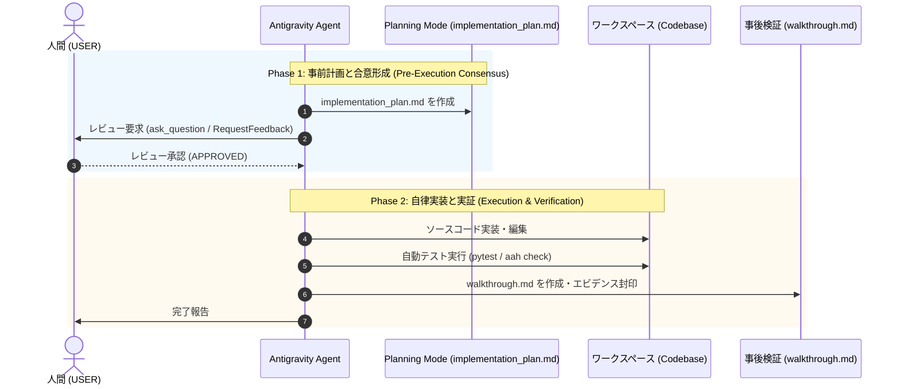

# Google Antigravity Two-Phase Governance Skill

本スキルは、Google Antigravity 環境において AI エージェントの自律変更を安全に統制するための **「二段階ガバナンス (Two-Phase Evidence & Review)」** 手続きを規定します。

---

## 1. Phase 1: 事前計画と人間承認 (Planning Mode)

エージェントはいかなる非自明なソースコード変更も、人間による明示的承認を得る前に行ってはなりません。

### 手順
1. **変更計画の集約**:
   - `blueprint.md`, `spec.md`, `plan.md`, `implementation.md` の内容を元に、Antigravity 公式アーティファクトである `implementation_plan.md` を作成。
   - 配置パス: `<appDataDir>\brain\<conversation-id>/implementation_plan.md`
2. **User Review Required の明示**:
   - 変更によって生じるトレードオフ、破壊的変更、アーキテクチャ上の改善提案を明記。
3. **対話型レビューの要請**:
   - `ask_question` ツール、または `ArtifactMetadata(RequestFeedback=true)` を用いて、ユーザーに承認または選択を求める。
4. **承認の確認**:
   - ユーザーが「承認 (APPROVED)」または「進めてよい (go ahead)」と回答するまで、コード変更ツール（`write_to_file`, `replace_file_content` 等でのソース編集）の実行を停止（ブロック）する。

---

## 2. Phase 2: 自律実行と事後検証 (Walkthrough Sealing)

承認を得た後、エージェントは自律的に実装を実行し、事後エビデンスを封印します。

### 手順
1. **安全な実装**:
   - 計画に記載されたファイルのみを変更し、計画外のスコープ逸脱を行わない。
   - 変更の最小化と、既存のコメント・スタイルの維持。
2. **検証テストの自動実行**:
   - `pytest` 等の自動テストスイートを実行。
   - 失敗した場合は直ちに自己修復し、すべてのテストがグリーンになるまで検証を継続。
3. **CLI 実機検証**:
   - CLI ツール（`aah check`, `aah verify` 等）を実行し、実際の挙動を確認。
4. **`walkthrough.md` の出力**:
   - 配置パス: `<appDataDir>\brain\<conversation-id>/walkthrough.md`
   - 実装内容、実行されたテストログ、検証結果、Before/After 差分を記録。
   - `ArtifactMetadata(UserFacing=true, RequestFeedback=false)` を設定。
5. **ユーザーへの最終完了報告**:
   - 成果物リンク（`spec.md`, `plan.md`, `implementation.md`, `walkthrough.md`）を提示して完了を報告。
