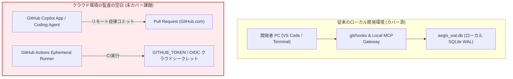
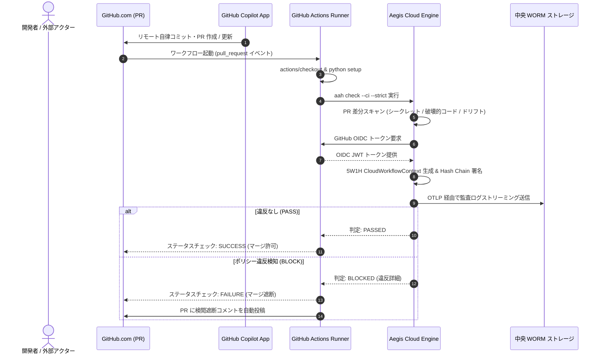

# Agent Aegis Harness (aah) - クラウドワークフロー & リモートエージェント監査構想企画書 (Blueprint)

**Document ID:** BLUEPRINT-CLOUDFLOW-001 | **Version:** 1.0.0 | **Status:** Active | **Author:** @sun-flat-yamada (Youhei Yamada)  
**Target Change:** `.devs/changes/2026-09-12_AddSupportCloudFlowAudit`  
**Parent Architecture:** [`docs/ARCHITECTURE.md`](../../docs/ARCHITECTURE.md) | **Related Guides:** [`docs/setup/target-project-guide.ja.md`](../../docs/setup/target-project-guide.ja.md)

---

## 1. 構想概要と課題提起

### 1.1 背景 (Context)
Agent Aegis Harness (`aah`) は、初期フェーズにおいてローカル開発環境（開発者端末上の VS Code GitHub Copilot、Claude Code CLI、Cursor、Google Antigravity SDK）を対象に、決定論的な指示ポインタ注入、Sentinel による即時事前検閲、Git コミット連動型監査ハッシュバインド（`git notes`）、および改ざん不能な SQLite WAL / Merkle Hash Chain ログ基盤を確立しました。

しかし、生成 AI を活用したソフトウェア開発はローカル端末完結型から、**「クラウド上で常時またはイベント駆動で自律動作するリモート AI エージェント」** へと急速に拡大しています：
- **GitHub Copilot App / GitHub Copilot Coding Agent**: GitHub.com 上で Issue や PR の指示を受け取り、クラウド上でブランチ作成からコミット、PR 生成までを自律完結する。
- **Copilot Workspace / PR Review Assistants**: リポジトリ全体の変更意図を解析し、ブラウザ上で修正パッチを生成・自動提案する。
- **CI/CD パイプライン内自律エージェント**: GitHub Actions や Cloud Build 上で動作するコードリファクタリングボット、自動脆弱性修正エージェント、ドキュメント自動同期ワーカー。

### 1.2 クラウドワークフローにおける監査の空白（4大課題）



1. **ローカルフックの完全なバイパス**:
   GitHub.com やクラウド側で自律稼働するエージェントは、開発者の端末を経由しません。そのため、端末側の `.git/hooks/post-commit` や Local MCP Gateway（STDIO）は一切呼び出されず、従来のローカル監視網を完全にすり抜けます。
2. **エフェメラル（使い捨て）コンテナによるログ揮発**:
   GitHub Actions ランナー等のクラウド環境はジョブ完了後に破棄されます。ローカルファイル（`aegis_wal.db` や `.aegis/logs/audit-trail.jsonl`）を生成しても、ランナー消滅とともに監査証跡が失われます。
3. **高特権シークレットの漏洩・悪用リスク**:
   CI/CD ランナー内には `GITHUB_TOKEN`、クラウド連携用の OIDC ID トークン、およびデプロイ用シークレットが環境変数として注入されています。自律エージェントが悪意あるプロンプトインジェクションを受けたりバグを起こした場合、これら高特権トークンがコミットログや外部通信経由で流出する重大リスクがあります。
4. **トリガーと 5W1H コンテキストの乖離**:
   ローカルの対話プロンプトとは異なり、クラウド環境のトリガーは GitHub Webhook（PR 作成、レビューコメント、Issue アサイン、スケジュール実行）です。既存の `AegisAuditEvent` スキーマでは、ワークフロー名、Run ID、コミット SHA、アクター種別などのクラウド特有のコンテキストを表現できません。

---

## 2. 意思決定背景・判断基準・トレードオフ (ADR)

### 2.1 ADR-0004: エフェメラル環境のログ永続化アーキテクチャ
- **選択肢:**
  - Option A: ジョブ終了時にログファイルを GitHub Actions Artifacts にアップロードする。
  - Option B: ランナーから社内の中央 Aegis OTel / WORM エンドポイントへリアルタイム OTLP ストリーミング送信する（ネットワーク遮断時は Artifact へフォールバック）。
- **決定理由:** Option A だけでは GitHub リポジトリ管理者による Artifact 削除や保持期間（デフォルト90日）経過による証跡喪失を防げず、企業のコンプライアンス（7年間不変保管等）を満たせません。Option B を標準とし、クラウド MCP Gateway または中央 OTel Collector への直接ストリーミングを採用します。

### 2.2 ADR-0005: ゲートウェイ統合方式（Composite Action vs Webhook Gateway）
- **選択肢:**
  - Option A: リポジトリごとの GitHub Actions ワークフロー（`aah-audit-action`）のみで制御する。
  - Option B: 全社 GitHub 組織（Organization）レベルで GitHub App を導入し、Webhook で一元傍受する。
  - Option C: **ハイブリッド構成 (Dual-Pillar)** — PR 判定とマージブロックは GitHub Actions Composite Action で即時実行し、Copilot App などの非同期対話ログは Webhook Gateway で集約。
- **決定理由:** 開発リポジトリ側でのブランチ保護（Branch Protection Rules）と連動してマージを阻止するには Actions のステータスチェックが必須です。一方で Copilot Coding Agent 等のクラウド対話履歴を捕捉するには Webhook 受信機構が必要です。両者を組み合わせた Option C を採用します。

### 2.3 ADR-0006: クラウドエージェントの真正性と非改ざん証明 (GitHub OIDC & Cosign)
- **決定事項:**
  クラウド上で実行された監査イベントには、GitHub Actions が発行する **OIDC ID トークン（JWT）** のクレーム（リポジトリ、ワークフロー、コミット SHA、実行者）を暗号学的にバインドします。
- **効果:** 静的な API キーの管理を不要化（Keyless）し、GitHub 公式認証基盤によって「どのリポジトリのどのジョブで生成された監査ログか」を暗号学的に保証します。

---

## 3. システムアーキテクチャ & データフロー

```mermaid
flowchart TD
    subgraph GitHubCloud ["GitHub.com / クラウドインフラ"]
        UserPR["開発者 / レビュアー"] -->|Issue / PR 作成| Repo["GitHub Repository"]
        CopilotAgent["GitHub Copilot App / Coding Agent"] -->|自律コード生成 & コミット| Repo
        
        Repo -->|Webhook イベント| WebhookGW["Aegis Cloud Webhook Gateway<br/>(Container Apps / ECS)"]
        Repo -->|PR イベント発火| ActionsRunner["GitHub Actions Ephemeral Runner"]
    end

    subgraph RunnerPerimeter ["CI ランナー内部 (aah-cloud-audit)"]
        ActionsRunner --> StepInit["1. aah check --ci"]
        StepInit --> SentinelGate["2. Sentinel Cloud Evaluator<br/>(セマンティック差分 & シークレット検閲)"]
        SentinelGate --> OIDCAttest["3. GitHub OIDC Token バインド<br/>(Keyless 真正性証明)"]
        OIDCAttest --> DualStream["4. OTLP Dual-Streamer"]
    end

    subgraph CentralEnterprise ["全社中央ガバナンス基盤"]
        DualStream -->|gRPC / OTLP (TLS)| CentralOTel["Aegis Central OTel Collector"]
        WebhookGW -->|REST / JSON| CentralOTel
        
        CentralOTel --> ImmutableWORM["WORM 不変監査ログ保管層<br/>(Azure Blob Immutable / AWS S3 Object Lock)"]
        CentralOTel --> EnterpriseSIEM["SIEM / SOC 監視<br/>(リアルタイム侵害アラート)"]
    end

    SentinelGate -->|Status Check (PASS / BLOCK)| PRCheck["PR 必須ステータスチェック"]
    PRCheck -->|ブロック| BlockMerge["不正コードのマージ自動遮断"]
```

### 3.1 エンドツーエンド実行シーケンス



---

## 4. 詳細仕様 & データモデルドラフト

### 4.1 `CloudWorkflowContext` スキーマ拡張仕様
`src/aegis/models.py` の `EnvironmentInfo` に統合される、クラウドワークフロー専用のコンテキスト定義です：

```python
class CloudWorkflowContext(BaseModel):
    """クラウド CI/CD およびリモートエージェント実行環境の 5W1H メタデータ"""
    platform: str = Field(default="github-actions", description="CI/CD プラットフォーム識別子")
    workflow_name: str = Field(..., description="GitHub Actions ワークフロー名 (.github/workflows/...)")
    workflow_run_id: str = Field(..., description="GITHUB_RUN_ID (一意のジョブ実行 ID)")
    workflow_run_attempt: int = Field(default=1, description="GITHUB_RUN_ATTEMPT (再試行回数)")
    job_id: str = Field(..., description="GITHUB_JOB (実行ジョブ名)")
    runner_environment: str = Field(..., description="github-hosted または self-hosted")
    
    # Git & PR 相関メタデータ
    event_name: str = Field(..., description="発火イベント名 (pull_request, issue_comment, push)")
    actor: str = Field(..., description="実行トリガー者 (例: github-actions[bot], copilot-agent)")
    actor_type: str = Field(..., description="human, bot, または autonomous-cloud-agent")
    pr_number: Optional[int] = Field(None, description="関連プルリクエスト番号")
    head_sha: str = Field(..., description="PR ヘッドコミット SHA")
    base_sha: str = Field(..., description="PR ベースコミット SHA")
    
    # OIDC 真正性証明
    oidc_token_issuer: Optional[str] = Field(None, description="https://token.actions.githubusercontent.com")
    job_workflow_ref: Optional[str] = Field(None, description="OIDC クレーム: 実行されたワークフロー定義の不変参照")
```

### 4.2 GitHub Actions 公式 Composite Action (`.github/actions/aah-cloud-audit/action.yml`)
利用リポジトリが最小限の YAML 記述で導入できる再利用可能アクションの仕様です：

```yaml
name: "Agent Aegis Cloud Audit Gate"
description: "Instant Sentinel Audit, Secret Redactor, and OIDC Attestation for AI-driven PRs"
author: "@sun-flat-yamada"

inputs:
  strict:
    description: "Fail workflow on warnings"
    required: false
    default: "true"
  otel-endpoint:
    description: "Central OTel Collector gRPC endpoint for audit streaming"
    required: false
    default: ""
  comment-pr:
    description: "Post audit verdict summary to PR comments on failure"
    required: false
    default: "true"

outputs:
  verdict:
    description: "Overall audit status (PASS / WARN / BLOCK)"
    value: ${{ steps.audit.outputs.verdict }}
  policy-digest:
    description: "Deterministic SHA-256 digest of active rules"
    value: ${{ steps.audit.outputs.policy_digest }}

runs:
  using: "composite"
  steps:
    - name: Set up Python
      uses: actions/setup-python@v5
      with:
        python-version: "3.10"

    - name: Install Agent Aegis Harness
      shell: bash
      run: pip install agent-aegis-harness

    - name: Run Aegis Cloud Sentinel Gate
      id: audit
      shell: bash
      env:
        ACTIONS_ID_TOKEN_REQUEST_URL: ${{ env.ACTIONS_ID_TOKEN_REQUEST_URL }}
        ACTIONS_ID_TOKEN_REQUEST_TOKEN: ${{ env.ACTIONS_ID_TOKEN_REQUEST_TOKEN }}
      run: |
        aah check --ci --strict=${{ inputs.strict }}
```

---

## 5. 導入・移行・運用計画 (Implementation Roadmap)

| フェーズ | 主要マイルストーン | 完了基準 |
| :--- | :--- | :--- |
| **Phase 1: モデル拡張 & CI モード実装** | `CloudWorkflowContext` Pydantic モデル定義、`aah check --ci` オプション追加（GitHub Actions 環境変数の自動検知と PR 差分スキャン） | pytest による CI モード単体テスト通過 |
| **Phase 2: Composite Action の公開** | `.github/actions/aah-cloud-audit/` の実装、PR 自動コメント投稿機能（GitHub CLI 経由）の追加 | 実際の PR でのステータスチェック判定 |
| **Phase 3: OIDC 署名 & OTLP ストリーミング** | GitHub OIDC トークン取得アダプタの実装、エフェメラル環境から中央 WORM への直接 OTLP 送信機能 | 中央 OTel Collector での完全な 5W1H ログ受信 |
| **Phase 4: Copilot App Webhook Gateway** | クラウド上の Copilot アプリ対話を捕捉する Webhook 受信サービスの開発と E2E 実機検証 | Copilot による自動 PR 作成時の監査ログ紐付け |

---

## 6. まとめ

本構想企画書（`blueprint.md`）により、これまで開発者ローカル環境に閉じていた Agent Aegis Harness の統制境界を、**GitHub Actions ランナーおよび GitHub Copilot App が自律稼働するクラウド実行基盤へと拡張**します。

開発者は手動の設定作業を行うことなく、CI/CD パイプラインに 1 つのステップを追加するだけで、クラウド上で生成されるあらゆる AI コード変更に対して数学的な改ざん防止と 5W1H 監査説明責任を全社規模で適用することが可能になります。
