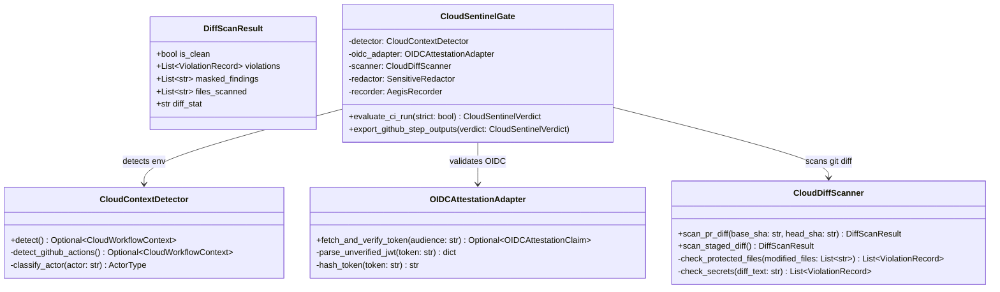

# Agent Aegis Harness (aah) - クラウドワークフロー監査 Google Antigravity 実装設計書

**Document ID:** IMPL-CLOUDFLOW-001 | **Version:** 1.0.0 | **Status:** Active | **Author:** @sun-flat-yamada (Youhei Yamada)  
**Parent Blueprint:** [`blueprint.md`](./blueprint.md) | **Specification:** [`spec.md`](./spec.md) | **Plan:** [`plan.md`](./plan.md)  
**Target Change:** `.devs/changes/2026-09-12_AddSupportCloudFlowAudit`

---

## 1. クラス設計 & 相互作用図

本ドキュメントは、Google Antigravity 環境下で自律エージェントのクラウド実行時監査を実現するための詳細なクラス設計および連携手順を規定します。



---

## 2. ディレクトリ構成とモジュール配置

```text
src/aegis/
├── cloud_audit/                    # [NEW] クラウドワークフロー監査専用パッケージ
│   ├── __init__.py
│   ├── detector.py                # CI 環境変数自動検出 (GitHub Actions, etc.)
│   ├── oidc.py                    # GitHub OIDC ID Token 取得・クレーム検証
│   └── scanner.py                 # PR 差分スキャン & 保護ファイル検査
├── models.py                       # [MODIFY] CloudWorkflowContext, OIDCAttestationClaim 追加
├── cli.py                          # [MODIFY] check --ci オプション & GITHUB_OUTPUT 連携
└── recorder/
    └── tracer.py                   # [MODIFY] CloudWorkflowContext の 5W1H 記録対応

.github/actions/
└── aah-cloud-audit/                # [NEW] 公式 Composite Action
    └── action.yml

tests/
└── test_cloud_audit.py             # [NEW] CI モード・OIDC・差分検閲の包括テスト
```

---

## 3. コアデータモデル (Pydantic v2 実装定義)

### 3.1 `src/aegis/models.py` 拡張抜粋

```python
from enum import Enum
from typing import Optional, List, Dict, Any
from pydantic import BaseModel, Field

class CloudPlatformType(str, Enum):
    GITHUB_ACTIONS = "github-actions"
    AZURE_PIPELINES = "azure-pipelines"
    AWS_CODEBUILD = "aws-codebuild"
    GENERIC_CI = "generic-ci"

class ActorType(str, Enum):
    HUMAN = "human"
    BOT = "bot"
    AUTONOMOUS_CLOUD_AGENT = "autonomous-cloud-agent"

class CloudWorkflowContext(BaseModel):
    """クラウド CI/CD ランナーおよびリモートエージェント実行環境の 5W1H メタデータ"""
    platform: CloudPlatformType = Field(default=CloudPlatformType.GITHUB_ACTIONS)
    workflow_name: str
    workflow_run_id: str
    workflow_run_attempt: int = 1
    job_id: str
    runner_environment: str = "github-hosted"
    event_name: str
    actor: str
    actor_type: ActorType = ActorType.HUMAN
    pr_number: Optional[int] = None
    head_sha: str
    base_sha: Optional[str] = None
    oidc_token_issuer: Optional[str] = None
    job_workflow_ref: Optional[str] = None

class OIDCAttestationClaim(BaseModel):
    """GitHub OIDC ID Token 検証済みクレーム"""
    iss: str
    sub: str
    aud: str
    repository: str
    repository_owner: str
    ref: str
    sha: str
    workflow: str
    run_id: str
    raw_token_sha256: str
```

---

## 4. Google Antigravity ライフサイクルフック連携

CI 環境下におけるエージェント実行および PR 判定では、Antigravity のライフサイクルフックと以下の通り連携します：

| Antigravity Hook / 契機 | 実行処理 | 出力エビデンス |
| :--- | :--- | :--- |
| **CI Initialization (`aah check --ci`)** | `CloudContextDetector` が GitHub Actions 環境変数を取得し、`CloudWorkflowContext` を初期化 | 5W1H の `environment.cloud_workflow` |
| **Pre-Merge Audit Gate** | `CloudDiffScanner` がベースブランチと PR ヘッドの Git 差分を静的スキャン | `sentinel_verdict` (PASS / WARN / BLOCK) |
| **OIDC Attestation** | `ACTIONS_ID_TOKEN_REQUEST_URL` より JWT を取得し SHA-256 ダイジェストをバインド | `oidc_token_issuer`, `job_workflow_ref` |
| **Step Output Sealing** | `$GITHUB_OUTPUT` へ結果を書き出し、GitHub PR ステータスチェックへ連携 | `$GITHUB_OUTPUT` (verdict, policy_digest) |

---

## 5. 署名・完全性検証アルゴリズム

1. **OIDC トークンのセキュアハンドリング**:
   - `ACTIONS_ID_TOKEN_REQUEST_TOKEN` を Bearer 認証に用いて `ACTIONS_ID_TOKEN_REQUEST_URL` に HTTP GET を発行。
   - 取得した JWT の Header/Payload をデコードし、`iss` が `https://token.actions.githubusercontent.com` であること、および `repository` が `GITHUB_REPOSITORY` と一致することを確認。
   - 平文 JWT は破棄し、`hashlib.sha256(token.encode()).hexdigest()` のみを記録。
2. **Hash Chain バインド**:
   - 生成された `AegisAuditEvent` はローカル WAL および OTel ストリーム送信時に前ブロックの `current_record_hash` と結合され、Merkle Hash Chain に封印される。

---

## 6. 実行・テストコマンド手順

```bash
# 1. クラウド監査単体・統合テストの実行
pytest tests/test_cloud_audit.py -v

# 2. CI モードの手動シミュレーション実行
python -m aegis.cli check --ci

# 3. 厳格モード（警告で即失敗）での検証
python -m aegis.cli check --ci --strict
```
