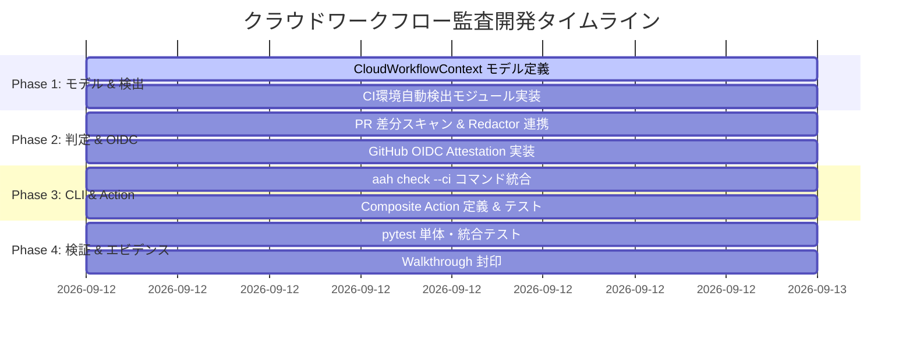

# Agent Aegis Harness (aah) - クラウドワークフロー監査開発計画書

**Document ID:** PLAN-CLOUDFLOW-001 | **Version:** 1.0.0 | **Status:** Active | **Author:** @sun-flat-yamada (Youhei Yamada)  
**Parent Blueprint:** [`blueprint.md`](./blueprint.md) | **Specification:** [`spec.md`](./spec.md)  
**Target Change:** `.devs/changes/2026-09-12_AddSupportCloudFlowAudit`

---

## 1. 基本方針と開発原則

本計画は、`blueprint.md` および `spec.md` に基づき、クラウド CI/CD ランナーおよびリモート自律エージェントに対する 5W1H 監査機能を、ゼロダウンタイムかつ決定論的再現性を担保して導入するための開発工程を定義します。

1. **Zero-Overhead in CI (CI実行における摩擦ゼロ)**:
   - CI ランナーでの実行遅延を 500ms 以下に抑え、開発ワークフローを阻害しない。
2. **Keyless Deterministic Attestation (キーレス真正性証明)**:
   - 静的な長期クレデンシャルを持たず、GitHub Actions の OIDC ID トークンにより実行コンテキストを暗号学的に証明する。
3. **Graceful Fallback (多層防御と縮退動作)**:
   - クラウド API や OIDC エンドポイントが一時的に不通の場合でも、環境変数情報による監査判定を継続し、CI を不当にクラッシュさせない。

---

## 2. マイルストーン & フェーズ計画

---

## 3. タスク詳細 WBS (Work Breakdown Structure)

### Task 1: データモデルおよび JSON Schema の拡張
- **担当ファイル**: `src/aegis/models.py`, `.aegis/schemas/audit-event.schema.json`
- **完了基準**:
  - `CloudPlatformType`, `ActorType`, `CloudWorkflowContext`, `OIDCAttestationClaim` の Pydantic v2 モデル定義。
  - `EnvironmentInfo` に `cloud_workflow: Optional[CloudWorkflowContext] = None` が追加されていること。
  - JSON Schema バリデーションが既存のテストを壊さず通過すること。

### Task 2: クラウド環境検出 & OIDC Attestation アダプタ
- **担当ファイル**: `src/aegis/cloud_audit/detector.py`, `src/aegis/cloud_audit/oidc.py`
- **完了基準**:
  - `GITHUB_ACTIONS`, `GITHUB_RUN_ID`, `GITHUB_ACTOR`, `GITHUB_EVENT_NAME` 等の環境変数からの安全な自動抽出。
  - アクター名に基づく `actor_type` 自動判定（`autonomous-cloud-agent` 識別）。
  - OIDC トークン要求エンドポイント（`ACTIONS_ID_TOKEN_REQUEST_URL`）のハンドリングおよび JWT ペイロードのデコード。平文トークンは即破棄し SHA-256 ダイジェストのみを保持。

### Task 3: `aah check --ci` CLI 統合 & PR 差分スキャン
- **担当ファイル**: `src/aegis/cli.py`, `src/aegis/cloud_audit/scanner.py`
- **完了基準**:
  - `aah check --ci` オプションの実装。
  - Git PR 差分（ベースコミットとヘッドコミット間）を自動走査し、機密情報漏洩、保護ファイル変更を検出。
  - `$GITHUB_OUTPUT` が指定されている場合、GitHub Actions 互換のステップ出力（`verdict`, `policy_digest`, `violations_count`）を生成。
  - 違反検知時はステータスコード 1 で終了。

### Task 4: 再利用可能 Composite Action
- **担当ファイル**: `.github/actions/aah-cloud-audit/action.yml`
- **完了基準**:
  - inputs（`strict`, `fail-on-block`）および outputs（`verdict`, `policy-digest`）が定義された Composite Action の作成。
  - 外部リポジトリが 1 行で呼び出し可能な構成になっていること。

### Task 5: 包括的テストスイートの実装 & 妥当性検証
- **担当ファイル**: `tests/test_cloud_audit.py`
- **完了基準**:
  - CI 環境変数の有無による分岐テスト。
  - OIDC モックトークンの検証テスト。
  - PR 差分検閲テスト（正常系 PASS、シークレット混入 BLOCK）。
  - すべてのテストが `pytest` で 100% グリーンであること。

---

## 4. テスト・検証戦略

### 4.1 単体テスト (Unit Tests)
- **環境変数検出テスト**: GitHub Actions の環境変数がセットされている場合とセットされていない場合の検出精度を検証。
- **アクター分類テスト**: 人間、標準ボット、自律 Copilot エージェントの正確な分類。
- **OIDC デコーダテスト**: サンプルの JWT ペイロードをデコードし、リポジトリ・SHA・ワークフロー参照の一致を検証。

### 4.2 統合テスト (Integration Tests)
- **CLI 実行テスト**: `runner = CliRunner()` を用いて `aah check --ci` および `aah check --ci --strict` の終了コードと出力を検証。
- **Redactor 連携テスト**: PR 差分内にシークレット（ダミー API キー等）が存在する場合に即座に `BLOCK` 判定が下り、終了コード 1 となることを検証。

### 4.3 改ざん・決定論性テスト (Integrity Tests)
- 同一のコミットハッシュおよび入力に対して、複数回実行しても同一の Policy Digest およびログハッシュが算出されることを確認。

---

## 5. リスク評価と緩和策

| リスク | 影響度 | 発生確率 | 緩和策 |
| :--- | :--- | :--- | :--- |
| **OIDC エンドポイントのタイムアウト** | 中 | 低 | タイムアウト時間を 2 秒に制限し、失敗時はローカル環境変数モードへフォールバックして CI 実行を止めない。 |
| **PR 差分取得失敗 (Shallow Clone)** | 高 | 中 | `actions/checkout` が shallow clone（`fetch-depth: 1`）の場合、`git fetch --depth=10` または差分フォールバック処理を実装。 |
| **誤検知による正常 PR のマージ遮断** | 高 | 低 | 危険コマンド・シークレット検知のルールは既存の実績ある Sentinel 正規表現セットを使用し、ホワイトリスト除外機能も提供。 |
