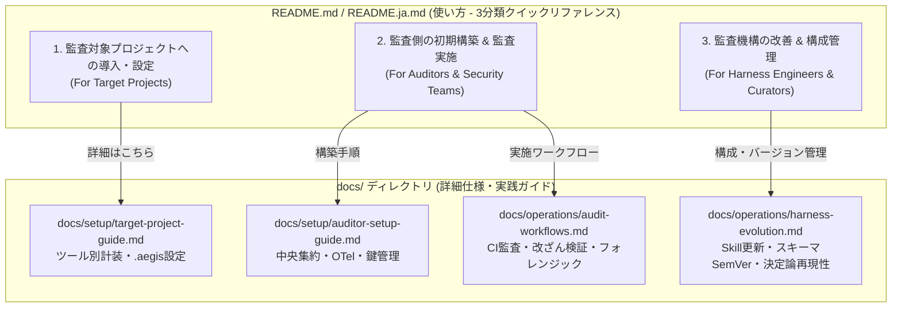
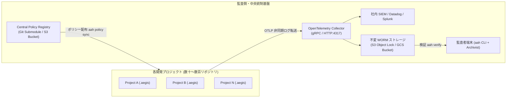
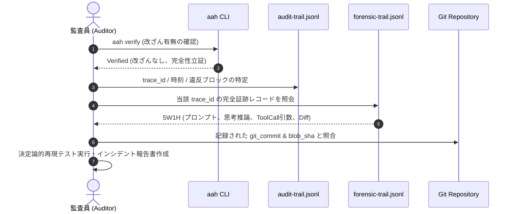
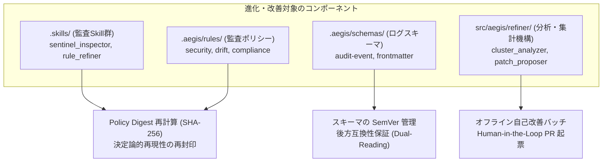
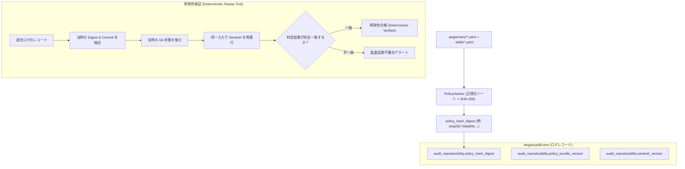
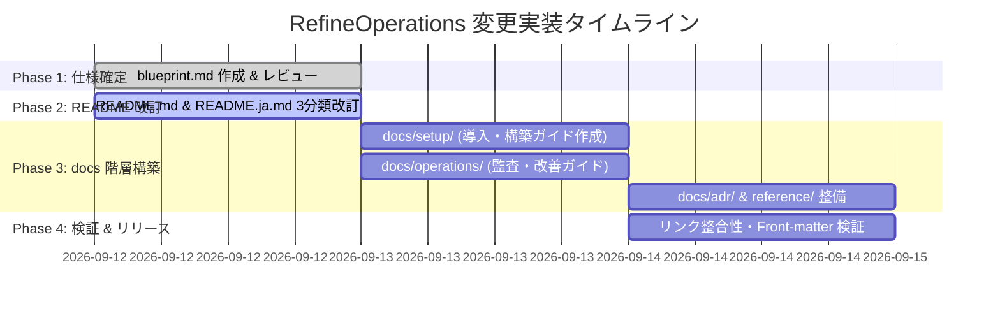

# Agent Aegis Harness (aah) - 運用・ドキュメント体系洗練 技術設計書 (Blueprint)

**Document ID:** BLUEPRINT-REFINE-001 | **Version:** 1.0.0 | **Status:** Active | **Author:** @sun-flat-yamada (Youhei Yamada)  
**Target Change:** `.devs/changes/2026-09-12_RefineOperations`

---

## 1. 変更メタデータ & 概要

### 1.1 変更の背景と目的
`agent-aegis-harness (aah)` は、初期実装 (`2026-09-12_initial-create`) により、コアエンジン（Sentinel, Archivist, Recorder, Refiner）および Google Antigravity SDK フック連携、Merkle Hash Chain 暗号署名基盤の実装が完了しました。

しかし、実際の全社展開および実運用を見据えた場合、利用者の役割ごとに参照すべき情報と操作手順が大きく異なります。現在の README は単一のクイックスタートのみとなっており、以下の3つの異なるペルソナが迅速に目的を達成するための動線が不足していました。

1. **被監査プロジェクト開発者 (Audited Project Developers):** 自らのリポジトリに Harness を導入し、AI エージェントを統制・記録したい。
2. **監査・ガバナンス担当者 (Auditors & Governance Officers):** 全社的な監査基盤を立ち上げ、定常監査・改ざん検証・インシデントフォレンジック調査を実施したい。
3. **ハーネス運用・改善エンジニア (Harness Engineers & Policy Curators):** 監査ポリシー、Sentinel スキル、ログスキーマ、集計・分析アルゴリズムを安全に進化させ、過去ログとのバージョン整合性と決定論的再現性を維持したい。

本設計書 (`blueprint.md`) は、README の使い方をこれら3つの利用分類に再編して端的に要約し、その詳細仕様・運用手順・バージョン整合管理方法を `docs/` ディレクトリ配下に完全な多言語体系（日英 1:1 対応）として拡充するための包括的技術設計書です。

### 1.2 変更スコープ一覧
| 変更対象領域 | 変更内容の概要 |
| :--- | :--- |
| **README 体系** | `README.md` および `README.ja.md` の「使い方」を3分類（導入、監査実施、改善運用）に再編し、クイックリファレンス化。 |
| **docs/ ディレクトリ構造** | `docs/setup/`, `docs/operations/`, `docs/adr/`, `docs/reference/` の階層構造を新設し、詳細手順書を配備。 |
| **導入・設定詳細仕様** | 監査対象プロジェクトへの導入、各種 AI ツール（Antigravity, Claude Code, Cursor）の計装設定仕様。 |
| **監査側初期構築仕様** | 監査者専用環境、中央ポリシー配布、OpenTelemetry/SIEM 集約基盤、WORM ストレージ連携仕様。 |
| **監査実施ユースケース仕様** | CI/CD 即時監査、Hash Chain 改ざん検証、インシデントフォレンジック調査、ドリフト評価ワークフロー。 |
| **監査機構改善・構成管理仕様** | 監査 Skill 更新、ポリシーハッシュ再計算、ログスキーマ SemVer 管理、決定論的再現性保証仕様。 |

---

## 2. README 改訂仕様 (3分類の端的な使い方構成)

`README.md`（英語正本）および `README.ja.md`（日本語版）における「使い方（Usage）」セクションは、詳細な記述で肥大化させず、各ペルソナが必要とする最小限のコマンドライン操作と `docs/` 配下の詳細ガイドへの誘導リンクを端的に記載します。

### 2.1 3分類の定義と役割マッピング



### 2.2 README 記載レイアウト仕様（抜粋・日本語版例）

```markdown
## 使い方 (Usage)

利用者の役割に合わせて、以下の3つのワークフローを提供しています。詳細な仕様・手順は `docs/` 配下のドキュメントを参照してください。

### 1. 監査対象プロジェクトへの導入・設定 (For Target Projects)
AI エージェントを利用するリポジトリに Harness を装着し、リアルタイム監査と証跡記録を有効化します。

```bash
# 依存関係のインストール
pip install agent-aegis-harness

# リポジトリに Aegis 設定 (.aegis/) と Hooks (.hooks/) を初期化
aah init

# AI エージェントコマンドを Sentinel 統制下で実行・記録
aah wrap -- antigravity run
# または各ツールフック (Antigravity SDK Hooks, Claude Code Hooks) による自動透過記録
```
📖 **詳細ガイド:** [監査対象プロジェクトへの導入・設定手順書](docs/setup/target-project-guide.ja.md)

---

### 2. 監査側の初期構築 & 監査実施 (For Auditors)
セキュリティ・ガバナンスチームが監査基盤を整備し、定常監査、改ざん検証、インシデント調査を実施します。

```bash
# 【初期構築】中央ポリシーの同期・監査環境の整合性チェック
aah check

# 【監査実施: ユースケースA】コミット前・CI/CD での即時判定 (違反時は exit 1)
aah check --strict

# 【監査実施: ユースケースB】監査ログの暗号学的改ざん検知 (Merkle Hash Chain 検証)
aah verify --log-file .aegis/logs/audit-trail.jsonl
```
📖 **詳細ガイド:** 
- [監査側初期構築手順書](docs/setup/auditor-setup-guide.ja.md)
- [監査実施ユースケース & ワークフロー例](docs/operations/audit-workflows.ja.md)

---

### 3. 監査機構の改善 & 構成管理 (For Harness Evolution)
蓄積されたログからルールやスキルを自己改善し、スキーマやポリシーのバージョン整合性を維持します。

```bash
# オフラインログ分析による改善候補のクラスタリング抽出
aah refine

# 改善パッチの自動ブランチ作成 & Pull Request 起票
aah refine --propose-pr
```
📖 **詳細ガイド:** [監査機構改善・構成管理・バージョン整合管理手順書](docs/operations/harness-evolution.ja.md)
```

---

## 3. `docs/` ディレクトリ配下の完全構造設計

### 3.1 ディレクトリツリー
すべての仕様書・手順書は、英語正本（`*.md`）と日本語版（`*.ja.md`）を 1 対 1 で配置し、YAML Front-matter を付与して機械可読性と整合性を担保します。

```text
agent-aegis-harness/
├── README.md                              # 英語 正本 (3分類クイックリファレンス)
├── README.ja.md                           # 日本語版 (3分類クイックリファレンス)
└── docs/
    ├── ARCHITECTURE.md                    # 全体アーキテクチャ & 設計思想
    ├── ARCHITECTURE.ja.md
    ├── ENTERPRISE_GUIDE.md                # エンタープライズ全社導入戦略
    ├── ENTERPRISE_GUIDE.ja.md
    ├── setup/                             # 【セットアップ・導入関連】
    │   ├── target-project-guide.md        # ① 監査対象プロジェクトへの導入・設定仕様 (英)
    │   ├── target-project-guide.ja.md     # ① 監査対象プロジェクトへの導入・設定仕様 (日)
    │   ├── auditor-setup-guide.md         # ② 監査側が必要な初期構築手順仕様 (英)
    │   └── auditor-setup-guide.ja.md      # ② 監査側が必要な初期構築手順仕様 (日)
    ├── operations/                        # 【運用・改善関連】
    │   ├── audit-workflows.md             # ③ 監査実施ユースケース & 操作例仕様 (英)
    │   ├── audit-workflows.ja.md          # ③ 監査実施ユースケース & 操作例仕様 (日)
    │   ├── harness-evolution.md           # ④ 監査機構の改善・構成・バージョン整合管理仕様 (英)
    │   └── harness-evolution.ja.md        # ④ 監査機構の改善・構成・バージョン整合管理仕様 (日)
    ├── adr/                               # 【設計意思決定記録】
    │   ├── 0001-immutable-audit-log.md
    │   ├── 0001-immutable-audit-log.ja.md
    │   ├── 0002-decoupled-refinement.md
    │   ├── 0002-decoupled-refinement.ja.md
    │   ├── 0003-three-tiered-documentation.md
    │   └── 0003-three-tiered-documentation.ja.md
    └── reference/                         # 【リファレンス】
        ├── cli-reference.md               # aah CLI 完全リファレンス (英)
        ├── cli-reference.ja.md            # aah CLI 完全リファレンス (日)
        ├── schema-reference.md            # ログスキーマ & Front-matter 完全リファレンス (英)
        └── schema-reference.ja.md         # ログスキーマ & Front-matter 完全リファレンス (日)
```

### 3.2 ドキュメント Front-matter 必須仕様
新規作成されるすべての Markdown ファイルには以下のスキーマに準拠した Front-matter を埋め込みます。

```yaml
---
$schema: ".aegis/schemas/frontmatter.schema.json"
doc_type: "guide" # [architecture_doc | guide | adr | reference | audit_rule]
id: "DOC-GUIDE-001"
title: "Document Title Here"
version: "1.0.0"
status: "active" # [draft | active | deprecated | superseded]
language: "ja" # [en | ja]
canonical_ref: "docs/setup/target-project-guide.md"
hash_digest: "sha256:pending"
compatibility:
  tools: ["google-antigravity", "claude-code", "github-copilot", "cursor", "windsurf", "cli"]
  min_aah_version: "0.1.0"
tags: ["setup", "target-project", "hooks"]
author: "@sun-flat-yamada"
last_reviewed: "2026-09-12"
---
```

---

## 4. 詳細仕様 ①: 監査対象プロジェクトへの導入・設定仕様 (`docs/setup/target-project-guide.md`)

### 4.1 概要とペルソナ
- **対象読者:** AI を利用して開発を行うエンジニア、テックリード、リポジトリ管理者。
- **目的:** 開発者の日常業務に摩擦を生じさせることなく（Zero-Friction）、既存のGitリポジトリに `aah` を導入し、AI の推論・ツール呼び出しを安全に計装する。

### 4.2 導入手順 (Step-by-Step)

#### Step 1: パッケージの導入
```bash
# 推奨: 開発用依存関係として導入
poetry add --group dev agent-aegis-harness
# または pip
pip install agent-aegis-harness
```

#### Step 2: リポジトリの初期化 (`aah init`)
`aah init` を実行すると、リポジトリルートに以下の構造が自動生成されます。
```text
.aegis/
├── config.yaml                    # プロジェクト別監査設定
├── rules/                         # 監査ポリシー定義 (デフォルト3種)
│   ├── security-policy.yaml       # 秘密鍵・危険コマンドブロック
│   ├── context-drift-policy.yaml  # コンテキスト乖離スコア閾値
│   └── skill-compliance-policy.yaml # 許可ツールホワイトリスト
├── schemas/                       # スキーマファイル群
├── templates/                     # 監査レポート用テンプレート
└── logs/                          # 監査ログ (.gitignore 推奨、CI経由で転送)
.hooks/
├── pre-agent-execution.sh         # エージェント実行前フック
└── post-agent-execution.sh        # エージェント実行後フック
```

#### Step 3: 各種 AI ツールとの計装連携設定

##### A. Google Antigravity (IDE / CLI / SDK)
Google Antigravity 環境では、ライフサイクルフックアダプタ (`src/aegis/recorder/antigravity_adapter.py`) を通じて完全に自動計装されます。
プロジェクトの Antigravity 設定（`LocalAgentConfig`）にアダプタを登録します。

```python
from aegis.recorder.antigravity_adapter import AntigravityAegisAdapter
from antigravity.sdk import LocalAgentConfig

def configure_agent():
    config = LocalAgentConfig()
    adapter = AntigravityAegisAdapter(repo_path=".")
    
    # ライフサイクルフックの登録
    config.register_hook("on_session_start", adapter.on_session_start)
    config.register_hook("pre_tool_call_decide", adapter.pre_tool_call_decide)
    config.register_hook("post_tool_call", adapter.post_tool_call)
    config.register_hook("on_session_end", adapter.on_session_end)
    return config
```

##### B. Claude Code
Claude Code では、`.hooks/pre-agent-execution.sh` および `.hooks/post-agent-execution.sh` を Claude 設定ファイル（`~/.claude/settings.json` またはプロジェクト設定）に登録します。
```json
{
  "hooks": {
    "pre_tool_call": "./.hooks/pre-agent-execution.sh",
    "post_tool_call": "./.hooks/post-agent-execution.sh"
  }
}
```

##### C. Cursor / Windsurf
リポジトリ直下の `.cursorrules` に Aegis ガバナンス準拠指示を埋め込み、危険操作実行時に `aah wrap` の介在を強制します。

##### D. 汎用 CLI / 自作スクリプト
任意の AI CLI を実行する際、`aah wrap` でコマンドを修飾します。
```bash
aah wrap -- claude "src/auth.py の脆弱性を修正して"
```

### 4.3 プロジェクト設定ファイル (`.aegis/config.yaml`) 仕様
```yaml
version: "1.0.0"
project:
  name: "my-target-app"
  tier: "tier-1-mission-critical"

sentinel:
  mode: "enforce" # [enforce | monitor-only]
  block_on_critical: true
  drift_threshold: 0.20
  redactor:
    additional_patterns:
      - name: "INTERNAL_SECRET_KEY"
        regex: "corp_sec_[A-Za-z0-9]{32}"
        mask: "[REDACTED_CORP_KEY]"

recorder:
  output_dir: ".aegis/logs"
  dual_stream:
    compact_log: "audit-trail.jsonl"
    forensic_log: "forensic-trail.jsonl"
  otlp_export:
    enabled: false # CI/本番環境でのみ true に設定
    endpoint: "https://otel-collector.corp.internal:4317"
```

### 4.4 導入検証 (Smoke Test)
```bash
# 導入が正常に完了したか検証
aah check
# 期待される結果: すべてのポリシーチェックが PASSED と表示されること
```

---

## 5. 詳細仕様 ②: 監査側が必要な初期構築仕様 (`docs/setup/auditor-setup-guide.md`)

### 5.1 概要とペルソナ
- **対象読者:** セキュリティ統制室、CISOチーム、社内プラットフォーム監査エンジニア。
- **目的:** 組織全体の AI エージェント運用を集中監視・監査するための集約基盤、ポリシー配布リポジトリ、不変ストレージを構築する。

### 5.2 監査基盤アーキテクチャ



### 5.3 初期構築手順 (Step-by-Step)

#### Step 1: 中央ポリシーレジストリ (Central Policy Registry) の構築
全社標準のセキュリティルール、許可ツールリスト、コンテキストドリフト基準を一元管理する Git リポジトリ `aegis-central-policies` を作成します。
各開発リポジトリはこのレジストリを Git Submodule または CI 同期ステップで参照します。

#### Step 2: OpenTelemetry Collector 集約インフラのセットアップ
各プロジェクトから送信される `AegisAuditEvent` を安全に受けるための OTel Collector をデプロイします。
```yaml
# otel-collector-config.yaml
receivers:
  otlp:
    protocols:
      grpc:
        endpoint: 0.0.0.0:4317
      http:
        endpoint: 0.0.0.0:4318

processors:
  batch:
    timeout: 5s
    send_batch_size: 100

exporters:
  file:
    path: /var/log/aegis/central-audit.jsonl
  awss3: # または gcs
    s3uploader:
      region: ap-northeast-1
      s3_bucket: aegis-immutable-audit-logs
      s3_prefix: raw-events

service:
  pipelines:
    logs:
      receivers: [otlp]
      processors: [batch]
      exporters: [file, awss3]
```

#### Step 3: 不変ストレージ (WORM: Write Once, Read Many) の有効化
改ざん防止の法的要件を満たすため、S3 Object Lock（Compliance Mode）または Google Cloud Storage Retention Policy を有効化し、一度書き込まれた監査ログを最低3年間削除・上書きできないように設定します。

#### Step 4: 監査者暗号鍵ペアの生成と配布
Archivist が監査ログを検証・認証するための署名鍵（Ed25519 または ECDSA）を準備し、監査者用端末にのみ秘密鍵を保管、公開鍵をリポジトリおよび OTel Exporter に配置します。

---

## 6. 詳細仕様 ③: 監査側が監査を実施するユースケース仕様 (`docs/operations/audit-workflows.md`)

### 6.1 監査ユースケース一覧
| ユースケース | 実行契機 | 目的・対象 | 使用コマンド / ツール |
| :--- | :--- | :--- | :--- |
| **UC-1: CI/CD Gate リアルタイム監査** | コミット時 / PR 作成時 | 危険操作・ポリシー違反を含む変更を自動ブロック | `aah check --strict` / GitHub Actions |
| **UC-2: 暗号学的完全性・改ざん検証** | 週次・月次の定期バッチ | ログファイルのハッシュ連鎖検証とポリシー整合検証 | `aah verify --log-file <path>` |
| **UC-3: インシデントフォレンジック調査** | セキュリティ事故発生時 | AI エージェントの全思考過程と生差分の完全再現 | `aah forensic trace <trace_id>` |
| **UC-4: ガバナンス・ドリフト分析** | スプリント終了時・四半期 | ドリフト傾向の分析とプロンプト品質の評価 | `aah stats` / OTel ダッシュボード |

### 6.2 各ユースケースの具体的操作フロー

#### UC-1: CI/CD Gate リアルタイム自動監査
GitHub Actions において、PR に含まれる AI 支援コードおよび直近の監査イベントをチェックします。

```yaml
# .github/workflows/audit-ci.yml
name: Sentinel Audit Gate

on:
  pull_request:
    branches: [main, develop]

jobs:
  audit-gate:
    runs-on: ubuntu-latest
    steps:
      - uses: actions/checkout@v4
      - name: Set up Python
        uses: actions/setup-python@v5
        with:
          python-version: "3.10"
      - name: Install Aegis Harness
        run: pip install agent-aegis-harness
      - name: Run Sentinel Instant Audit
        run: aah check --strict
```
- **判定結果:**
  - `status == PASS`: CI 成功、マージ可能。
  - `status == WARN`: 警告通知を PR にコメント。
  - `status == BLOCK`: 非ゼロ（exit code 1）で CI 停止。危険なコマンド呼び出しや PII 漏洩をマージ前に確実に遮断。

#### UC-2: 定期的な暗号学的完全性・改ざん検証 (Archivist Verify)
監査者は、ローカルまたは WORM ストレージから取得した `audit-trail.jsonl` を検証します。

```bash
# 特定の監査ログファイルの暗号学的完全性を検証
aah verify --log-file .aegis/logs/audit-trail.jsonl
```
- **検証ロジック:**
  1. Genesis Block (第1ブロック) から最終ブロックまで走査。
  2. $H_i = \text{SHA256}(H_{i-1} + \text{Payload}_i)$ の連鎖（Hash Chain）を再計算。
  3. 1バイトでも改ざん、行の削除、順序の入れ替えがあった場合、即座に改ざん箇所（ブロック番号）を特定して `exit 2` を返却。
  4. 当該ログが記録された時点の `policy_hash_digest` と Git コミットが一致するかを突合。

#### UC-3: インシデント発生時のフォレンジック調査 (Forensic Deep Dive)
重大インシデント（例: 意図しない本番テーブル DROP、APIキーの誤送信）が発生した際の調査フロー：



- **操作例:**
  ```bash
  # 違反イベントから抽出した trace_id で完全フォレンジック証跡を抽出
  grep "550e8400-e29b-41d4-a716-446655440000" .aegis/logs/forensic-trail.jsonl | jq .
  ```
  これにより、AI がどのような思考ログ（`inference_trace.reasoning_summary`）を経て、どのような引数でツールを実行したのか（`action_payload.tool_calls`）を完全に解明します。

---

## 7. 詳細仕様 ④: 監査機構の改善・構成管理・バージョン整合管理仕様 (`docs/operations/harness-evolution.md`)

### 7.1 改善対象の4大コンポーネント
監査基盤は固定的なものではなく、AI モデルの進化や現場のルール変更に合わせて継続的に更新されます。



### 7.2 監査 Skill (`.skills/`) の更新手順
1. **課題の検出:** `aah refine` により、特定のプロンプトで過剰な誤検知（False Positive）または検知漏れが発生しているパターンを抽出。
2. **スキル定義の編集:** `.skills/sentinel_inspector.yaml` 内のプロンプトテンプレート、評価ロジックを修正。
3. **ローカルテスト:** `pytest tests/test_sentinel.py` で単体テストおよび回帰テストを実行。
4. **Policy Digest の再計算:** `aah check` を実行し、新しい `policy_hash_digest` を算出・確認。
5. **PR 作成と人間承認:** 変更差分を Pull Request として起票し、セキュリティチームのレビューを経てマージ。

### 7.3 ログフォーマット (`.aegis/schemas/audit-event.schema.json`) の更新と後方互換性管理

スキーマの進化においては、**過去に記録された数百万件の不変ログが将来にわたって検証可能であること（Decodability）** を絶対条件とします。

#### スキーマのセマンティックバージョニング規約
- **パッチ更新 (`x.y.Z`):** 説明文（`description`）の修正、フォーマット例の更新。互換性に影響なし。
- **マイナー更新 (`x.Y.z`):** 
  - オプショナルな新しいメタデータフィールドの追加（例: `environment.ide_version` の追加）。
  - **後方互換性を完全維持**: 旧ログを新スキーマで検証してもエラーにならない設計（`additionalProperties: true` またはオプショナル定義）。
- **メジャー更新 (`X.y.z`):**
  - 必須フィールドの追加・削除、既存フィールドの型変更。
  - **バージョン共存方式の採用**: メジャー変更時はスキーマファイルを上書きせず、`.aegis/schemas/audit-event.v2.schema.json` を新設。
  - レコーダー・ベリファイアは `AegisAuditEvent` 内のスキーマ参照 URI に応じてパーサーを切り替える **Dual-Reading (マルチスキーマ検証)** を実装。

### 7.4 構成管理方法 (Configuration Management)
- **Central Policy Repository 方式:** 全社共通ポリシーは専用の中央リポジトリで管理し、各リポジトリの CI で `aah policy sync` を実行して同期。
- **Git Commit との厳密な紐付け:** すべての監査ログには記録実行時の `git_commit` SHA と `policy_hash_digest` が不可分に記録されるため、いつでも「当時のルールファイル一式」を Git 履歴からチェックアウトして再現可能。

### 7.5 バージョン整合管理方法 (Version Consistency & Reproducibility)



#### 整合性担保の 3 本柱
1. **決定論的ハッシュ (Canonical Hash):** ファイルの空白や改行コード（CRLF / LF）に左右されないよう、YAML を正規化パースした辞書キー順ソートに基づいて `policy_hash_digest` を算出。
2. **バージョン整合ゲート (`min_aah_version`):** ポリシーファイルに記載された要求最小バージョンを `aah` 実行時に Sentinel が検証し、古い CLI での不正な監査実行を防止。
3. **決定論的再現テスト (`aah verify --reproduce`):** 過去の監査ログに記録されたコンテキストとプロンプトを入力として再評価を行い、過去と現在の判定ロジックが完全に一致することを検証するリプレイ検証機能を提供。

---

## 8. 設計意思決定記録 (ADR)

### 8.1 ADR-0003: README の3分類化とドキュメント階層構造の分離
- **ステータス:** 承認 (Accepted)
- **文脈:** 初期実装後のフィードバックにおいて、「開発者向けの導入方法」「監査者向けの構築・実施手順」「改善者向けの構成管理手順」が混在しており、各ロールが直感的に操作できない課題があった。
- **決定:** 
  - `README.md` は上記3分類のクイックリファレンス（各3〜5行のコマンド例と概要）に特化する。
  - 実務に必要な詳細仕様・ワークフローは `docs/setup/`, `docs/operations/` 配下に分離し、体系的に管理する。
- **結果:** 導入摩擦が劇的に低減し、監査担当者および改善担当者が必要な専門ドキュメントへ迷わず到達可能となる。

### 8.2 ADR-0004: ポリシーダイジェスト連動型スキーマ後方互換性管理
- **ステータス:** 承認 (Accepted)
- **文脈:** 監査ルールやログフォーマットの改善に伴い、過去に記録した監査ログが検証不能になる「監査証跡の腐朽（Bit Rot of Audit Trails）」を防ぐ必要がある。
- **決定:** 
  - ポリシーファイル群の変更はすべて決定論的 SHA-256 ダイジェスト（`policy_hash_digest`）で識別する。
  - スキーマの更新は SemVer に準拠し、メジャー変更はマルチスキーマ共存（Dual-Reading）で過去ログの検証可能性を永続保証する。
- **結果:** 法的・規制要件に耐えうる決定論的再現性と、日々の継続的改善（Refinement）が完全に両立する。

---

## 9. 実装・検証計画 (Implementation & Verification Plan)

### 9.1 実装タスク一覧 (WBS)



1. **Task 1: README の 3分類改訂**
   - `README.md` (英語) の Usage セクションを 3分類に再構成。
   - `README.ja.md` (日本語) の Usage セクションを 3分類に再構成。
2. **Task 2: `docs/setup/` ガイドの作成**
   - `docs/setup/target-project-guide.md` & `target-project-guide.ja.md`
   - `docs/setup/auditor-setup-guide.md` & `auditor-setup-guide.ja.md`
3. **Task 3: `docs/operations/` ガイドの作成**
   - `docs/operations/audit-workflows.md` & `audit-workflows.ja.md`
   - `docs/operations/harness-evolution.md` & `harness-evolution.ja.md`
4. **Task 4: ADR および リファレンスの拡充**
   - `docs/adr/0003-three-tiered-documentation.md` (日英)
   - `docs/reference/cli-reference.md` (日英)

### 9.2 検証計画 (Verification Plan)
- **ドキュメント Front-matter 構文検査:**
  - 全ての新規 Markdown ファイルが `.aegis/schemas/frontmatter.schema.json` に適合しているかを linter で検証。
- **リンク整合性検査 (Dead Link Check):**
  - README から `docs/` 配下への相対リンク、および `docs/` 間相互リンクのパスが 100% 正しいことを確認。
- **CLI コマンド実動作検証:**
  - README および手順書に記載された `aah init`, `aah check`, `aah check --strict`, `aah verify`, `aah refine` が記載通りの挙動を示すことを再確認。
- **日英対訳整合性検証:**
  - 各英語ドキュメントと日本語ドキュメントの章立て・コマンド・技術用語が 1:1 で一致していることを突き合わせ検証。
