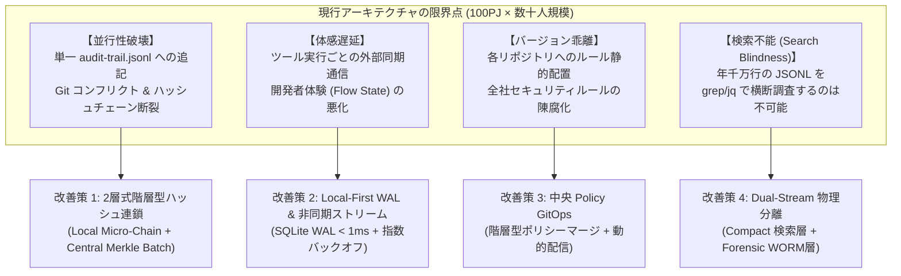
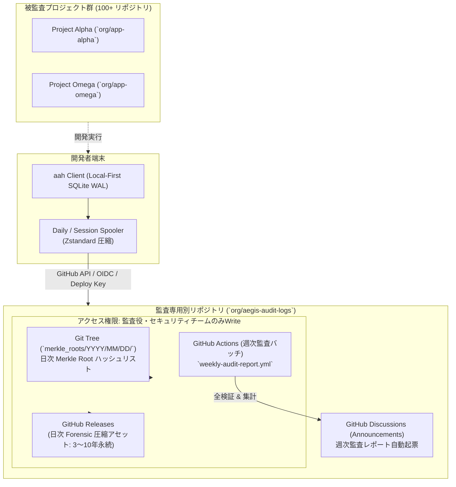
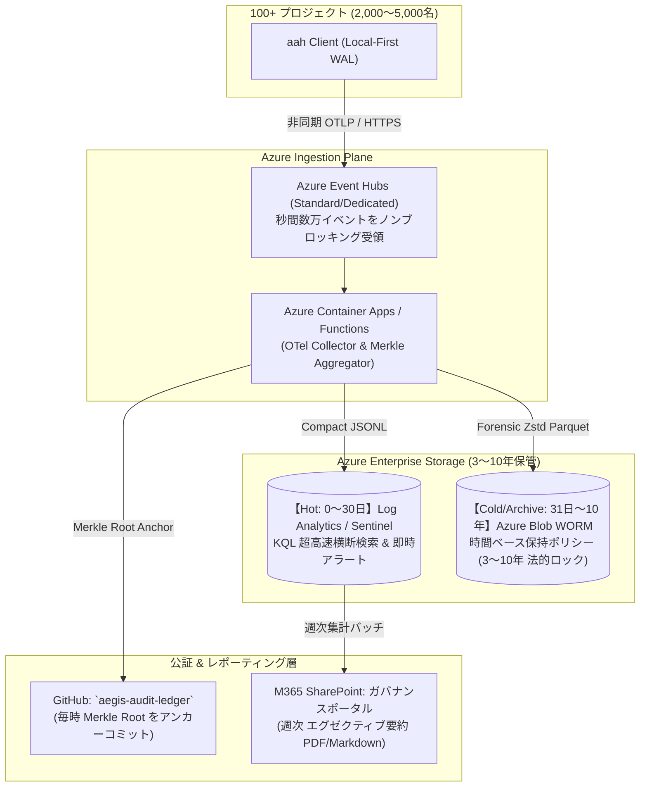
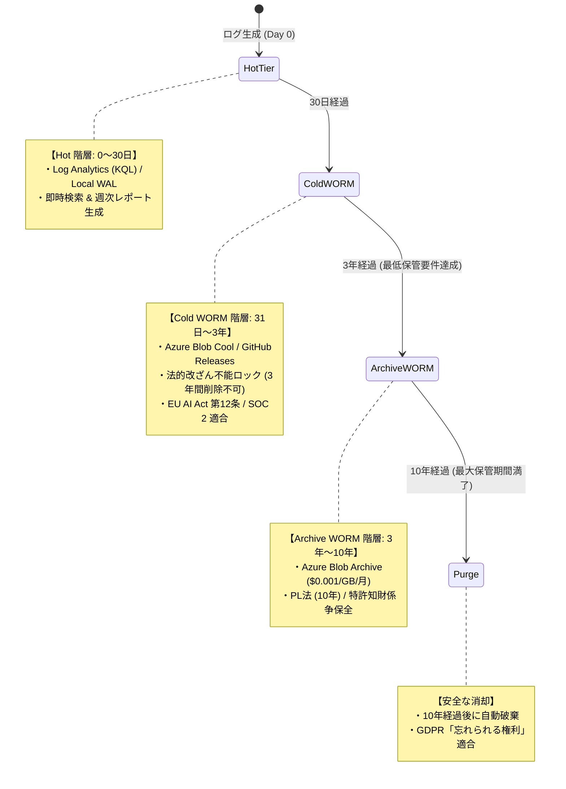
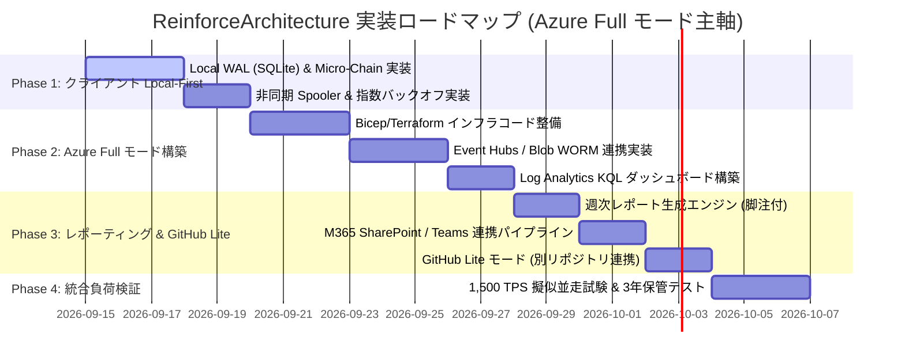

# Agent Aegis Harness (aah) - 大規模エンタープライズ拡張 & 監査記録保管基盤 技術設計書 (Blueprint)

**Document ID:** BLUEPRINT-REINFORCE-001 | **Version:** 1.2.0 | **Status:** Active | **Author:** @sun-flat-yamada (Youhei Yamada)  
**Target Change:** `.devs/changes/2026-09-12_ReinforceArchitecture`

---

## 1. エグゼクティブサマリー & 要件定義

### 1.1 運用前提の確定要件
本設計書は、以下のエンタープライズ運用要件に基づき策定されました。

| 要件領域 | 確定パラメータ・仕様 | 背景・法的根拠 |
| :--- | :--- | :--- |
| **運用規模** | **100 プロジェクト以上 × 各 20〜50 名**<br>（日常アクティブ 2,000〜5,000名） | 全社横断での日常的 AI 開発並走（ピーク時 300〜1,500 req/sec、日次 50〜150万イベント） |
| **主幹プラットフォーム方針** | **Azure フル機能モード (選択肢B 採択)**<br>＋ **GitHub-Native 簡易モード (別リポジトリ分離)** | ・**Azure フル機能モード (Primary):** 大規模・即時フォレンジック・法的 WORM・IaC 自動化<br>・**GitHub-Native 簡易モード (Secondary):** 専用別リポジトリ管理によるゼロインフラ構成 |
| **監査ログ保管期間** | **最低 3 年、最大 10 年** | ・最低 3年: EU AI Act 第12条、SOC 2 Type II、内部統制（J-SOX）<br>・最大 10年: 製造物責任法（PL法）、特許・知財係争、安全保障・基幹システム説明責任 |
| **監査役・法務向け報告** | **週次レポーティング (Weekly)** | ISO/IEC 42001 および NIST AI RMF 準拠の 5 大監査指標 ＋ **引用元・改善意図フッター** |

---

## 2. 100PJ × 数十人並走利用におけるアーキテクチャレビューと改善設計

### 2.1 現行アーキテクチャの課題とボトルネック分析
初期設計（`2026-09-12_initial-create`）に対し、全社 2,000〜5,000名が日常利用した場合の耐性を検証しました。



### 2.2 提案する 4 大アーキテクチャ強化策
1. **2層式階層型ハッシュ連鎖 (Hierarchical Hash Chain & Merkle Batch):**
   - **Layer 1 (Local Session Micro-Chain):** 各開発者・各セッション内で独立したハッシュ連鎖を形成。他者との書き込み競合は一切発生せず、オフライン作業でも完全な暗号連鎖を維持。
   - **Layer 2 (Central Merkle Batch Seal):** 5分〜1時間単位で全イベントを集約し、二分木ハッシュ（Merkle Tree）を構築。頂点の **Merkle Root Hash** を公証台帳にコミット（アンカー封印）。
2. **Local-First WAL & 非同期バッファリング:**
   - クライアント側判定（Sentinel Tier 1 AST/Regex）はインプロセスで **3ms 未満** で完了。
   - 監査イベントはローカル組み込み SQLite WAL に即座に記録（**1ms 未満**）。
   - バックグラウンドデーモンがバッチ送信（50件単位）。回線切断時もローカル退避によりログ欠損率 0% を保証。
3. **中央 Policy GitOps & 動的配信:**
   - 全社共通ルール（Global Core: 禁止コマンド、シークレットパターン）と個別ルール（Project Local: ツールホワイトリスト等）を階層分離。クライアントは起動時に ETag で差分自動更新。
4. **Dual-Stream 物理分離:**
   - 日常監視・検索用の **Compact Trail**（~1.5KB）と、生思考・差分を含む **Forensic Trail**（~40KB、zstandard 圧縮）を物理的に分離して最適配置。

---

## 3. 2大運用モードの詳細設計

### 3.1 2大モードの全体比較対照表

| 評価軸 | ① GitHub-Native 簡易モード (Lite Mode) | ② Azure エンタープライズ フル機能モード (Full Mode) 【主軸】 |
| :--- | :--- | :--- |
| **位置づけ** | **セカンダリ / ゼロインフラ構成** | **プライマリ（選択肢B 採択）/ 基幹エンタープライズ** |
| **主幹インフラ** | **GitHub Enterprise のみ** (専用別リポジトリ) | **Microsoft Azure ＋ GitHub ＋ M365** |
| **ログ保管場所** | **監査専用別リポジトリ** (`aegis-audit-logs`) | **Azure Blob Immutable WORM** (3〜10年保持) |
| **インジェスト方式** | クライアント端末蓄積 → **日次/セッション終了バッチ** | クライアントから **リアルタイム OTLP ストリーミング** |
| **インフラ自動化** | なし（リポジトリ作成と Secret 設定のみ） | **Bicep / Terraform** による完全自動プロビジョニング |
| **横断検索・分析** | GitHub Actions での日次 jq/Python 集計、Code Search | **Azure Log Analytics / Sentinel (KQL)** によるミリ秒検索 |
| **リアルタイムアラート** | △ 日次検知、または PR 時の Sentinel Check | **◎ 即時アラート**（危険コマンド検知後 数秒で通知） |
| **保管期間 (3〜10年)** | GitHub Releases アーカイブ + 週次バックアップ | **Hot → Cool → Cold → Archive 自動階層化**（10年破棄自動化） |

---

### 3.2 モード A: GitHub-Native 簡易モード (別リポジトリ管理方式)

開発プロジェクトのリポジトリを一切肥大化・汚染させず、監査専用の別リポジトリに集約する方式です。



#### 1. リポジトリ分離と権限統制モデル
- **被監査プロジェクト (`org/app-*`):**
  - 一般開発者が自由にコード変更・PR を行うリポジトリ。
  - 監査ログ自体はリポジトリ内にコミット**しない**（`.gitignore` に `.aegis/logs/` を強制指定）。
- **監査専用別リポジトリ (`org/aegis-audit-logs`):**
  - 一般開発者の書き込み権限を遮断（閲覧のみ、または完全非公開）。
  - 各プロジェクトからは **専用 Deploy Key** または **GitHub Actions OIDC (OpenID Connect)** を用いてログをプッシュ。
  - `branch protection` により、管理者権限であっても Force Push および履歴削除を禁止。

#### 2. プロジェクト側設定仕様 (`.aegis/config.yaml`)
```yaml
version: "1.2.0"
project:
  name: "app-alpha"
  tier: "tier-1-mission-critical"

audit_storage:
  mode: "github-lite"
  github_lite:
    # 監査ログ集約先の専用別リポジトリ
    audit_repository: "my-enterprise-org/aegis-audit-logs"
    branch: "main"
    auth_method: "oidc" # [oidc | deploy_key | pat]
    deploy_key_secret_env: "AEGIS_AUDIT_DEPLOY_KEY"
    upload_target: "releases" # 大容量ログは Releases アセットへ格納
    compression: "zstd"
    batch_interval_minutes: 60
    retention_years: 3
```

---

### 3.3 モード B: Azure フル機能モード (選択肢B 採択・主軸設計)

100 プロジェクト・数千名の日常並走を支えるプライマリ構成です。



#### 1. インフラ構成仕様 (IaC: Bicep / Terraform 設計)
Azure フル機能モードのインフラは、IaC により数分で再現・プロビジョニング可能です。

```hcl
# main.tf (抜粋設計)
# 1. Event Hubs (高スループットインジェスト)
resource "azurerm_eventhub_namespace" "aegis" {
  name                = "evh-aegis-enterprise-prod"
  location            = var.location
  resource_group_name = var.resource_group_name
  sku                 = "Standard"
  capacity            = 4 # 最大 4,000 req/sec 吸収
  auto_inflate_enabled = true
  maximum_throughput_units = 10
}

# 2. Immutable Blob Storage (3〜10年 WORM 法的保管)
resource "azurerm_storage_account" "aegis_worm" {
  name                     = "staegisauditwormprod"
  location                 = var.location
  resource_group_name      = var.resource_group_name
  account_tier             = "Standard"
  account_replication_type = "GRS" # 地理冗長
  access_tier              = "Cool"

  # 時間ベース不変ストレージポリシー (最低3年間削除・改変禁止)
  immutability_policy {
    allow_protected_append_writes = true
    period_since_creation_in_days = 1095 # 3年 (最大3650日/10年まで延長可)
    state                         = "Locked" # 管理者含め完全不変
  }
}

# 3. Log Analytics & Sentinel (KQL 超高速検索)
resource "azurerm_log_analytics_workspace" "aegis" {
  name                = "log-aegis-audit-prod"
  location            = var.location
  resource_group_name = var.resource_group_name
  sku                 = "PerGB2018"
  retention_in_days   = 30 # Hot 階層 30日
}
```

---

## 4. 監査ログの「最低3年・最大10年」保管ライフサイクル設計



---

## 5. 監査役・法務部門向け「週次レポーティング」仕様設計

### 5.1 週次追跡すべき 5 大監査指標 (Core Governance KPIs)
国際標準（**ISO/IEC 42001:2023** AIマネジメントシステム、**NIST AI RMF 1.0**、**EU AI Act**、**OWASP Top 10 for LLM**）に準拠した 5 大指標です。

| 指標カテゴリ | 具体的 KPI / メトリクス | 目標値 / 警戒閾値 | 監査役・法務にとっての意味・重要性 |
| :--- | :--- | :--- | :--- |
| **① セキュリティ & 機密保護** | ・**Secret / PII 自動マスキング件数**<br>・**Critical 危険コマンド阻止数** | 目標: 危険実行 0件<br>警戒: 急激な増加 | プロンプトや差分経由での秘密鍵・個人情報の漏洩が確実に防がれているかの客観的証左 |
| **② ポリシー整合性** | ・**Policy Digest 一致率 (準拠率)**<br>・**未許可ツール試行数** | 目標: **100.0%**<br>警戒: < 95.0% | 100プロジェクトが「最新の全社ガバナンス規則」の管理下で正しく稼働しているかの統制証明 |
| **③ 推論ドリフト & 計画整合** | ・**平均ドリフトスコア**<br>・**計画外ファイル変更率** | 目標: ドリフト < 0.15<br>目標: 計画外変更 < 2% | AI が人間の指示（事前承認計画）を逸脱し、勝手なコード改変を行っていないかの監視 |
| **④ 暗号学的完全性** | ・**Hash Chain 改ざん検証結果**<br>・**Merkle Root 公証一致率** | 目標: **エラー 0件**<br>警戒: 1件でも不一致 | 監査ログ自体が開発者や内部不正によって手動改ざんされていないことの数学的証明 |
| **⑤ 活用規模 & コスト健全性** | ・**日常アクティブ PJ・人数**<br>・**消費トークン・推論費用推移** | モニタリング | AI の投資対効果（ROI）の把握と、異常なトークン消費（無限ループ等）の早期警戒 |

---

### 5.2 週次レポート標準フォーマット (引用元・解説フッター付き)

本レポートは、監査役や法務責任者が「なぜこの指標を監視しているのか」「異常時に何を改善すべきか」を即座に参照できるよう、**末尾に詳細な引用元・解説フッター** を備えています。

```markdown
# 🛡️ 週次 AI 開発ガバナンス監査レポート (Weekly AI Governance Executive Summary)
**対象期間:** 2026-09-07 〜 2026-09-13 | **発行日:** 2026-09-14 | **統制責任者:** Aegis Central Sentinel  
**配布先:** 監査役会、法務・コンプライアンス室、CISO、全社開発推進本部

---

## 1. エグゼクティブ・サマリー (全社ガバナンス判定)
- **今週の全社総合ステータス:** 🟢 **NORMAL (良好・統制遵守)**
- **今週の総括:**
  全 104 プロジェクト（アクティブ開発者 3,420 名）において、累計 842,100 回の AI ツール実行を計装・監査しました。
  暗号学的完全性検証（Merkle Hash Chain）は 100% 成功し、ログの改ざん・欠損は検知されませんでした。
  機密情報（APIキー等）のプロンプト混入が 14 件検知されましたが、Aegis Redactor により送信直前にすべて自動マスキングされ、社外流出はゼロ件に抑止されました。

---

## 2. 5大ガバナンス KPI ダッシュボード
| 重点監査項目 | 今週の実績 | 前週比 | 評価 | 基準値 |
| :--- | :---: | :---: | :---: | :--- |
| **全社ポリシー準拠率** | **99.2%** | +0.4% | 🟢 良好 | 98.0% 以上 |
| **危険コマンド即時ブロック数** | **2 件 (阻止済)** | -1 件 | 🟢 抑止成功 | 発生時即時遮断 |
| **機密情報 (Secret/PII) マスキング数** | **14 件 (遮断済)** | +3 件 | 🟡 要注意 | 自動マスキング |
| **平均コンテキストドリフトスコア** | **0.06** | ±0.00 | 🟢 安定 | 0.20 以下 |
| **計画外コード変更試行率** | **0.8%** | -0.2% | 🟢 良好 | 3.0% 以下 |
| **Hash Chain 暗号完全性検証** | **100% PASS** | ±0% | 🟢 改ざんなし | 100% 必須 |

---

## 3. インシデント & ヒヤリハット詳細 (阻止された危険操作)
今週 Sentinel により自動ブロック（BLOCK）された重要インシデント事例です。
1. **[2026-09-09 14:22] プロジェクト: `payment-core-v2`**
   - **事象:** AI エージェントがテスト環境初期化の文脈において `rm -rf /` に類する再帰削除コマンドを発行。
   - **処置:** `RULE-SEC-001` (Tier 1 AST) によりツール実行直前にミリ秒遮断。実環境への影響ゼロ。
2. **[2026-09-11 10:05] プロジェクト: `crm-analytics`**
   - **事象:** 開発者が外部クラウドのアクセスキーを含む設定ファイルをプロンプト内に誤って貼り付け。
   - **処置:** `SensitiveRedactor` が正規表現パターンで即座に `[REDACTED_AWS_KEY]` に置換して送信。

---

## 4. プロジェクト別健全性ランキング & 是正推奨
- **優良プロジェクト (Best Compliance):** `auth-platform`, `billing-gateway`（準拠率 100%、ドリフトゼロ）
- **要改善プロジェクト (Action Required):** `legacy-portal-migration`
  - **課題:** 一部端末で旧バージョンのルールセット（Policy Digest 不一致）が検出されました。
  - **是正措置:** 当該プロジェクト管理者に対し、`aah policy sync` の実行を自動 Issue にて通知済。

---

## 5. 監査役・法務レビュー承認欄 (Sign-off)
- [ ] 常勤監査役 確認済 (Date: ___________)
- [ ] 法務責任者 確認済 (Date: ___________)

---

## 📚 付録: 監査 KPI の引用元・規格参照および改善ガイダンス (Governance Standards & Footnotes)
本レポートの各 KPI は、国際標準規格および主要法規制ガイドラインの要求事項に基づいて設計されています。

1. **機密情報 (Secret/PII) マスキング数**
   - **引用元規格:** [NIST AI RMF 1.0 (MAP 1.5, GOVERN 1.2)](https://airc.nist.gov/AI-RMF-Knowledge-Base) / [OWASP Top 10 for LLM: LLM06 (Sensitive Information Disclosure)](https://owasp.org/www-project-top-10-for-large-language-model-applications/)
   - **意図・改善ガイダンス:** プロンプト投入やコード差分経由での機密情報漏洩をプロアクティブに防止します。検知数が増加傾向にある場合、該当プロジェクトに対するセキュアコーディング教育の実施、および `.aegis/rules/security-policy.yaml` の正規表現パターンの拡充を推奨します。
2. **危険コマンド即時ブロック数**
   - **引用元規格:** [ISO/IEC 42001:2023 附属書 A.8.4 (AIシステムの運用制御)](https://www.iso.org/standard/81230.html) / [OWASP Top 10 for LLM: LLM08 (Excessive Agency)](https://owasp.org/www-project-top-10-for-large-language-model-applications/)
   - **意図・改善ガイダンス:** AI エージェントに付与された実行権限が過剰になり、破壊的コマンド（ディスク削除、DB DROP 等）を実行するリスクを遮断します。ブロック発生時は、ツールの実行権限（最小権限の原則: Least Privilege）を再検証してください。
3. **全社ポリシー準拠率 (Policy Digest 一致率)**
   - **引用元規格:** [EU AI Act 第12条 (Record-keeping & Logging)](https://artificialintelligenceact.eu/article/12/) / [ISO/IEC 42001:2023 箇条 9.1 (監視、測定、分析及び評価)](https://www.iso.org/standard/81230.html)
   - **意図・改善ガイダンス:** 全 100+ プロジェクトが最新の全社統一セキュリティルール（決定論的ハッシュ）下で統制されているかを証明します。準拠率が低下したプロジェクトには CI Gate で警告またはビルド停止を適用します。
4. **コンテキストドリフトスコア & 計画外コード変更率**
   - **引用元規格:** [NIST AI RMF 1.0 (MEASURE 2.7, 2.11 モデル挙動追跡)](https://airc.nist.gov/AI-RMF-Knowledge-Base) / [Google Antigravity Two-Phase Governance](https://cloud.google.com/)
   - **意図・改善ガイダンス:** 人間の指示（事前承認計画: `implementation_plan.md`）から AI が勝手に逸脱する「ハルシネーション改変」を抑止します。ドリフトが増大した場合はプロンプトの細分化やコンテキスト圧縮設定の調整を推奨します。
5. **Hash Chain 暗号完全性検証**
   - **引用元規格:** [SOC 2 Type II (Trust Services Criteria CC6.8, CC7.2 不変証跡)](https://www.aicpa-cima.com/) / [RFC 6962 (Certificate Transparency / Merkle Tree)](https://www.rfc-editor.org/rfc/rfc6962)
   - **意図・改善ガイダンス:** 内部不正や開発者による手動での監査ログ改ざん・隠蔽を数学的に排除します。1件でも不一致が検知された場合はインシデントフォレンジック手順（UC-3）を直ちに発動してください。
```

---

## 6. 設計意思決定記録 (ADR)

### 6.1 ADR-0005: 2層階層型ハッシュ連鎖 (Micro-Chain & Merkle Batch) の採用
- **ステータス:** 承認 (Accepted)
- **決定:** 端末ローカルではセッション単位の `Micro-Chain` で競合を回避し、中央では `Merkle Tree Batch` で束ねて公証する 2 層構造を採用。
- **理由:** 100プロジェクト・数千人の同時書き込みにおいて、単一ファイルへの追記は物理的に破綻するため。

### 6.2 ADR-0007: GitHub-Native 簡易モード (別リポジトリ管理) と Azure フル機能モードの 2 モード提供
- **ステータス:** 承認 (Accepted)
- **決定:** 選択肢Bに基づき「Azure フル機能モード」を主軸として構築し、並行して被監査プロジェクトから分離した「GitHub-Native 簡易モード (専用別リポジトリ)」を整備する。
- **理由:** 組織のインフラ成熟度に応じた柔軟な展開を可能にしつつ、GitHub 利用時にもリポジトリ肥大化を確実に防ぐため。

### 6.3 ADR-0008: ISO/IEC 42001 & NIST AI RMF 準拠の週次 5 大ガバナンス指標の標準化
- **ステータス:** 承認 (Accepted)
- **決定:** レポート末尾に各指標の引用元・根拠・改善ガイダンスを明記した週次エグゼクティブサマリーを標準化する。
- **理由:** 監査役・法務部門が指標の背景意図を理解し、具体的な改善アクションに直結させるため。

---

## 7. 実装・検証ロードマップ (選択肢B 準拠)


