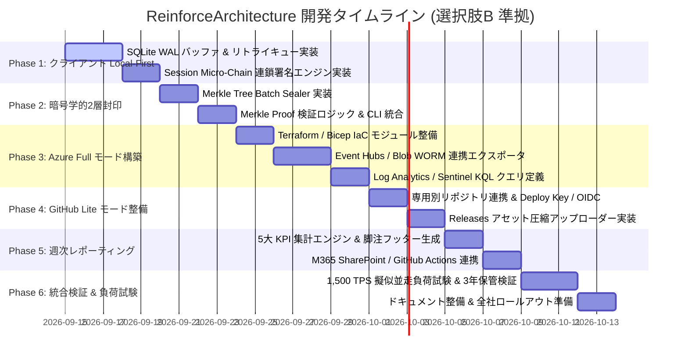
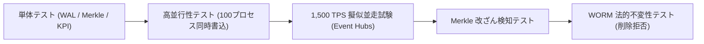

# Agent Aegis Harness (aah) - エンタープライズ拡張 開発計画書 (Plan)

**Document ID:** PLAN-REINFORCE-001 | **Version:** 1.0.0 | **Status:** Active | **Author:** @sun-flat-yamada (Youhei Yamada)  
**Target Change:** `.devs/changes/2026-09-12_ReinforceArchitecture`

---

## 1. 基本方針と開発原則

本開発計画は、`blueprint.md`（v1.2.0）および `spec.md`（v1.0.0）に定義された技術仕様に基づき、**100 プロジェクト・数千名（2,000〜5,000名）規模の日常 AI 並走運用** に耐えうるガバナンス基盤を段階的かつ安全に実装するための実行計画書です。

### 3 大開発原則
1. **Zero-Friction & Zero-Latency (現場の思考速度を奪わない):**
   クライアント側判定はインプロセス（< 3ms）、ログ書込はローカル SQLite WAL（< 1ms）で完結させ、中央転送は完全非同期化する。ネットワーク瞬断や中央負荷によって開発者のエージェント操作がブロックされる事態をゼロにする。
2. **Primary-First with Fallback (Azure Full 主軸と GitHub Lite の共存):**
   選択肢Bの採択に基づき、基幹インフラとなる **Azure フル機能モード（Event Hubs, Blob WORM, Log Analytics, IaC）** を最優先で構築する。同時に、クラウド未配備環境向けの **GitHub-Native 簡易モード（専用別リポジトリ集約方式）** を並行整備し、同一データモデル（`AegisAuditEvent`）での相互移行性を担保する。
3. **Audit Readiness by Default (監査役・法務への即時説明責任):**
   ISO/IEC 42001 および NIST AI RMF に準拠した 5 大ガバナンス KPI と、規格引用・改善意図フッターを備えた週次エグゼクティブサマリーを自動生成可能にする。

---

## 2. マイルストーン & フェーズ計画

### Phase 1: クライアント Local-First 化 & Session Micro-Chain
- **目標:** 単一ファイル追記による Git コンフリクト・排他ロック競合を排除し、オフライン完全対応の高速ローカルバッファを確立。
- **主要成果物:**
  - `src/aegis/recorder/wal.py`（SQLite WAL 組み込みストア）
  - `src/aegis/archivist/micro_chain.py`（セッションスコープ局所連鎖）
  - `tests/test_wal.py`, `tests/test_micro_chain.py`

### Phase 2: 中央 Merkle Batch Sealer & 2層暗号検証エンジン
- **目標:** 多数のクライアントから送られる Micro-Chain ログを束ね、二分木ハッシュ（Merkle Tree）を生成して公証台帳へアンカーする機構を確立。
- **主要成果物:**
  - `src/aegis/archivist/merkle.py`（Merkle Tree 生成 & Merkle Proof 計算）
  - `src/aegis/archivist/notary.py`（GitHub 公証リポジトリへのコミット連携）
  - `tests/test_merkle.py`

### Phase 3: Azure フル機能モード構築 (Primary Target)
- **目標:** 秒間数万イベントを吸収する Event Hubs、3〜10年改ざん不能な Blob WORM、および KQL 超高速横断検索基盤の IaC と連携エクスポーターを構築。
- **主要成果物:**
  - `infra/azure/`（Terraform / Bicep モジュール群）
  - `src/aegis/recorder/azure_exporter.py`（Event Hubs / Blob WORM 転送）
  - `src/aegis/sentinel/kql_rules.py`（Sentinel リアルタイムアラートルール）

### Phase 4: GitHub-Native 簡易モード整備 (Secondary Target)
- **目標:** クラウドインフラ不要で、被監査プロジェクトから分離した専用別リポジトリ（`aegis-audit-logs`）へ安全に集約・永続化するパイプラインを確立。
- **主要成果物:**
  - `src/aegis/recorder/github_spooler.py`（GitHub Releases 添付アセット自動アップロード）
  - `.github/workflows/audit-batch.yml`（専用リポジトリ内集約バッチ）

### Phase 5: 週次ガバナンスレポーティングエンジン
- **目標:** ISO/IEC 42001, NIST AI RMF 準拠の 5 大 KPI、ヒヤリハット事例、および規格引用・改善意図フッターを備えた週次エグゼクティブサマリー自動生成パイプラインを完成。
- **主要成果物:**
  - `src/aegis/refiner/weekly_reporter.py`（KPI 集計・Markdown/PDF レンダラー）
  - `src/aegis/templates/weekly-report-template.md`
  - M365 SharePoint / Teams 連携スクリプト

### Phase 6: 統合負荷検証 (1,500 TPS) & リリース
- **目標:** 100 クライアント、秒間 1,500 リクエストの擬似トラフィックを注入し、レイテンシ < 3ms、ログ欠損 0% を実証。

---

## 3. タスク詳細 WBS (Work Breakdown Structure)

| WBS ID | タスク名 | 担当モジュール | 完了基準 (Acceptance Criteria) |
| :--- | :--- | :--- | :--- |
| **1.1** | SQLite WAL バッファモジュール実装 | `src/aegis/recorder/wal.py` | 1プロセスあたり書込 < 1ms、100並行プロセス書き込みでロック競合エラー 0件 |
| **1.2** | Session Micro-Chain 実装 | `src/aegis/archivist/micro_chain.py` | セッション開始〜終了までのイベントが直前ハッシュを取り込んで決定論的に連鎖すること |
| **1.3** | 非同期 Spooler & 指数バックオフ | `src/aegis/recorder/spooler.py` | オフライン時にローカル WAL へ安全退避し、オンライン復帰時に一括再同期されること |
| **2.1** | Merkle Tree 構築 & Root 算出 | `src/aegis/archivist/merkle.py` | 10,000 件のイベントから < 50ms で Merkle Root を算出し、深さ $\log_2 N$ の証明パスを出力 |
| **2.2** | Merkle Proof 検証ロジック | `src/aegis/archivist/integrity.py` | 任意イベントと Merkle Proof から Root Hash の完全一致を検証できること（1ビット改ざんで即検知） |
| **3.1** | Azure IaC (Terraform) モジュール整備 | `infra/azure/` | Event Hubs, Blob (Immutable WORM: 3〜10年), Log Analytics が `terraform apply` 一発で展開可能 |
| **3.2** | Azure Event Hubs / Blob エクスポータ | `src/aegis/recorder/azure_exporter.py` | OTLP / HTTPS バッチを Event Hubs へ送信し、Blob WORM へ Parquet 形式で格納できること |
| **3.3** | KQL 横断フォレンジッククエリ定義 | `docs/reference/kql-queries.md` | 数千万行から特定 trace_id や CRITICAL 違反を 2 秒以内に抽出できるクエリを整備 |
| **4.1** | GitHub 簡易モード用別リポジトリ連携 | `src/aegis/recorder/github_spooler.py` | 被監査プロジェクトから Deploy Key / OIDC 経由で監査専用別リポジトリへ日次集約できること |
| **4.2** | GitHub Releases 圧縮アセットアップロード | `src/aegis/recorder/github_spooler.py` | Forensic 生ログを zstd 圧縮し、Releases アセットとして自動添付（1ファイル最大2GB） |
| **5.1** | 週次 5 大ガバナンス KPI 集計器 | `src/aegis/refiner/weekly_reporter.py` | マスキング数、危険ブロック数、ポリシー準拠率、ドリフト、完全性合格率を正確に算出 |
| **5.2** | 規格引用元・改善意図フッター生成 | `src/aegis/templates/` | ISO/IEC 42001, NIST AI RMF, EU AI Act, OWASP LLM の引用リンク・解説がフッターに自動付与 |
| **5.3** | M365 SharePoint / Discussions 配信 | `src/aegis/refiner/weekly_reporter.py` | 週次レポート Markdown / PDF を SharePoint または GitHub Discussions へ自動起票 |
| **6.1** | 1,500 TPS 擬似並走ストレステスト | `tests/stress/` | 100プロジェクト × 複数プロセスの擬似並走で、ログ消失 0件、平均レイテンシ < 3ms を実証 |
| **6.2** | 3〜10年 WORM 保管検証テスト | `tests/test_worm.py` | Blob Storage の時間ベース不変ロックが有効であり、管理者権限での上書き・削除が拒否されることを確認 |

---

## 4. テスト・検証戦略

1. **高並行性・ファイル競合排除テスト (`test_wal_concurrency.py`):**
   - 100 個の Python プロセスを同時起動し、各自が秒間 20 件のイベントをローカル WAL に同時書き込み。
   - SQLite WAL モードにより、ロック競合エラーやデッドロックが 0 件で完了することを実証。
2. **Merkle Proof 改ざん検知テスト (`test_merkle_tamper.py`):**
   - 生成された Merkle Tree の任意のリーフノードまたは中間ノードのハッシュを 1 バイト書き換え、`aah verify --merkle-proof` が即座に不正を検知しエラー終了することを確認。
3. **WORM 法的不変性テスト (`test_azure_worm_immutability.py`):**
   - Azure SDK を用い、保持ポリシーが設定された Blob コンテナ内のオブジェクトに対し、管理者認証トークンで削除 API（`DeleteBlob`）および上書き API を発行。
   - Azure から `409 BlobImmutableDueToPolicy` が返却され、物理的に削除不能であることを立証。
4. **週次レポート生成 & リンク整合性テスト (`test_weekly_report.py`):**
   - サンプル監査ログから 5 大 KPI が正しく集計され、末尾のフッターに ISO/IEC 42001、NIST AI RMF、EU AI Act、OWASP LLM、SOC 2 のリンクが正しく展開されることを検証。

---

## 5. リスク評価と緩和策

| リスク要因 | 影響度 | 発生確率 | 緩和策 |
| :--- | :--- | :--- | :--- |
| **Azure Event Hubs のコスト増大** | 中 | 低 | クライアント側で 50件または 5秒単位のバッチ送信を行い、API 呼出回数を 1/50 に圧縮。Auto-inflate で必要時のみスケール。 |
| **オフライン端末のローカルディスク逼迫** | 中 | 低 | ローカル SQLite WAL には最大 100MB（約 50,000 件）のローテーション制限を設け、古い送信済みログは自動パージ。 |
| **GitHub Releases の API レートリミット** | 中 | 低 | リアルタイム送信を行わず、1日1回・1プロジェクト1ファイルに集約してアップロード。2,000人規模でも日次 2,000 req で枠内に余裕収容。 |
| **開発者のルール改定無視・旧バージョン使用** | 高 | 中 | CI Gate（`aah check --strict`）で `policy_hash_digest` の不一致を検知し、未更新プロジェクトのマージを自動遮断。 |
