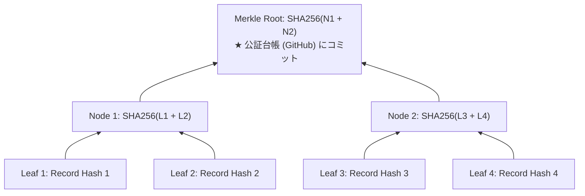

# Agent Aegis Harness (aah) - エンタープライズ拡張 技術仕様書 (Spec)

**Document ID:** SPEC-REINFORCE-001 | **Version:** 1.0.0 | **Status:** Active | **Author:** @sun-flat-yamada (Youhei Yamada)  
**Target Change:** `.devs/changes/2026-09-12_ReinforceArchitecture`

---

## 1. 概要と適用範囲

### 1.1 背景と目的
本仕様書は、`blueprint.md`（v1.2.0）に基づき、**100 プロジェクト以上・数千名（2,000〜5,000名）の開発者が日常的に AI を並走利用する大規模エンタープライズ環境** において、`agent-aegis-harness (aah)` を安定稼働させるための具体的なコンポーネント仕様、データモデル、暗号アルゴリズム、インフラ連携、および週次レポーティングの技術仕様を定めた文書です。

### 1.2 確定された基本要件
1. **主幹プラットフォーム方針:** **Microsoft Azure フル機能モード（選択肢B 採択）** を主軸とし、インフラ調達を不要とする **GitHub-Native 簡易モード（専用別リポジトリ集約方式）** を並行提供。
2. **保管期間:** **最低 3 年、最大 10 年** の 4 階層ライフサイクル（Hot / Cold WORM / Archive WORM / 安全消却）。
3. **監査役・法務向け報告:** **週次レポーティング**（ISO/IEC 42001, NIST AI RMF 準拠の 5 大 KPI ＋ 引用元・改善意図フッター）。

---

## 2. システムアーキテクチャ & コンポーネント詳細仕様

```mermaid
flowchart TB
    subgraph ClientLayer ["1. クライアント層 (開発者端末 / 各プロジェクト)"]
        Adapter["Antigravity / IDE / CLI Hooks"]
        SentinelInProc["Sentinel Tier 1 (AST/Regex < 3ms)"]
        LocalMicroChain["Micro-Chain Hasher (Session Scoped)"]
        LocalWAL[("Local SQLite WAL Buffer<br/>(書込 < 1ms / リングバッファ)")]
        AsyncSpooler["Async Batch Spooler<br/>(指数バックオフ / 圧縮転送)"]

        Adapter --> SentinelInProc
        SentinelInProc --> LocalMicroChain
        LocalMicroChain --> LocalWAL
        LocalWAL -.-> AsyncSpooler
    end

    subgraph ModeSwitch {"運用モード分岐"}
        AsyncSpooler -->|Mode B: Azure Full (Primary)| AzureIngress
        AsyncSpooler -->|Mode A: GitHub Lite (Secondary)| GitHubAuditRepo
    end

    subgraph ModeB_Azure ["2. Azure フル機能モード (Enterprise Full)"]
        AzureIngress["Azure Event Hubs (秒間数万件受領)"]
        IngressWorker["Azure Container Apps (OTel Ingress & Merkle Sealer)"]
        HotADX[("Azure Log Analytics / Sentinel (Hot: 30日)<br/>KQL 横断高速検索 & リアルタイムアラート")]
        ColdWORM[("Azure Blob Immutable WORM (3〜10年)<br/>時間ベース保持ポリシー (法的ロック)")]
        AzureIngress --> IngressWorker
        IngressWorker --> HotADX
        IngressWorker --> ColdWORM
    end

    subgraph ModeA_GitHub ["3. GitHub-Native 簡易モード (Lite)"]
        GitHubAuditRepo["監査専用別リポジトリ (`aegis-audit-logs`)"]
        GitTree["Git Tree: 日次 Merkle Root ハッシュ一覧"]
        ReleasesAssets["GitHub Releases: 日次 Forensic 圧縮アセット (3〜10年)"]
        GitHubAuditRepo --> GitTree
        GitHubAuditRepo --> ReleasesAssets
    end

    subgraph GovernancePlane ["4. ガバナンス・公証・レポーティング層"]
        GitAnchor["GitHub `aegis-audit-ledger`: 毎時 Merkle Root 公開公証"]
        WeeklyEngine["週次監査レポート自動生成エンジン (5大KPI + 脚注付録)"]
        SharePointM365["M365 SharePoint / Teams: 監査役・法務ポータル"]
        GitHubDiscussions["GitHub Discussions: 週次レポート自動起票"]

        IngressWorker -.->|毎時アンカー| GitAnchor
        HotADX --> WeeklyEngine
        GitTree --> WeeklyEngine
        WeeklyEngine -->|Azure Full| SharePointM365
        WeeklyEngine -->|GitHub Lite| GitHubDiscussions
    end
```

---

## 3. 暗号学的完全性仕様: 2層階層型ハッシュ連鎖 (Hierarchical Hash Chain)

### 3.1 Layer 1: Local Session Micro-Chain (局所セッション連鎖)
各クライアント端末・各セッション内で独立して生成される線形ハッシュ連鎖。

- **初期化:** セッション開始時に `GENESIS_HASH = "0" * 64` から開始。
- **レコードハッシュ計算式:**
  $$H_{\text{local}}^{(k)} = \text{SHA256}\left( \text{CanonicalJSON}(\text{Payload}_k) \parallel H_{\text{local}}^{(k-1)} \right)$$
  - $\text{CanonicalJSON}$: キーを辞書順ソートし、空白・改行を除去した正規化 JSON。
  - $\text{Payload}_k$: `trace_id`, `step_index`, `timestamp`, `trigger`, `action_payload`, `sentinel_verdict` 等。
- **特徴:** 他の開発者や他プロセスとのロック競合・Git コンフリクトが原理的にゼロ。オフライン環境でも完全な暗号連鎖を保証。

### 3.2 Layer 2: Central Merkle Tree Batch Sealing (中央マークルツリーバッチ封印)
中央 Ingress（Azure フルモード）または日次集計バッチ（GitHub 簡易モード）が、一定間隔（5分〜1時間）で全プロジェクトから収集された監査レコードを束ねて封印。



1. **バッチ集約アルゴリズム:**
   - バッチ期間内に到着した $N$ 個のイベントの `current_record_hash` をソートし、リーフノード $L_1, L_2, \dots, L_N$ を形成。
   - 二分木ハッシュを再帰的に計算し、頂点 **Merkle Root** を算出。
2. **監査パス (Merkle Proof):**
   - 任意のイベント $k$ がこのバッチに含まれていたことを証明するため、深さ $\mathcal{O}(\log_2 N)$ の兄弟ハッシュリストを生成。
3. **公証アンカー (Anchor Commit):**
   - 算出された Merkle Root、バッチタイムスタンプ、イベント総数を記載したブロックメタデータを、GitHub の `aegis-audit-ledger` リポジトリへ自動コミット（GPG / GitHub OIDC 署名付き）。

---

## 4. データモデル拡張仕様 (`src/aegis/models.py`)

大規模運用および 2 モード対応、週次レポーティングのために拡張される Pydantic v2 モデル定義です。

```python
"""
Agent Aegis Harness - Enterprise Extension Models
Adds Multi-Mode Storage, Merkle Proof, and Weekly Governance Models
"""
from __future__ import annotations
from datetime import datetime
from enum import Enum
from typing import Any, Dict, List, Optional
from pydantic import BaseModel, Field

class StorageMode(str, Enum):
    AZURE_FULL = "azure-full"
    GITHUB_LITE = "github-lite"

class AzureFullConfig(BaseModel):
    event_hubs_connection_str: Optional[str] = Field(None, description="Event Hubs 接続文字列 (Env 参照推奨)")
    event_hubs_name: str = Field("aegis-audit-events", description="対象 Event Hub 名")
    blob_account_name: str = Field(..., description="WORM Blob ストレージアカウント名")
    blob_container: str = Field("aegis-audit-worm", description="不変コンテナ名")
    log_analytics_workspace_id: Optional[str] = Field(None, description="Log Analytics Workspace ID")
    otlp_endpoint: str = Field("https://aegis-ingress.corp.internal:4317", description="Ingress Gateway OTLP Endpoint")

class GitHubLiteConfig(BaseModel):
    audit_repository: str = Field(..., description="監査ログ専用別リポジトリ (例: org/aegis-audit-logs)")
    branch: str = Field("main", description="アンカーブランチ名")
    auth_method: str = Field("oidc", description="認証方式 (oidc | deploy_key | pat)")
    deploy_key_secret_env: str = Field("AEGIS_AUDIT_DEPLOY_KEY", description="Deploy Key 環境変数名")
    upload_target: str = Field("releases", description="保管先 (releases | branch_commit)")
    compression: str = Field("zstd", description="圧縮方式 (zstd | gzip)")
    batch_interval_minutes: int = Field(60, description="ローカル集約バッチ間隔")
    retention_years: int = Field(3, ge=3, le=10, description="保管期間年数")

class AuditStorageConfig(BaseModel):
    mode: StorageMode = Field(StorageMode.AZURE_FULL, description="監査ログ保管モード")
    azure_full: Optional[AzureFullConfig] = None
    github_lite: Optional[GitHubLiteConfig] = None

class MerkleProof(BaseModel):
    batch_id: str
    batch_timestamp: datetime
    leaf_index: int
    total_leaves: int
    merkle_root: str
    audit_path: List[str] = Field(..., description="兄弟ハッシュリスト (Log2 N)")
    anchor_commit_sha: Optional[str] = None

class GovernanceKPIItem(BaseModel):
    kpi_id: str
    name: str
    current_value: float
    previous_value: float
    delta_percent: float
    status: str = Field(..., description="NORMAL | WARNING | CRITICAL")
    target_threshold: float
    reference_standard: str = Field(..., description="引用元規格 (例: ISO/IEC 42001, NIST AI RMF)")
    reference_url: str = Field(..., description="規格・ガイドラインリンク")
    guidance: str = Field(..., description="意図および改善ガイダンス")

class WeeklyGovernanceReport(BaseModel):
    report_id: str
    period_start: datetime
    period_end: datetime
    generation_time: datetime = Field(default_factory=datetime.utcnow)
    overall_status: str = Field(..., description="NORMAL | WARNING | CRITICAL")
    executive_summary: str
    total_active_projects: int
    total_active_users: int
    total_tool_executions: int
    kpi_metrics: List[GovernanceKPIItem]
    incident_highlights: List[Dict[str, Any]]
    project_compliance_ranking: List[Dict[str, Any]]
    sign_off_status: Dict[str, Optional[str]] = Field(default_factory=dict)
```

---

## 5. 監査ログ保管ライフサイクル仕様 (3〜10年)

| 階層名 | 期間 | 格納先 (Azure Full) | 格納先 (GitHub Lite) | 適用ポリシー・制約 | 主な用途 |
| :--- | :--- | :--- | :--- | :--- | :--- |
| **Hot 階層** | **0 〜 30日** | Azure Log Analytics (Workspace 30日保持) | ローカル SQLite WAL ＋ 直近サマリー JSONL | 高速インデックス化、クエリ課金 | 週次レポート生成、リアルタイムインシデント検知 |
| **Cold WORM 階層** | **31日 〜 3年**<br>【最低保管】 | Azure Blob Storage (Cool 階層)<br>時間ベース保持ポリシー (1,095日) | 監査専用別リポジトリの **GitHub Releases 添付アセット** (zstd) | **法的不変ロック (WORM)**<br>管理者含め削除・改変不能 | EU AI Act 第12条、SOC 2 Type II、内部統制適合証明 |
| **Archive WORM 階層**| **3年 〜 10年**<br>【最大保管】 | Azure Blob Storage (Archive 階層)<br>超低コスト保管 ($0.001/GB/月) | GitHub Releases 永続保管 ＋ 四半期コールドバックアップ | 訴訟ホールド可能<br>データ取り出しに数時間要する | 製造物責任（PL法 10年）、特許知財係争、基幹システム説明責任 |
| **安全消却** | **10年経過後** | Azure Storage ライフサイクル管理による自動消去 | GitHub Actions による期限満了アセット消去 | 暗号学的消滅<br>無期限保持の漏洩リスク排除 | GDPR「忘れられる権利」適合、プライバシー保護 |

---

## 6. 監査役・法務部門向け「週次レポーティング」仕様

### 6.1 週次 5 大ガバナンス KPI 定義仕様
1. **KPI-SEC-01 (機密情報マスキング数):**
   $$\text{MaskingCount} = \sum (\text{AegisRedactor が置換したシークレット・PIIの総数})$$
2. **KPI-SEC-02 (危険コマンド即時ブロック数):**
   $$\text{BlockCount} = \sum (\text{Sentinel が BLOCK 判定した危険コマンド数})$$
3. **KPI-CMP-01 (全社ポリシー準拠率):**
   $$\text{ComplianceRate} = \frac{\text{最新の policy\_hash\_digest と一致して稼働したプロジェクト数}}{\text{稼働中の全プロジェクト数}} \times 100\%$$
4. **KPI-DRF-01 (推論ドリフト & 計画外変更率):**
   $$\text{UnplannedModRatio} = \frac{\text{計画外ファイル変更試行数}}{\text{全ファイル変更試行数}} \times 100\%$$
5. **KPI-INT-01 (Hash Chain 暗号完全性検証):**
   $$\text{IntegrityPassRate} = \frac{\text{Hash Chain / Merkle Proof 検証合格レコード数}}{\text{総レコード数}} \times 100\% \quad (\text{目標: 100.0\%})$$

### 6.2 レポート末尾フッターの付録データ構造
すべての週次レポートの末尾には、以下の 5 項目が標準付録（Footnotes）として必ず展開されます。

```markdown
---
## 📚 付録: 監査 KPI の引用元・規格参照および改善ガイダンス (Governance Standards & Footnotes)

1. **機密情報 (Secret/PII) マスキング数**
   - **引用元規格:** [NIST AI RMF 1.0 (MAP 1.5, GOVERN 1.2)](https://airc.nist.gov/AI-RMF-Knowledge-Base) / [OWASP Top 10 for LLM: LLM06 (Sensitive Information Disclosure)](https://owasp.org/www-project-top-10-for-large-language-model-applications/)
   - **意図・改善ガイダンス:** プロンプト投入やコード差分経由での機密情報漏洩をプロアクティブに防止します。検知数が増加傾向にある場合、該当プロジェクトに対するセキュアコーディング教育の実施、および `.aegis/rules/security-policy.yaml` の正規表現パターンの拡充を推奨します。

2. **危険コマンド即時ブロック数**
   - **引用元規格:** [ISO/IEC 42001:2023 附属書 A.8.4 (AIシステムの運用制御)](https://www.iso.org/standard/81230.html) / [OWASP Top 10 for LLM: LLM08 (Excessive Agency)](https://owasp.org/www-project-top-10-for-large-language-model-applications/)
   - **意図・改善ガイダンス:** AI エージェントに付与された実行権限が過剰になり、破壊的コマンド（ディスク削除、DB DROP 等）を実行するリスクを遮断します。ブロック発生時は、ツールの実行権限（最小権限の原則: Least Privilege）を再検証してください。

3. **全社ポリシー準拠率 (Policy Digest 一致率)**
   - **引用元規格:** [EU AI Act 第12条 (Record-keeping & Logging)](https://artificialintelligenceact.eu/article/12/) / [ISO/IEC 42001:2023 箇条 9.1 (監視、測定、分析及び評価)](https://www.iso.org/standard/81230.html)
   - **意図・改善ガイダンス:** 全 100+ プロジェクトが最新の全社統一セキュリティルール（決定論的ハッシュ）下で統制されているかを証明します。準拠率が低下したプロジェクトには CI Gate で警告またはビルド停止を適用します。

4. **コンテキストドリフトスコア & 計画外コード変更率**
   - **引用元規格:** [NIST AI RMF 1.0 (MEASURE 2.7, 2.11 モデル挙動追跡)](https://airc.nist.gov/AI-RMF-Knowledge-Base) / [Google Antigravity Two-Phase Governance](https://cloud.google.com/)
   - **意図・改善ガイダンス:** 人間の指示（事前承認計画: `implementation_plan.md`）から AI が勝手に逸脱する「ハルシネーション改変」を抑止します。ドリフトが増大した場合はプロンプトの細分化やコンテキスト圧縮設定の調整を推奨します。

5. **Hash Chain 暗号完全性検証**
   - **引用元規格:** [SOC 2 Type II (Trust Services Criteria CC6.8, CC7.2 不変証跡)](https://www.aicpa-cima.com/) / [RFC 6962 (Certificate Transparency / Merkle Tree)](https://www.rfc-editor.org/rfc/rfc6962)
   - **意図・改善ガイダンス:** 内部不正や開発者による手動での監査ログ改ざん・隠蔽を数学的に排除します。1件でも不一致が検知された場合はインシデントフォレンジック手順（UC-3）を直ちに発動してください。
```

---

## 7. IaC (Infrastructure as Code) 仕様 (Azure Full モード)

Azure フル機能モードのインフラは、Terraform モジュール構造として `infra/azure/` 配下に提供されます。

```text
infra/azure/
├── main.tf                    # プロバイダ定義 & 全体オーケストレーション
├── variables.tf               # パラメータ定義 (保持年数, レプリケーション等)
├── outputs.tf                 # エンドポイント, 接続情報出力
├── modules/
│   ├── event_hubs/            # Ingestion Layer (Standard, Auto-inflate)
│   ├── immutable_storage/     # WORM Layer (Time-based Retention: 1,095〜3,650日)
│   ├── log_analytics/         # Analytics Layer (Workspace, Sentinel, KQL)
│   └── container_ingress/     # Ingress Gateway (OTel Collector, Merkle Sealer)
```

---

## 8. CLI インターフェース拡張仕様 (`aah`)

```text
aah [OPTIONS] COMMAND [ARGS]...

Enterprise Commands:
  report        週次・月次の監査役・法務向けガバナンスレポートを生成
                Options: --weekly / --monthly, --format [markdown|pdf|json], --output <path>
  spool         ローカル WAL に蓄積された未送信イベントを中央/別リポジトリへ強制フラッシュ
  sync          中央 Policy Registry から最新ルールを取得しローカルキャッシュとダイジェストを同期
  verify        暗号学的完全性を検証
                Options: --log-file <path>, --merkle-proof <path>, --reproduce
```
