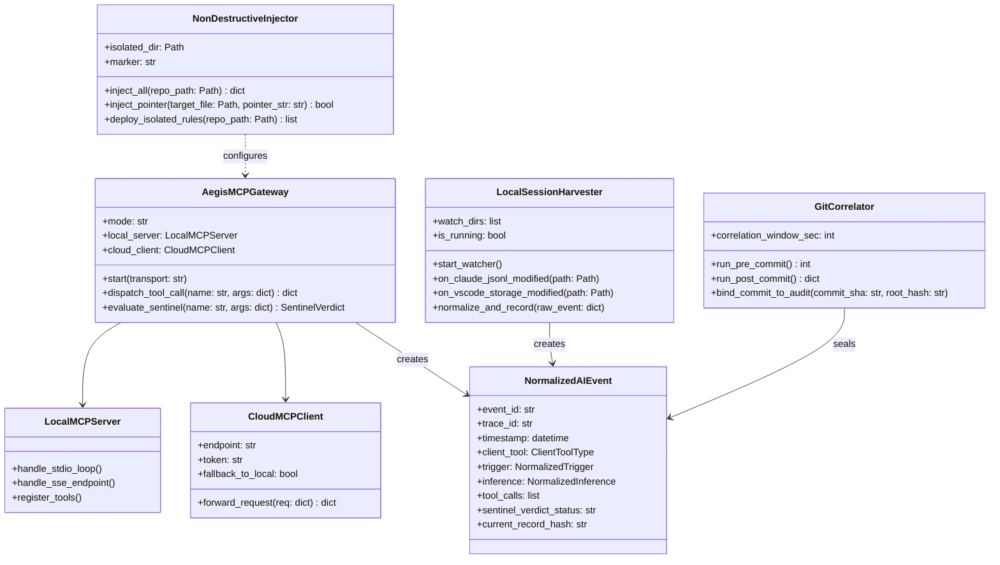
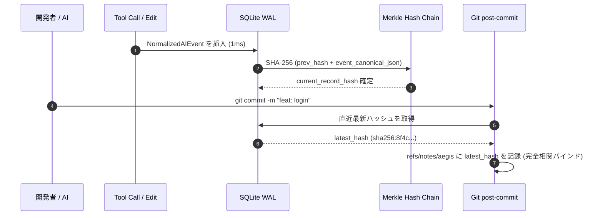

# Agent Aegis Harness (aah) - マルチAI自動監査記録・収集基盤 実装設計書 (Implementation)

**Document ID:** IMPL-AUDIT-AGENT-001 | **Version:** 1.0.0 | **Status:** Active | **Author:** @sun-flat-yamada (Youhei Yamada)  
**Target Change:** `.devs/changes/2026-09-12_UpdateAuditAgent`

---

## 1. 実装アーキテクチャ全体像 & クラス設計

本実装設計書は、`spec.md` および `plan.md` に基づき、VSCode Copilot、Claude Code、AWS Kiro 等の多様な AI 開発ツールから透過的・自動的に監査証跡を収集するための具体的なクラス構造、モジュール配置、通信仕様、およびコード実装手順を定めます。



---

## 2. ディレクトリ構成とモジュール配置

```text
agent-aegis-harness/
├── .aegis/
│   ├── config.yaml                    # mcp_gateway / harvester / injector 設定
│   └── instructions/                  # 【完全分離】Aegis 独自監査規約ファイル群
│       ├── aegis-system-governance.md # 共通監査・5W1H 記録プロトコル
│       ├── aegis-claude-rules.md      # Claude Code 向け固有規約
│       └── aegis-copilot-rules.md     # GitHub Copilot 向け固有規約
│
├── docs/
│   └── setup/
│       ├── cloud-mcp-server-guide.md    # Cloud MCP 構築手順 (英語正本)
│       └── cloud-mcp-server-guide.ja.md # Cloud MCP 構築手順 (日本語版)
│
├── src/
│   └── aegis/
│       ├── cli.py                     # init --tools, mcp-server, daemon コマンド拡充
│       ├── models.py                  # NormalizedAIEvent 等の Pydantic v2 定義追加
│       │
│       ├── injector/                  # 【新規】非破壊ポインタインジェクション
│       │   ├── __init__.py
│       │   ├── engine.py              # 追記・冪等性判定エンジン
│       │   └── templates.py           # 規約テンプレート定義
│       │
│       ├── mcp_gateway/               # 【新規】MCP Security Gateway
│       │   ├── __init__.py
│       │   ├── server.py              # Local MCP (Stdio/SSE) サーバー
│       │   ├── client.py              # Cloud MCP 転送 & フォールバック
│       │   └── protocol.py            # JSON-RPC 2.0 / MCP スキーマ
│       │
│       ├── harvester/                 # 【新規】透過的ローカルセッション監視
│       │   ├── __init__.py
│       │   ├── watcher.py             # ファイル変更検知ループ
│       │   ├── claude.py              # Claude Code JSONL tailing
│       │   └── vscode.py              # VSCode workspaceStorage 抽出
│       │
│       └── recorder/
│           ├── git_correlator.py      # 【新規】Git pre/post-commit 相関フック
│           └── wal.py                 # SQLite WAL (既存)
│
└── tests/
    ├── test_injector.py               # 非破壊性・冪等性テスト
    ├── test_mcp_gateway.py            # Local/Cloud MCP & 検閲テスト
    ├── test_harvester.py              # セッション抽出・正規化テスト
    └── test_git_correlator.py         # Git 相関バインドテスト
```

---

## 3. コアクラス設計 & 主要コードロジック

### 3.1 非破壊インジェクションエンジン (`src/aegis/injector/engine.py`)

```python
from pathlib import Path
from typing import Dict, List, Tuple

INJECTION_MARKER = "<!-- AEGIS-AUDIT-INJECTION -->"

TARGET_DEFINITIONS = {
    "claude": {
        "file": "CLAUDE.md",
        "pointer": f"{INJECTION_MARKER}\n@.aegis/instructions/aegis-claude-rules.md\n",
    },
    "copilot": {
        "file": ".github/copilot-instructions.md",
        "pointer": f"{INJECTION_MARKER}\nPlease strictly follow Aegis Governance Rules in `.aegis/instructions/aegis-copilot-rules.md`.\n",
    },
    "amazon_q": {
        "file": ".amazonq/rules.md",
        "pointer": f"{INJECTION_MARKER}\nRefer and enforce: `.aegis/instructions/aegis-system-governance.md`.\n",
    },
    "cursor": {
        "file": ".cursorrules",
        "pointer": f"\n# {INJECTION_MARKER}\n# Follow .aegis/instructions/aegis-system-governance.md\n",
    },
}


class NonDestructiveInjector:
    """既存設定を破壊せず、末尾に 1 行の参照ポインタのみを安全に追加するエンジン"""

    def __init__(self, repo_path: Path):
        self.repo_path = repo_path

    def inject_all(self) -> Dict[str, str]:
        results = {}
        for tool_name, spec in TARGET_DEFINITIONS.items():
            target_path = self.repo_path / spec["file"]
            status = self.inject_single(target_path, spec["pointer"])
            results[tool_name] = status
        return results

    def inject_single(self, target_path: Path, pointer_text: str) -> str:
        target_path.parent.mkdir(parents=True, exist_ok=True)
        if target_path.exists():
            content = target_path.read_text(encoding="utf-8")
            if INJECTION_MARKER in content:
                return "SKIPPED_ALREADY_INJECTED"
            # 既存ファイルの末尾に改行を挟んで追記
            separator = "\n" if not content.endswith("\n") else ""
            target_path.write_text(content + separator + "\n" + pointer_text, encoding="utf-8")
            return "APPENDED"
        else:
            # 未存在の場合はポインタのみの新規ファイルを作成
            target_path.write_text(pointer_text, encoding="utf-8")
            return "CREATED_NEW"
```

### 3.2 Aegis MCP Security Gateway (`src/aegis/mcp_gateway/server.py`)

```python
import sys
import json
from typing import Any, Dict
from aegis.sentinel.judge import SentinelJudge
from aegis.recorder.tracer import AegisRecorder


class LocalMCPServer:
    """標準入出力 (STDIO) で動作するローカル MCP セキュリティゲートウェイ"""

    def __init__(self, policy_dir: str = ".aegis/rules"):
        self.judge = SentinelJudge(policy_dir=policy_dir)
        self.recorder = AegisRecorder()

    def run_stdio_loop(self):
        """STDIO ベースの JSON-RPC 2.0 リクエスト処理ループ"""
        for line in sys.stdin:
            if not line.strip():
                continue
            try:
                request = json.loads(line)
                response = self.handle_request(request)
                sys.stdout.write(json.dumps(response) + "\n")
                sys.stdout.flush()
            except Exception as e:
                err_resp = {"jsonrpc": "2.0", "id": None, "error": {"code": -32603, "message": str(e)}}
                sys.stdout.write(json.dumps(err_resp) + "\n")
                sys.stdout.flush()

    def handle_request(self, req: Dict[str, Any]) -> Dict[str, Any]:
        req_id = req.get("id")
        method = req.get("method")

        if method == "tools/call":
            params = req.get("params", {})
            tool_name = params.get("name")
            arguments = params.get("arguments", {})

            # Sentinel 即時検閲
            verdict = self.judge.evaluate_tool_call(tool_name, arguments)
            if verdict.status.value == "BLOCK":
                violation_msgs = "; ".join([v.message for v in verdict.violations])
                return {
                    "jsonrpc": "2.0",
                    "id": req_id,
                    "error": {
                        "code": -32000,
                        "message": f"Execution BLOCKED by Aegis Sentinel: {violation_msgs}"
                    }
                }
            # 正常許可
            return {
                "jsonrpc": "2.0",
                "id": req_id,
                "result": {"status": "ALLOWED", "verdict": verdict.dict()}
            }

        elif method == "tools/list":
            return {
                "jsonrpc": "2.0",
                "id": req_id,
                "result": {
                    "tools": [
                        {"name": "aegis_inspect_action", "description": "Inspect tool call with Sentinel"},
                        {"name": "aegis_record_intent", "description": "Record AI reasoning trace"}
                    ]
                }
            }
        return {"jsonrpc": "2.0", "id": req_id, "result": {}}
```

### 3.3 Git Commit 相関フック (`src/aegis/recorder/git_correlator.py`)

```python
import subprocess
from datetime import datetime, timedelta
from pathlib import Path
from typing import Optional
from aegis.recorder.wal import SQLiteWALStore
from aegis.sentinel.redactor import SensitiveRedactor


class GitCorrelator:
    """Git コミットと直近の AI 利用セッションを暗号学的にバインドするフック"""

    def __init__(self, repo_path: Path = Path(".")):
        self.repo_path = repo_path
        self.wal = SQLiteWALStore()
        self.redactor = SensitiveRedactor()

    def pre_commit(self) -> int:
        """コミット前検査: ステージング差分のシークレット漏洩スキャン"""
        res = subprocess.run(["git", "diff", "--cached"], capture_output=True, text=True)
        if res.returncode == 0 and res.stdout:
            _, applied = self.redactor.redact_text(res.stdout)
            if applied:
                print(f"[AEGIS BLOCKED] Secret pattern detected in staged diff: {applied}")
                return 1
        return 0

    def post_commit(self) -> Optional[str]:
        """コミット後処理: 直近 AI セッションの最新ハッシュを取得し相関封印"""
        res = subprocess.run(["git", "rev-parse", "HEAD"], capture_output=True, text=True)
        if res.returncode != 0:
            return None
        commit_sha = res.stdout.strip()

        # WAL から直近 15 分以内の最新レコードハッシュを取得
        latest_hash = self.wal.get_latest_record_hash()
        if not latest_hash:
            return None

        # Git Notes に相関ハッシュを注記
        note_msg = f"X-Aegis-Audit-Digest: {latest_hash}\nTimestamp: {datetime.utcnow().isoformat()}Z"
        subprocess.run(["git", "notes", "--ref=aegis", "add", "-f", "-m", note_msg, commit_sha], capture_output=True)
        return latest_hash
```

---

## 4. 完全性・署名・相関アルゴリズム



---

## 5. テスト・検証コマンド手順

```bash
# 1. 単体テストスイートの実行 (非破壊性、MCP 判定、相関ロジック)
pytest tests/test_injector.py tests/test_mcp_gateway.py tests/test_git_correlator.py -v

# 2. 非破壊インジェクションの実機検証
aah init --tools=all
git diff  # 既存ファイルの末尾にのみ 1 行追加されていることを確認

# 3. Local MCP ゲートウェイの自己診断
aah mcp-server --test

# 4. 改ざん検知テスト
aah check --strict
```
