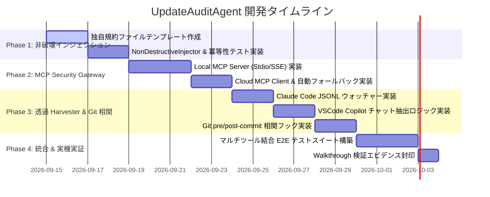

# Agent Aegis Harness (aah) - マルチAI自動監査記録・収集基盤 開発計画書 (Plan)

**Document ID:** PLAN-AUDIT-AGENT-001 | **Version:** 1.0.0 | **Status:** Active | **Author:** @sun-flat-yamada (Youhei Yamada)  
**Target Change:** `.devs/changes/2026-09-12_UpdateAuditAgent`

---

## 1. 基本方針と開発原則

本開発計画は、`blueprint.md`（v1.1.0）および `spec.md`（v1.0.0）に定義された技術仕様に基づき、**開発者の日常的な AI 利用（VSCode Copilot、Claude Code、AWS Kiro 等）から透過的かつ漏れなく監査証跡を収集する基盤** を段階的・安全に実装するための実行計画書です。

### 3 大開発原則
1. **Non-Destructive First (既存コンテキストの完全不可侵):**
   既存の `CLAUDE.md` や `copilot-instructions.md` を決して上書きせず、独自の監査規約（`.aegis/instructions/`）を完全分離配備し、末尾への 1 行ポインタ追加のみを安全に行う。
2. **Zero Flow Disruption (開発者体験の阻害ゼロ):**
   インライン補完のキーストローク監視による遅延を排除（遅延 0ms）。Local MCP 判定は 1ms 未満、Harvester はメモリ 20MB 未満の超軽量待機とし、開発者の集中（Flow State）を守る。
3. **Dual-Vector Resilience (二重防壁と耐障害性):**
   能動的誘導（Active）と透過的外部捕捉（Passive）を併用することで、片方のバイパスや障害が発生しても証跡の欠損率 0% を保証する。Cloud MCP ダウン時も Local MCP への自動縮退により作業を停止させない。

---

## 2. マイルストーン & フェーズ計画

### Phase 1: 独自規約分離 & 非破壊インジェクター
- **目標:** 既存のプロジェクト設定を 1 文字も壊さずに、各 AI ツールが自動で Aegis 監査規約を読み込む仕組みを確立。
- **主要成果物:**
  - `src/aegis/injector/engine.py`（非破壊ポインタ挿入エンジン）
  - `.aegis/instructions/`（共通およびツール別規約テンプレート）
  - `tests/test_injector.py`

### Phase 2: MCP Security Gateway (Local & Cloud)
- **目標:** Claude Code や Cursor 等の MCP ツール呼び出しを安全に中継・検閲する Gateway を実装。Local をデフォルトとし、設定で Cloud 接続およびフォールバックを可能にする。
- **主要成果物:**
  - `src/aegis/mcp_gateway/server.py`（Local MCP Stdio/SSE サーバー）
  - `src/aegis/mcp_gateway/client.py`（Cloud MCP 転送クライアント）
  - `tests/test_mcp_gateway.py`

### Phase 3: 透過 Harvester デーモン & Git 相関フック
- **目標:** 開発者が手動で何も操作しなくても、Claude Code の対話ログや VSCode のチャット履歴を自動抽出し、Git コミットと暗号学的にバインドする。
- **主要成果物:**
  - `src/aegis/harvester/watcher.py`（イベント駆動ファイル監視）
  - `src/aegis/recorder/git_correlator.py`（Git pre/post-commit フック）
  - `tests/test_harvester.py`, `tests/test_git_correlator.py`

### Phase 4: 総合 E2E 検証 & 実機テスト
- **目標:** 実際に Claude Code、VSCode Copilot、CLI を使ったシナリオを走行させ、監査ログが欠損なく SQLite WAL および Merkle Hash Chain に記録されることを実証。
- **主要成果物:**
  - `tests/e2e/test_multi_agent_audit.py`
  - `.devs/changes/2026-09-12_UpdateAuditAgent/walkthrough.md`

---

## 3. タスク詳細 WBS (Work Breakdown Structure)

| WBS ID | タスク名 | 担当モジュール | 完了基準 |
| :--- | :--- | :--- | :--- |
| **T1.1** | 独自規約テンプレートの作成 | `.aegis/instructions/` | 共通規約、Claude 規約、Copilot 規約の 3 ファイルが作成され、frontmatter を満たすこと。 |
| **T1.2** | 非破壊インジェクターの実装 | `src/aegis/injector/engine.py` | 既存ファイルへの 1 行追記、新規作成、マーカー存在時の冪等スキップが動作すること。 |
| **T2.1** | Local MCP Server の実装 | `src/aegis/mcp_gateway/server.py` | JSON-RPC 2.0 に準拠し、`SentinelJudge` の検閲（BLOCK/ALLOW）が正常に機能すること。 |
| **T2.2** | Cloud MCP Client & フォールバック | `src/aegis/mcp_gateway/client.py` | Cloud エンドポイントへの転送と、タイムアウト/接続失敗時の Local 自動縮退が動くこと。 |
| **T3.1** | Claude Code セッション Harvester | `src/aegis/harvester/claude.py` | `~/.claude/projects/` の JSONL 追記を検知し、Prompt/Thinking/ToolCall を抽出できること。 |
| **T3.2** | VSCode Copilot チャット抽出 | `src/aegis/harvester/vscode.py` | `workspaceStorage` のセッションレコードを安全にリードし正規化できること。 |
| **T3.3** | Git pre/post-commit 相関フック | `src/aegis/recorder/git_correlator.py` | コミット時に直近 AI イベントと Git SHA をバインドし、ハッシュ連鎖へ記録すること。 |
| **T4.1** | CLI サブコマンドの拡充 | `src/aegis/cli.py` | `aah init --tools`, `aah mcp-server`, `aah daemon` コマンドが追加されること。 |
| **T4.2** | 総合 E2E 検証 & レポート作成 | `tests/e2e/`, `walkthrough.md` | 全自動テストがパスし、実機検証ログが記録・封印されること。 |

---

## 4. テスト・検証戦略

### 4.1 単体テスト (Unit Tests)
- **非破壊性テスト (`test_injector.py`):**
  - 既存の `CLAUDE.md`（カスタム指示入り）にインジェクターを実行し、既存行が 100% 保持され末尾に 1 行のみ追加されることをアサート。
  - 2 回連続で実行しても行数が増えないこと（冪等性）。
- **MCP 検閲テスト (`test_mcp_gateway.py`):**
  - `rm -rf /` を引数に含む Tool Call が即座に `BLOCK` されること。
  - 正常なファイルリード Tool Call が `ALLOW` され、監査ログが発行されること。
- **Cloud フォールバックテスト:**
  - Cloud URL を意図的に無効なポートに向けた際、5 秒以内に Local モードへ自動フェイルオーバーすること。

### 4.2 改ざん検知テスト (Integrity Tests)
- Harvester が記録した監査ログの 1 バイトを改ざんし、`aah check` および `aah verify` が直ちに不整合を検知して exit 1 を返すことを検証。

### 4.3 E2E 擬似マルチツール検証
- テストスクリプトから Claude Code 形式の JSONL 追記、および Git コミットを連続実行し、`NormalizedAIEvent` が正しく相関付けられて `audit-trail.jsonl` に保存されることを確認。

---

## 5. リスク評価と緩和策

| リスク要因 | 影響度 | 発生確率 | 緩和策 |
| :--- | :---: | :---: | :--- |
| **プロジェクトの既存ルール破壊** | 高 | 低 | マーカー検知による追記専用ロジックを徹底し、上書き（truncate/write）をコードレベルで禁止。 |
| **端末のメモリ・CPU 負荷** | 中 | 低 | ポーリングではなく OS のネイティブファイル監視（inotify / ReadDirectoryChangesW）を採用。 |
| **Cloud MCP 通信途絶** | 中 | 中 | クライアント側に自動ローカルフォールバックと SQLite WAL スプール機能を実装。 |
| **ログ容量の肥大化** | 中 | 低 | インライン補完は採用コード差分のみを対象とし、キーストローク全記録を避ける（ADR-02）。 |
