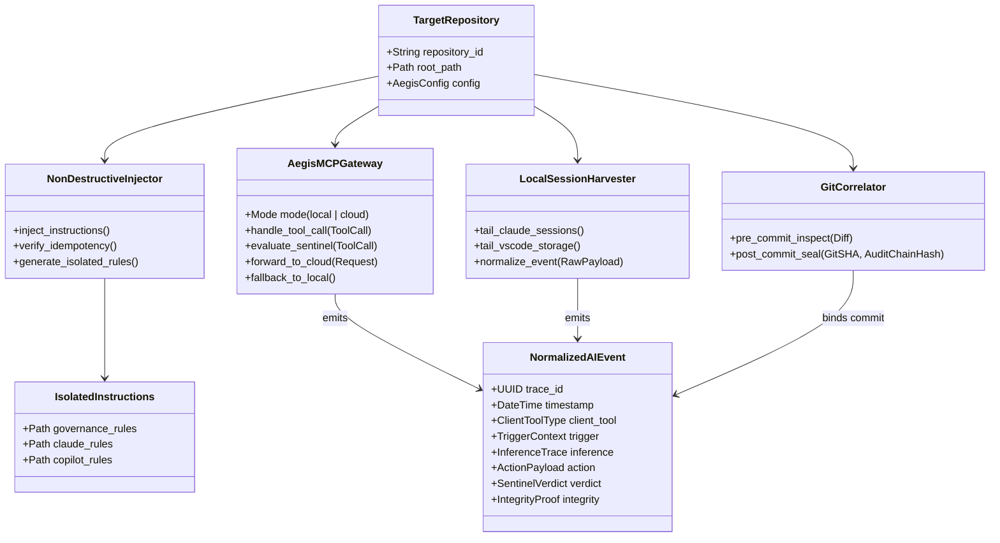

# Agent Aegis Harness (aah) - マルチAI自動監査記録・収集基盤 技術仕様書 (Spec)

**Document ID:** SPEC-AUDIT-AGENT-001 | **Version:** 1.0.0 | **Status:** Active | **Author:** @sun-flat-yamada (Youhei Yamada)  
**Target Change:** `.devs/changes/2026-09-12_UpdateAuditAgent`

---

## 1. システム全体像とドメインモデル

### 1.1 目的と適用範囲
本仕様書は、`blueprint.md`（v1.1.0）の設計合意に基づき、開発者が日常的に使用する多彩な AI 開発支援ツール（VSCode Copilot、Claude Code、AWS Kiro、Copilot CLI 等）において、**意識的な手動操作を一切介さず、完全自動で監査証跡を収集・暗号封印するための機能仕様およびデータモデル** を定義します。

### 1.2 ドメインモデル (Domain Entity Model)



---

## 2. データ構造 & スキーマ定義 (Pydantic v2)

### 2.1 共通正規化監査イベントスキーマ (`src/aegis/models.py` 拡張)

すべてのツールから収集されるイベントは、以下の共通データモデルへ正規化されます。

```python
from datetime import datetime
from enum import Enum
from typing import Any, Dict, List, Optional
from pydantic import BaseModel, Field


class ClientToolType(str, Enum):
    ANTIGRAVITY = "antigravity"
    CLAUDE_CODE = "claude-code"
    GITHUB_COPILOT = "github-copilot"
    GITHUB_COPILOT_CLI = "github-copilot-cli"
    AWS_KIRO = "aws-kiro"
    CURSOR = "cursor"
    WINDSURF = "windsurf"
    CLI = "cli"


class TriggerSourceType(str, Enum):
    CHAT_PROMPT = "chat_prompt"
    INLINE_EDIT = "inline_edit"
    TERMINAL_COMMAND = "terminal_command"
    MCP_TOOL_CALL = "mcp_tool_call"
    GIT_COMMIT = "git_commit"


class NormalizedTrigger(BaseModel):
    source: TriggerSourceType
    raw_prompt: Optional[str] = None
    sanitized_prompt: str
    user_identity: str
    session_id: str


class NormalizedInference(BaseModel):
    model_name: Optional[str] = None
    chain_of_thought_summary: Optional[str] = None
    raw_thinking_hash: Optional[str] = None
    user_intent_summary: Optional[str] = None


class NormalizedToolCall(BaseModel):
    tool_name: str
    arguments: Dict[str, Any]
    output_summary: Optional[str] = None
    status: str # SUCCESS | ERROR | BLOCKED


class GitCorrelationContext(BaseModel):
    commit_sha: Optional[str] = None
    branch_name: Optional[str] = None
    staged_files: List[str] = []
    diff_hash: Optional[str] = None
    correlation_proof: Optional[str] = None


class NormalizedAIEvent(BaseModel):
    """マルチツール共通の正規化 5W1H 監査イベント"""
    event_id: str = Field(..., description="Unique UUID for this event")
    trace_id: str = Field(..., description="Trace/Session ID linking multi-turn actions")
    timestamp: datetime = Field(default_factory=datetime.utcnow)
    client_tool: ClientToolType
    
    # 5W1H Core Components
    trigger: NormalizedTrigger
    inference: NormalizedInference
    tool_calls: List[NormalizedToolCall] = []
    affected_files: List[str] = []
    git_context: Optional[GitCorrelationContext] = None
    
    # Governance & Integrity
    sentinel_verdict_status: str # ALLOW | WARN | BLOCK
    policy_hash_digest: str
    previous_record_hash: str
    current_record_hash: str
```

### 2.2 設定ファイル拡張スキーマ (`.aegis/config.yaml`)

```yaml
version: "1.3.0"
repository_id: "payment-checkout-service"

# 1. 能動的指示インジェクション設定
instruction_injector:
  enabled: true
  marker_tag: "<!-- AEGIS-AUDIT-INJECTION -->"
  isolated_dir: ".aegis/instructions"
  target_tools:
    claude_code:
      target_file: "CLAUDE.md"
      pointer: "@.aegis/instructions/aegis-claude-rules.md"
    copilot:
      target_file: ".github/copilot-instructions.md"
      pointer: "Strictly enforce audit governance: follow .aegis/instructions/aegis-copilot-rules.md"
    amazon_q:
      target_file: ".amazonq/rules.md"
      pointer: "Follow security & compliance rules in .aegis/instructions/aegis-system-governance.md"

# 2. MCP Security Gateway 設定
mcp_gateway:
  mode: "local" # [local | cloud]
  local:
    transport: "stdio"
    port: 8080 # sse transport 選択時
  cloud:
    endpoint: "https://aegis-mcp.enterprise.internal/v1/mcp"
    auth_token_env: "AEGIS_CLOUD_MCP_TOKEN"
    tls_verify: true
    timeout_sec: 5.0
    fallback_to_local_on_error: true

# 3. 透過的監視 (Harvester) 設定
harvester:
  enabled: true
  poll_interval_ms: 1000 # ファイル変更検知後のバッファリング間隔
  watch_claude: true
  watch_vscode_copilot: true
  watch_aws_q: true

# 4. Git コミット相関設定
git_correlator:
  enabled: true
  max_correlation_window_sec: 900 # 過去15分以内のAIセッションを相関付け
  block_on_secret_leak: true
```

---

## 3. インターフェース仕様 & コアアルゴリズム

### 3.1 非破壊インジェクター (`aegis.injector.NonDestructiveInjector`)

#### アルゴリズム:
1. **独立規約ファイルの生成:**
   - `.aegis/instructions/` 配下に、各ツールの仕様に合わせた独立 Markdown を生成（上書き安全）。
     - `aegis-system-governance.md`（共通コア規約、5W1H、シークレット禁止）
     - `aegis-claude-rules.md`（Claude Code 向け: MCP 優先利用、変更理由の出力形式）
     - `aegis-copilot-rules.md`（Copilot Chat 向け: コミット前検証、推論要約の出力形式）
2. **既存グローバル定義ファイルへのポインタ挿入:**
   - 既存ファイルが存在するか判定。
   - **存在する場合:**
     - ファイル内容に対象マーカー文字列 `<!-- AEGIS-AUDIT-INJECTION -->` が含まれているかを検索。
     - 含まれていれば **何もしない（冪等性確保）**。
     - 含まれていなければ、ファイルの末尾に改行を追加した上で以下の 2 行を追記（Append）：
       ```markdown
       <!-- AEGIS-AUDIT-INJECTION -->
       <POINTER_STRING>
       ```
   - **存在しない場合:**
     - 親ディレクトリを作成し、上記 2 行のみを含む新規ファイルを作成。

### 3.2 Aegis MCP Security Gateway (`aegis.mcp_gateway`)

#### プロトコル仕様:
- **標準:** Model Context Protocol (MCP) JSON-RPC 2.0 (Stdio / SSE Transport)
- **公開ツール一覧:**
  - `aegis_inspect_action`: エージェントが実行予定のアクション（コマンド/ファイル変更）を事前検閲するツール。
  - `aegis_record_intent`: エージェントが自身の思考・推論根拠（Why）を明示的に登録するツール。
- **インターセプト動作:**
  - クライアントからの Tool Call リクエストを受信。
  - `SentinelJudge` による事前検閲：
    - 禁止コマンド（`rm -rf /`, `DROP DATABASE`, `chmod 777` 等）を正規表現・AST で検査。
    - 機微ファイル（`.env`, `*.pem`, `id_rsa`）への書き込みを検査。
  - 判定結果:
    - **BLOCK:** JSON-RPC エラーレスポンス（エラーコード `-32000`, メッセージ: `Execution BLOCKED by Aegis Sentinel: <violation>`）を即時返却。
    - **ALLOW:** 正常レスポンスを返却し、バックグラウンドで `NormalizedAIEvent` を SQLite WAL に記録。

#### Cloud モード時のフォールバック仕様:
```python
def handle_tool_call(request: ToolCallRequest) -> ToolCallResponse:
    if config.mcp_gateway.mode == "cloud":
        try:
            return cloud_client.post(request, timeout=config.mcp_gateway.cloud.timeout_sec)
        except (TimeoutError, NetworkError) as e:
            if not config.mcp_gateway.cloud.fallback_to_local_on_error:
                raise e
            logger.warning("Cloud MCP unavailable, falling back to Local Sentinel.")
    
    # Local MCP 処理を実行
    return local_sentinel.evaluate_and_execute(request)
```

### 3.3 ローカルセッション監視ハーベスター (`aegis.harvester`)

#### 監視対象ファイルと解析ルール:
1. **Claude Code:**
   - パス: `~/.claude/projects/<project_hash>/sessions/<session_id>.jsonl`
   - 各行の JSON をパースし、`type == "user"` からプロンプト、`type == "assistant"` の `thinking` ブロックから推論根拠、`tool_use` ブロックからツール実行を抽出。
2. **VSCode GitHub Copilot:**
   - パス: `~/AppData/Roaming/Code/User/workspaceStorage/<workspace_id>/state.vscdb` (Windows) / `~/.config/Code/User/workspaceStorage/...` (Linux/macOS)
   - `interactive.sessions` テーブルの差分レコードを抽出。ユーザープロンプトと AI 回答をペアリング。
3. **正規化と WAL 登録:**
   - 抽出した生データを `SensitiveRedactor` でマスキング後、`NormalizedAIEvent` に変換して SQLite WAL に挿入。

### 3.4 Git コミット相関フック (`aegis.git_correlator`)

#### フック動作仕様:
- **`pre-commit`:**
  - `git diff --cached` を取得。
  - `SensitiveRedactor` でスキャンし、API キーや平文パスワードを検知した場合はエラー終了（exit 1）。
- **`post-commit`:**
  - コミット SHA とブランチ名を取得。
  - ローカル SQLite WAL から直近 15 分以内の未相関 AI イベント群をクエリ。
  - 最新の Merkle Root ハッシュを取得し、`CommitCorrelationContext` を作成。
  - `audit-trail.jsonl` に相関イベントをコミットし、Git Notes（`refs/notes/aegis`）にハッシュを記録。

---

## 4. セキュリティ、マスキング、コンテキストドリフト抑止要件

### 4.1 シークレット & PII マスキング (SensitiveRedactor)
- ログ収集時に以下のパターンをインプロセスで検出・置換（`<REDACTED_TYPE:hash>`）：
  - クラウドクレデンシャル（AWS Access Key, GCP Service Account, Azure Connection String）
  - API トークン（GitHub PAT, Anthropic Key, OpenAI Key）
  - 個人情報（Email, IPv4/IPv6, クレジットカード番号）

### 4.2 コンテキストドリフト（ルール希薄化）抑止
- 長時間チャットやトークン制限によるルールドリフトを防ぐため、Aegis MCP Gateway は Tool Call 応答ヘッダーに常に現在の `policy_hash_digest` と必須遵守メタデータを付与してコンテキスト内に最新のガバナンス状態を再注入（Re-injection）する。

---

## 5. 非機能要件 (NFR: Non-Functional Requirements)

| 要件領域 | 目標指標 | 検証方法 |
| :--- | :--- | :--- |
| **Local MCP 判定遅延** | **1ms 未満** (p99 < 3ms) | 単体ベンチマークテスト (AST/Regex in-memory) |
| **Cloud MCP 通信遅延** | **200ms 未満** (社内閉域網) | OTel 分散トレース計測 |
| **Harvester メモリフットプリント** | **20MB 未満** | OS プロセスモニタリング |
| **CPU 使用率 (アイドル時)** | **0.1% 未満** (イベント駆動待機) | OS パフォーマンスカウンタ |
| **ログ欠損率 (フォールバック時)** | **0.00%** (Local WAL 自動退避) | 擬似ネットワーク遮断テスト |
| **改ざん検知耐性** | **1bit 改ざんで即検知** | SHA-256 Merkle Chain 検証 |

---

## 6. 次のステップ

本技術仕様書（Stage 2: `spec.md`）に基づき、続いて **Stage 3: `plan.md`（開発計画書 & WBS・テスト戦略）** の策定へ進みます。
各コンポーネント（インジェクター、MCP ゲートウェイ、ハーベスター、Git 相関フック）の実装優先順位とテストケースを具体化します。
