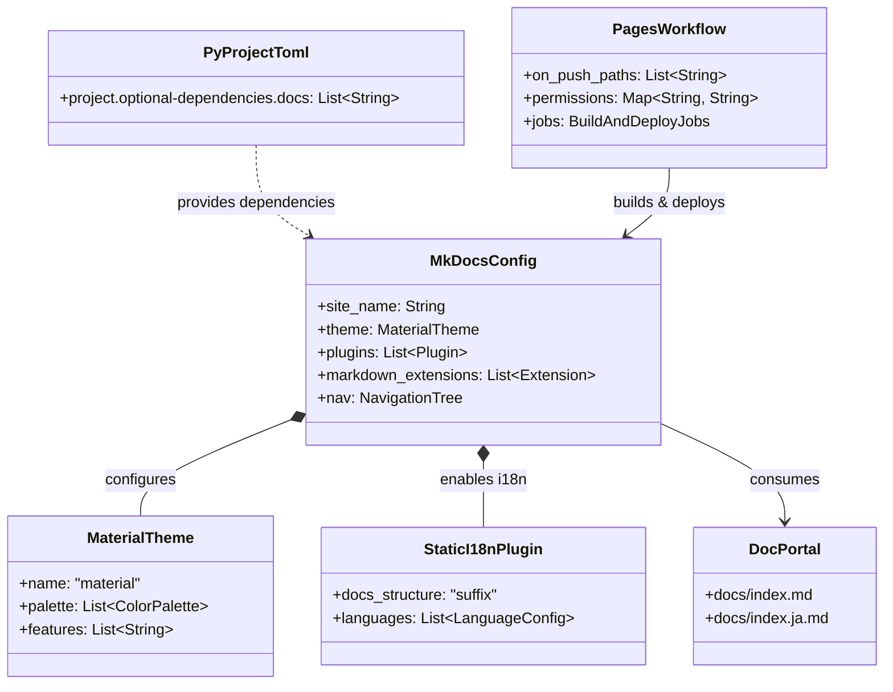

# GitHub Pages ドキュメント公開基盤 実装詳細設計書 (implementation)

## 1. クラス設計 & アーキテクチャ構成図

本機能は Python ベースの静的サイト生成ツールチェーン（Material for MkDocs）と GitHub Actions の最新デプロイ基盤を統合します。



---

## 2. ディレクトリ構成と変更ファイル配置

```text
agent-aegis-harness/
├── .github/
│   └── workflows/
│       ├── audit-ci.yml               # (既存)
│       ├── frontmatter-linter.yml     # (既存)
│       ├── self-refine-batch.yml      # (既存)
│       └── pages.yml                  # [NEW] GitHub Pages デプロイ CI
├── docs/
│   ├── index.md                       # [NEW] ポータル概要トップ (EN)
│   ├── index.ja.md                    # [NEW] ポータル概要トップ (JA)
│   ├── ARCHITECTURE.md
│   ├── ARCHITECTURE.ja.md
│   ├── adr/
│   ├── operations/
│   └── setup/
├── Makefile                           # [MODIFY] docs-serve, docs-build ターゲット追加
├── pyproject.toml                     # [MODIFY] optional-dependencies.docs 追加
└── mkdocs.yml                         # [NEW] MkDocs サイト設定・ナビゲーション定義
```

---

## 3. コアデータモデル・設定詳細定義

### 3.1 `pyproject.toml` 拡張
```toml
[project.optional-dependencies]
dev = [
    "pytest>=7.4.0",
    "pytest-asyncio>=0.23.0",
]
docs = [
    "mkdocs-material>=9.5.0",
    "mkdocs-static-i18n>=1.2.0",
]
```

### 3.2 `mkdocs.yml` のナビゲーションおよび機能設定
- Material for MkDocs の `features`:
  - `navigation.instant` (高速SPA遷移)
  - `navigation.tracking` (スクロール追従アンカー)
  - `navigation.tabs` (トップバーの大項目タブ表示)
  - `navigation.sections` (サイドバーのセクション構造化)
  - `navigation.expand` (初期展開)
  - `navigation.top` (Back to top ボタン)
  - `search.suggest` (検索候補サジェスト)
  - `search.highlight` (検索ヒット箇所のハイライト)
  - `content.code.copy` (コードブロックのコピーボタン)
- テーマカラー:
  - Default: Indigo (ライトモード)
  - Slate: Indigo (ダークモード)
- プラグイン:
  - `search`: 日本語トークナイザー対応 (`lang: [en, ja]`)
  - `i18n`: サフィックスモード (`docs_structure: suffix`)

### 3.3 `docs/index.md` & `docs/index.ja.md`
Agent Aegis Harness の概要、アーキテクチャ、セットアップへの誘導リンクを含む。
`.aegis/schemas/frontmatter.schema.json` 必須属性を網羅。

### 3.4 `.github/workflows/pages.yml`
- OIDC によるセキュアな認証
- `actions/upload-pages-artifact@v5` および `actions/deploy-pages@v5` によるゼロコンフィグ公開

---

## 4. 実行・テストコマンド手順

1. **ドキュメント依存のインストール**:
   ```bash
   pip install -e ".[docs]"
   ```
2. **ローカルプレビュー起動**:
   ```bash
   mkdocs serve
   ```
3. **静的厳格ビルド検証**:
   ```bash
   mkdocs build --strict
   ```
4. **Front-matter スキーマ検証**:
   ```bash
   python -c "import json, sys, yaml, jsonschema; from pathlib import Path; schema = json.loads(Path('.aegis/schemas/frontmatter.schema.json').read_text(encoding='utf-8')); [jsonschema.validate(instance=yaml.safe_load(f.read_text(encoding='utf-8').split('---', 2)[1]), schema=schema) for f in Path('.').glob('docs/**/*.md') if not '.venv' in f.parts]"
   ```
5. **既存テストスイート検証**:
   ```bash
   pytest tests/
   ```
