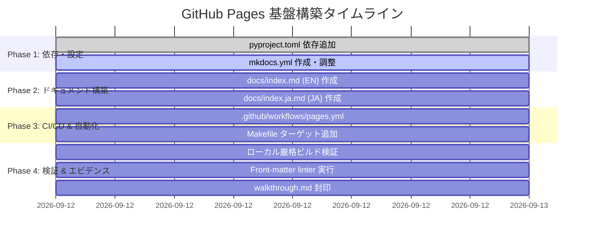

# GitHub Pages ドキュメント公開基盤 開発計画 & WBS (plan)

## 1. 開発方針・原則

1. **決定論的ビルドと完全再現性**:
   - `pyproject.toml` にてバージョン制約を明示し、ローカル（開発者環境）とリモート（GitHub Actions）で同一の静的 HTML/JS/CSS 成果物が生成されることを保証する。
2. **多層防御とスキーマ検証**:
   - 生成するすべての新規ドキュメント（`docs/index.md`, `docs/index.ja.md`）は、既存の `.aegis/schemas/frontmatter.schema.json` によるフロントマターバリデーションを通過させる。
   - `mkdocs build --strict` による警告ゼロ・リンク切れゼロをビルド成功条件とする。
3. **既存エコシステムとの完全な調和**:
   - Python/pip 基盤にドキュメントビルドを統合し、Node.js などの外部ツールチェーンを持ち込まない。
   - 既存の CI ワークフロー（`audit-ci.yml`, `frontmatter-linter.yml`）と競合しない設計とする。

---

## 2. マイルストーン & タイムライン

---

## 3. タスク詳細 WBS (Work Breakdown Structure)

| WBS ID | タスク名 | 成果物 | 完了基準 (Done Definition) |
| :--- | :--- | :--- | :--- |
| **WBS-1** | 依存関係の拡張 | [`pyproject.toml`](file:///v:/repos/sun.flat.yamada/agent-aegis-harness/pyproject.toml) | `[project.optional-dependencies]` に `docs`（`mkdocs-material`, `mkdocs-static-i18n`）が追加され、`pip install -e ".[docs]"` が正常完了すること。 |
| **WBS-2** | ポータル トップページの作成 | [`docs/index.md`](file:///v:/repos/sun.flat.yamada/agent-aegis-harness/docs/index.md), [`docs/index.ja.md`](file:///v:/repos/sun.flat.yamada/agent-aegis-harness/docs/index.ja.md) | フロントマタースキーマに準拠し、全体ナビゲーションや各ガイドへのリンクを含む概要ページが日英で作成されること。 |
| **WBS-3** | MkDocs 設定の構築 | [`mkdocs.yml`](file:///v:/repos/sun.flat.yamada/agent-aegis-harness/mkdocs.yml) | テーマ設定、Material アイコン、i18n 言語切替、Mermaid/コードハイライト拡張、ナビゲーションツリーが定義されていること。 |
| **WBS-4** | GitHub Actions ワークフロー定義 | [`.github/workflows/pages.yml`](file:///v:/repos/sun.flat.yamada/agent-aegis-harness/.github/workflows/pages.yml) | `main` への push または手動実行で、OIDC 権限を用いた公式 Pages デプロイパイプライン（`upload-pages-artifact@v5`, `deploy-pages@v5`）が定義されていること。 |
| **WBS-5** | 開発作業用コマンドの追加 | [`Makefile`](file:///v:/repos/sun.flat.yamada/agent-aegis-harness/Makefile) | `make docs-serve`, `make docs-build`, `make install-docs` が追加され、開発者がローカルで即座にビルド検証できること。 |
| **WBS-6** | 静的検証 & テスト実行 | `site/`, ログ | `mkdocs build --strict`、`frontmatter-linter.yml` 相当のスクリプト、および既存 pytest がすべてエラー 0 でパスすること。 |

---

## 4. テスト・検証戦略

1. **ビルド整合性テスト (`mkdocs build --strict`)**:
   - すべての内部相対リンク（`.md` 参照）が解決可能か。
   - 画像や Mermaid 図の構文エラーがないか。
   - 未登録の孤立ドキュメントがないか警告レベルで検証。
2. **多言語構造テスト**:
   - `site/index.html`（英語）と `site/ja/index.html`（日本語）が正しく出力されるか。
   - 言語切替リンクが生成されているか。
3. **フロントマター・スキーマ適合テスト**:
   - 新規作成した `docs/index.md` および `docs/index.ja.md` が `.aegis/schemas/frontmatter.schema.json` のバリデーションに合格すること。
4. **リグレッション防止テスト**:
   - 既存の全単体テスト（`pytest tests/`）および Sentinel 監査（`aah check --strict`）が影響を受けずにパスすること。

---

## 5. リスク評価と緩和策

| リスク | 影響度 | 発生確率 | 緩和策 |
| :--- | :---: | :---: | :--- |
| **既存の Markdown 内部リンクの不整合** | 中 | 中 | `mkdocs build --strict` を用いて、警告をエラーとして扱い事前にすべて捕捉・修正する。 |
| **多言語プラグインによるビルド遅延** | 低 | 低 | `mkdocs-static-i18n` は静的サフィックスを直接処理するため高速。CI 上でのキャッシュ（pip cache）を活用。 |
| **GitHub Pages 側の設定不備** | 中 | 低 | デプロイ先を OIDC 連携環境（`environment: github-pages`）に設定し、ドキュメントにリポジトリ設定手順を明記する。 |
