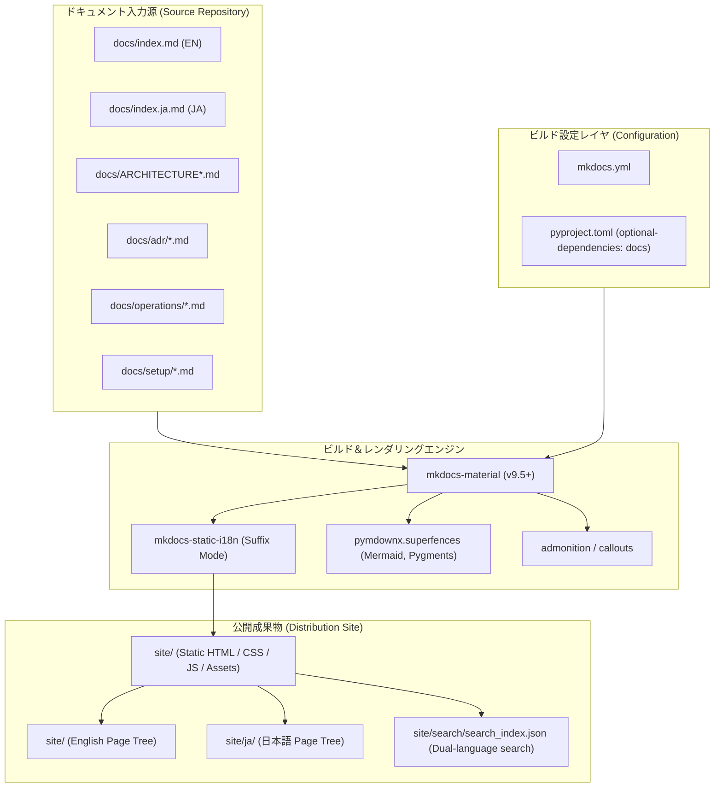

# GitHub Pages ドキュメント公開基盤 要求分析 & 詳細仕様書 (spec)

## 1. システム全体像とドメインモデル

本仕様書は、Agent Aegis Harness (`aah`) のドキュメント資産（`docs/`）を、GitHub Pages 上で高機能かつ美しく閲覧可能な静的サイトとして自動公開するための詳細仕様を定めます。



---

## 2. データ構造 & スキーマ定義

### 2.1 `mkdocs.yml` 定義仕様

```yaml
site_name: Agent Aegis Harness
site_description: Automated Evaluation & Governance Infrastructure for Software-AI
site_author: Youhei Yamada
site_url: https://sun-flat-yamada.github.io/agent-aegis-harness/
repo_url: https://github.com/sun-flat-yamada/agent-aegis-harness
repo_name: sun-flat-yamada/agent-aegis-harness
edit_uri: edit/main/docs/

theme:
  name: material
  language: en
  palette:
    # ライトモード
    - scheme: default
      primary: indigo
      accent: indigo
      toggle:
        icon: material/brightness-7
        name: Switch to dark mode
    # ダークモード
    - scheme: slate
      primary: indigo
      accent: indigo
      toggle:
        icon: material/brightness-4
        name: Switch to light mode
  features:
    - navigation.instant
    - navigation.tracking
    - navigation.tabs
    - navigation.sections
    - navigation.expand
    - navigation.top
    - search.suggest
    - search.highlight
    - content.code.copy
    - content.action.edit

plugins:
  - search:
      lang:
        - en
        - ja
  - i18n:
      docs_structure: suffix
      fallback_to_default: true
      languages:
        - locale: en
          name: English
          default: true
          build: true
        - locale: ja
          name: 日本語
          build: true

markdown_extensions:
  - admonition
  - pymdownx.details
  - pymdownx.superfences:
      custom_fences:
        - name: mermaid
          class: mermaid
          format: !!python/name:pymdownx.superfences.fence_code_format
  - pymdownx.highlight:
      anchor_linenums: true
      line_spans: __span
      pygments_lang_class: true
  - pymdownx.inlinehilite
  - pymdownx.tabbed:
      alternate_style: true
  - pymdownx.snippets
  - pymdownx.tasklist:
      custom_checkbox: true
  - tables
  - attr_list
  - md_in_html
  - def_list
  - toc:
      permalink: true

nav:
  - Overview: index.md
  - Architecture: ARCHITECTURE.md
  - Architecture Decision Records:
      - ADR Overview: adr/0001-immutable-audit-log.md
      - 0001 Immutable Audit Log: adr/0001-immutable-audit-log.md
      - 0002 Decoupled Refinement: adr/0002-decoupled-refinement.md
      - 0003 Three-Tiered Documentation: adr/0003-three-tiered-documentation.md
  - Operations:
      - Audit Workflows: operations/audit-workflows.md
      - Cloud Cost Analysis: operations/cloud-cost-analysis.md
      - Harness Evolution: operations/harness-evolution.md
  - Setup Guide:
      - Target Project Guide: setup/target-project-guide.md
      - Auditor Setup Guide: setup/auditor-setup-guide.md
      - Cloud MCP Server Guide: setup/cloud-mcp-server-guide.md
```

### 2.2 CI ワークフロー仕様 (`.github/workflows/pages.yml`)

```yaml
name: Deploy GitHub Pages Documentation

on:
  push:
    branches:
      - main
    paths:
      - 'docs/**'
      - 'mkdocs.yml'
      - 'pyproject.toml'
      - '.github/workflows/pages.yml'
  workflow_dispatch:

permissions:
  contents: read
  pages: write
  id-token: write

concurrency:
  group: 'pages'
  cancel-in-progress: false

jobs:
  build:
    name: Build Documentation Site
    runs-on: ubuntu-latest
    steps:
      - name: Checkout Repository
        uses: actions/checkout@v4

      - name: Set up Python 3.10
        uses: actions/setup-python@v5
        with:
          python-version: '3.10'
          cache: 'pip'

      - name: Install Dependencies
        run: |
          python -m pip install --upgrade pip
          pip install -e ".[docs]"

      - name: Build MkDocs Site
        run: |
          mkdocs build --strict

      - name: Upload GitHub Pages Artifact
        uses: actions/upload-pages-artifact@v5
        with:
          path: site/

  deploy:
    name: Deploy to GitHub Pages
    environment:
      name: github-pages
      url: ${{ steps.deployment.outputs.page_url }}
    runs-on: ubuntu-latest
    needs: build
    steps:
      - name: Deploy to GitHub Pages
        id: deployment
        uses: actions/deploy-pages@v5
```

---

## 3. インターフェース仕様

### 3.1 Makefile ターゲット
- `make docs-serve`: ローカル開発用。`mkdocs serve` を実行して `http://127.0.0.1:8000` でプレビューとホットリロードを提供。
- `make docs-build`: CI 検証用。`mkdocs build --strict` を実行し、リンク切れや構文エラーを検証。
- `make install-docs`: ドキュメント用追加パッケージ（`mkdocs-material`, `mkdocs-static-i18n`）をローカル環境へインストール。

### 3.2 フロントマター仕様
追加するトップページ（`docs/index.md` および `docs/index.ja.md`）には、既存のフロントマタースキーマに準拠した YAML メタデータを記述する：
```yaml
---
$schema: ".aegis/schemas/frontmatter.schema.json"
doc_type: "guide"
id: "DOC-PORTAL-INDEX"
title: "Agent Aegis Harness Documentation"
version: "1.0.0"
status: "active"
language: "en" # (ja の場合は "ja")
canonical_ref: "docs/index.md"
author: "@sun-flat-yamada"
last_reviewed: "2026-09-12"
compatibility:
  tools: ["google-antigravity", "claude-code", "github-copilot", "cursor"]
  min_aah_version: "0.1.0"
tags: ["portal", "overview", "quickstart"]
---
```

---

## 4. セキュリティ、マスキング、コンテキストドリフト抑止要件

1. **GitHub Pages デプロイの最小権限原則 (Least Privilege)**:
   - レガシーな個人アクセストークン（PAT）や専用デプロイキー、または永続的な `gh-pages` コミット権限を一切排除。
   - GitHub Actions の標準 OIDC 連携 (`id-token: write` & `pages: write`) のみをワークフロー限定で付与。
2. **Strict Build による壊れたリンク検知**:
   - `mkdocs build --strict` を CI に強制し、Markdown 内の内部リンク切れや構文異常を即座にエラーとして検出し、不完全なドキュメントの公開を防止。
3. **機密情報の非公開**:
   - `.aegis/logs/` や `.env` 等の監査ログ・クレデンシャルが `site/` 配下に紛れ込まないよう、`docs_dir: docs` に限定してビルドを隔離。

---

## 5. 非機能要件

1. **高速レスポンスとオフライン対応**:
   - 静的 HTML/JS/CSS として完全に事前生成され、CDN から 100ms 未満で高速配信。
   - Material for MkDocs の `navigation.instant` により SPA 的なページ遷移を実現。
2. **日英バイリンガルシームレス切替**:
   - 画面右上の言語スイッチャーにより、閲覧中の同一ページに対応する英語/日本語版へワンクリックで遷移。
3. **全文検索性能**:
   - クライアントサイド JavaScript（Lunr.js + 日本語トークナイザー）による即時インクリメンタル検索。
