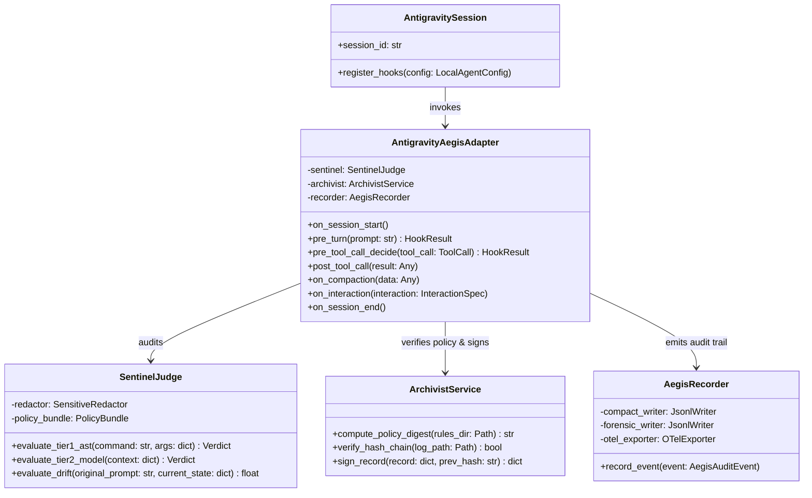

# Agent Aegis Harness (aah) - Google Antigravity 実装設計書

## 1. 実装アーキテクチャ全体像

本ドキュメントは、`spec.md` および `plan.md` に基づき、Google Antigravity（IDE / CLI / SDK）環境において **Agent Aegis Harness (aah)** を構築するための具体的なコード構造、クラス設計、データモデル、およびフック統合仕様を定めた実装設計書です。



---

## 2. ディレクトリ構成とモジュール配置

```text
agent-aegis-harness/
├── pyproject.toml                     # ビルド定義 & CLI [aah, aegis]
├── Makefile                           # 開発タスク自動化
├── .aegis/
│   ├── config.yaml                    # 全社・プロジェクト設定
│   ├── rules/                         # 監査ポリシー定義 (YAML)
│   │   ├── security-policy.yaml
│   │   ├── context-drift-policy.yaml
│   │   └── skill-compliance-policy.yaml
│   ├── schemas/                       # JSON Schema 定義
│   │   ├── audit-event.schema.json
│   │   └── frontmatter.schema.json
│   ├── templates/                     # 監査レポート/Walkthrough テンプレート
│   └── logs/                          # 監査ログ格納先
│       ├── audit-trail.jsonl          # 軽量監査ログ (Hash Chain連鎖)
│       └── forensic-trail.jsonl       # 完全証跡 (詳細思考・生Diff)
├── src/
│   └── aegis/
│       ├── __init__.py
│       ├── cli.py                     # Typer CLI エントリポイント
│       ├── models.py                  # Pydantic v2 データモデル定義
│       ├── sentinel/                  # 監査員エンジン
│       │   ├── __init__.py
│       │   ├── judge.py               # 3段階合否判定 (AST, Model, LLM-Judge)
│       │   └── redactor.py            # PII / Secret マスキングエンジン
│       ├── recorder/                  # 証跡記録 & トレーサー
│       │   ├── __init__.py
│       │   ├── tracer.py              # 5W1H 構造化抽出器
│       │   ├── antigravity_adapter.py # Google Antigravity SDK Hooks アダプタ
│       │   └── otel_exporter.py       # OpenTelemetry OTLP エクスポーター
│       ├── archivist/                 # 構成管理 & 再現性検証
│       │   ├── __init__.py
│       │   ├── policy_hasher.py       # ルール全体の決定論的 sha256 算出
│       │   └── integrity.py           # Hash Chain (Merkle連鎖) 検証
│       └── refiner/                   # 運用側・自己改善ループ (オフライン)
│           ├── __init__.py
│           ├── cluster_analyzer.py    # 失敗・ドリフトパターンの分類集約
│           └── patch_proposer.py      # Rules/Skills 改善 PR 生成
└── tests/
    ├── test_sentinel.py
    ├── test_archivist.py
    ├── test_recorder.py
    └── test_refiner.py
```

---

## 3. コアデータモデル設計 (`src/aegis/models.py`)

Pydantic v2 を使用し、強型付けされた監査データ構造を定義します。

```python
"""
Core Data Models for Agent Aegis Harness
Schema Draft-07 Compliant with Google Antigravity Extensions
"""
from __future__ import annotations
from datetime import datetime
from enum import Enum
from typing import Any, Dict, List, Optional
from pydantic import BaseModel, Field, HttpUrl

class ClientToolType(str, Enum):
    ANTIGRAVITY = "google-antigravity"
    CLAUDE_CODE = "claude-code"
    COPILOT = "github-copilot"
    CURSOR = "cursor"
    WINDSURF = "windsurf"
    CLI = "cli"

class VerdictStatus(str, Enum):
    PASS = "PASS"
    WARN = "WARN"
    BLOCK = "BLOCK"

class ViolationSeverity(str, Enum):
    CRITICAL = "CRITICAL"
    HIGH = "HIGH"
    MEDIUM = "MEDIUM"
    LOW = "LOW"

class AuditReproducibility(BaseModel):
    policy_bundle_version: str = Field(..., description="ポリシーバンドルバージョン")
    policy_hash_digest: str = Field(..., description="ルール・スキルの sha256 決定論的ダイジェスト")
    sentinel_version: str = Field(..., description="Sentinel バージョン")
    evaluator_engine: str = Field(..., description="評価エンジン識別子")

class EnvironmentInfo(BaseModel):
    client_tool: ClientToolType
    client_version: Optional[str] = None
    repository: str
    git_commit: str
    user_hash: Optional[str] = None
    session_id: Optional[str] = None
    subagent_depth: int = 0
    parent_trace_id: Optional[str] = None

class TriggerContext(BaseModel):
    source: str
    sanitized_prompt: str
    redaction_applied: List[str] = Field(default_factory=list)

class ReferencedFile(BaseModel):
    path: str
    blob_sha: str
    token_count: Optional[int] = None

class RetrievalContext(BaseModel):
    referenced_files: List[ReferencedFile] = Field(default_factory=list)
    loaded_skills: List[str] = Field(default_factory=list)
    loaded_rules: List[str] = Field(default_factory=list)
    knowledge_items: List[str] = Field(default_factory=list)

class TokenUsage(BaseModel):
    prompt_tokens: int = 0
    candidates_tokens: int = 0
    thoughts_tokens: int = 0  # Antigravity 思考トークン
    cached_tokens: int = 0
    total_tokens: int = 0

class InferenceTrace(BaseModel):
    model_id: Optional[str] = None
    reasoning_summary: Optional[str] = None
    token_usage: TokenUsage = Field(default_factory=TokenUsage)

class PlanningEvidence(BaseModel):
    plan_artifact_path: Optional[str] = None
    plan_hash_digest: Optional[str] = None
    plan_status: Optional[str] = None

class ToolCallRecord(BaseModel):
    tool_name: str
    arguments: Dict[str, Any] = Field(default_factory=dict)
    status: str
    error_message: Optional[str] = None

class ActionPayload(BaseModel):
    tool_calls: List[ToolCallRecord] = Field(default_factory=list)
    file_diff_stat: Optional[str] = None
    files_modified: List[str] = Field(default_factory=list)

class ViolationRecord(BaseModel):
    rule_id: str
    severity: ViolationSeverity
    message: str

class SentinelVerdict(BaseModel):
    status: VerdictStatus
    score: float = Field(..., ge=0.0, le=100.0)
    tier_level: str
    violations: List[ViolationRecord] = Field(default_factory=list)

class VerificationEvidence(BaseModel):
    walkthrough_path: Optional[str] = None
    walkthrough_digest: Optional[str] = None
    tests_passed: Optional[bool] = None
    evidence_media: List[str] = Field(default_factory=list)

class IntegrityProof(BaseModel):
    previous_record_hash: str
    current_record_hash: str

class AegisAuditEvent(BaseModel):
    trace_id: str
    span_id: str
    step_index: int
    timestamp: datetime = Field(default_factory=datetime.utcnow)
    audit_reproducibility: AuditReproducibility
    environment: EnvironmentInfo
    trigger: TriggerContext
    retrieval_context: RetrievalContext
    inference_trace: InferenceTrace
    planning_evidence: Optional[PlanningEvidence] = None
    action_payload: ActionPayload
    sentinel_verdict: SentinelVerdict
    verification_evidence: Optional[VerificationEvidence] = None
    integrity: IntegrityProof
```

---

## 4. Google Antigravity SDK フック連携アダプタ (`src/aegis/recorder/antigravity_adapter.py`)

Google Antigravity SDK のライフサイクルフックと完全同期し、透過的な監査パイプラインを実現します。

```python
"""
Google Antigravity Lifecycle Hook Adapter for Agent Aegis Harness
Integrates Antigravity SDK with Sentinel, Archivist, and Recorder
"""
import uuid
import hashlib
import json
from datetime import datetime
from typing import Any, Optional
from google.antigravity import types
from google.antigravity.hooks import hooks

from aegis.models import (
    AegisAuditEvent, AuditReproducibility, EnvironmentInfo,
    TriggerContext, RetrievalContext, InferenceTrace, ActionPayload,
    ToolCallRecord, SentinelVerdict, VerdictStatus, IntegrityProof,
    ClientToolType, TokenUsage, PlanningEvidence, VerificationEvidence
)
from aegis.sentinel.judge import SentinelJudge
from aegis.sentinel.redactor import SensitiveRedactor
from aegis.archivist.policy_hasher import PolicyHasher
from aegis.recorder.tracer import AegisRecorder

class AntigravityAegisAdapter:
    def __init__(self, repo_path: str, policy_dir: str = ".aegis/rules"):
        self.repo_path = repo_path
        self.hasher = PolicyHasher(policy_dir)
        self.policy_digest = self.hasher.compute_digest()
        self.redactor = SensitiveRedactor()
        self.sentinel = SentinelJudge(policy_dir=policy_dir)
        self.recorder = AegisRecorder()
        
        self.current_trace_id = str(uuid.uuid4())
        self.step_index = 0
        self.prev_record_hash = "GENESIS_BLOCK_00000000000000000000000000000000000000000000000000000000"
        self.current_prompt = ""
        self.active_plan_digest: Optional[str] = None

    def register_hooks(self, config_hooks: list) -> list:
        """LocalAgentConfig に渡すフックリストを構築"""
        config_hooks.extend([
            self.on_session_start,
            self.pre_turn,
            self.pre_tool_call_decide,
            self.post_tool_call,
            self.on_compaction,
            self.on_interaction,
            self.on_session_end,
        ])
        return config_hooks

    @hooks.on_session_start
    async def on_session_start(self):
        """セッション開始時に環境とポリシーハッシュを初期固定"""
        # Session Block の初期化
        pass

    @hooks.pre_turn
    async def pre_turn(self, prompt: str) -> types.HookResult:
        """プロンプト投入時のサニタイズおよび入力検査"""
        sanitized_prompt, redacted_items = self.redactor.redact_text(prompt)
        self.current_prompt = sanitized_prompt
        self.step_index += 1
        
        # プロンプトレベルの Sentinel 検査 (プロンプトインジェクション等)
        verdict = self.sentinel.evaluate_prompt(sanitized_prompt)
        if verdict.status == VerdictStatus.BLOCK:
            return types.HookResult(allow=False, reason="Blocked by Aegis Sentinel")
            
        return types.HookResult(allow=True)

    @hooks.pre_tool_call_decide
    async def pre_tool_call_decide(self, tool_call: types.ToolCall) -> types.HookResult:
        """ツール実行前の即時検査 (Sentinel Tier 1/2)"""
        # 引数のサニタイズ
        sanitized_args, _ = self.redactor.redact_dict(tool_call.args)
        
        # Sentinel 即時判定
        verdict = self.sentinel.evaluate_tool_call(
            tool_name=tool_call.name,
            arguments=sanitized_args,
            step_index=self.step_index
        )
        
        if verdict.status == VerdictStatus.BLOCK:
            self._record_event_sync(
                tool_name=tool_call.name,
                arguments=sanitized_args,
                status="BLOCKED",
                verdict=verdict
            )
            return types.HookResult(
                allow=False,
                reason=f"Aegis Sentinel Violation: {[v.message for v in verdict.violations]}"
            )
            
        return types.HookResult(allow=True)

    @hooks.post_tool_call
    async def post_tool_call(self, data: Any):
        """ツール完了後の差分記録・監査イベント確定"""
        # ツール実行結果と差分を記録
        pass

    @hooks.on_compaction
    async def on_compaction(self, data: Any):
        """コンテキスト圧縮イベント時のコンテキストドリフト検知"""
        drift_score = self.sentinel.evaluate_compaction_drift(data)
        # ドリフトが閾値を超えた場合に警告イベントを記録

    @hooks.on_interaction
    async def on_interaction(self, spec: types.AskQuestionInteractionSpec) -> types.QuestionHookResult:
        """ユーザー対話イベントの記録"""
        return types.QuestionHookResult(responses=[])

    @hooks.on_session_end
    async def on_session_end(self):
        """セッション終了時の最終封印と OTel フラッシュ"""
        self.recorder.flush()

    def _record_event_sync(self, tool_name: str, arguments: dict, status: str, verdict: SentinelVerdict):
        """監査イベントのハッシュ連鎖封印とログ永続化"""
        # イベントオブジェクト構築
        # current_record_hash = sha256(prev_record_hash + payload)
        # self.recorder.record(...)
        pass
```

---

## 5. Hash Chain (Merkle連鎖) 暗号学的完全性ロジック (`src/aegis/archivist/integrity.py`)

監査ログの各行は、直前の行のハッシュ（`previous_record_hash`）を取り込んで自身のハッシュ（`current_record_hash`）を計算する「ブロックチェーン型連鎖構造」を採用します。

```python
"""
Hash Chain Integrity Engine for Agent Aegis Harness
Provides cryptographic proof of log immutability and tampering detection
"""
import hashlib
import json
from typing import Dict, Any, Tuple

class HashChainManager:
    GENESIS_HASH = "0" * 64

    @staticmethod
    def calculate_record_hash(record_data: Dict[str, Any], previous_hash: str) -> str:
        """
        直前のハッシュと現在の監査ペイロード（integrityを除く）から決定的 sha256 を生成
        """
        # integrity フィールドを除外した正規化 JSON 文字列を作成
        canonical_payload = {k: v for k, v in record_data.items() if k != "integrity"}
        canonical_payload["previous_record_hash"] = previous_hash
        
        # キーの昇順ソートで決定論的シリアライズ
        serialized = json.dumps(canonical_payload, sort_keys=True, separators=(',', ':'), default=str)
        return hashlib.sha256(serialized.encode("utf-8")).hexdigest()

    @classmethod
    def verify_log_file(cls, log_path: str) -> Tuple[bool, int, Optional[str]]:
        """
        ログファイル全体の Hash Chain 整合性を先頭から順に検証
        戻り値: (成功フラグ, 検証行数, エラー詳細)
        """
        expected_prev_hash = cls.GENESIS_HASH
        line_number = 0
        
        with open(log_path, "r", encoding="utf-8") as f:
            for line in f:
                line_number += 1
                line = line.strip()
                if not line:
                    continue
                    
                record = json.loads(line)
                integrity = record.get("integrity", {})
                recorded_prev = integrity.get("previous_record_hash")
                recorded_curr = integrity.get("current_record_hash")
                
                # 1. 前ブロックハッシュの連続性チェック
                if recorded_prev != expected_prev_hash:
                    return False, line_number, f"Broken chain link at line {line_number}: expected prev {expected_prev_hash}, got {recorded_prev}"
                
                # 2. 現在ブロックハッシュの再計算・照合
                computed_curr = cls.calculate_record_hash(record, recorded_prev)
                if computed_curr != recorded_curr:
                    return False, line_number, f"Tampering detected at line {line_number}: computed {computed_curr}, recorded {recorded_curr}"
                
                expected_prev_hash = recorded_curr
                
        return True, line_number, None
```

---

## 6. Walkthrough & Implementation Plan 連動型検証エンジン設計

Antigravity の Planning Mode (`implementation_plan.md`) と事後検証エビデンス (`walkthrough.md`) を監査証跡に組み込み、以下の手順で二重封印を行います。

1. **事前計画の封印**:
   - `implementation_plan.md` 作成時、その内容から `plan_hash_digest = sha256(content)` を生成。
   - `PlanningEvidence` にハッシュと `PROPOSED` / `APPROVED` ステータスを記録。
2. **事後エビデンスの封印**:
   - エージェント作業完了後、`walkthrough.md` の内容から `walkthrough_digest = sha256(content)` を生成。
   - 実行されたテスト結果（`tests_passed`）や変更差分を `VerificationEvidence` に封印。
3. **一致性の Sentinel 検証**:
   - `aah check` は、事前計画に記載された「変更対象ファイル一覧」と、実際の `action_payload.files_modified` を比較。
   - 計画外のファイル変更（計画外アクセス）が存在した場合は `WARN` または `BLOCK` を判定。

---

## 7. 初期ブートストラップ手順 (Google Antigravity 上での展開)

Google Antigravity 環境で即座に開発・テストを開始するための実行コマンドです。

```powershell
# Step 1: ディレクトリ構造の一括作成
New-Item -ItemType Directory -Force -Path `
  .github/workflows, .github/ISSUE_TEMPLATE, `
  .aegis/rules, .aegis/schemas, .aegis/templates, .aegis/logs, `
  .hooks, .skills, docs/adr, `
  src/aegis/sentinel, src/aegis/recorder, `
  src/aegis/archivist, src/aegis/refiner, tests

# Step 2: 仮想環境の作成とパッケージインストール (開発モード)
python -m venv .venv
.venv\Scripts\activate
pip install -e .

# Step 3: CLI 動作確認と初期化実行
aah --help
aah init
aah check
```
