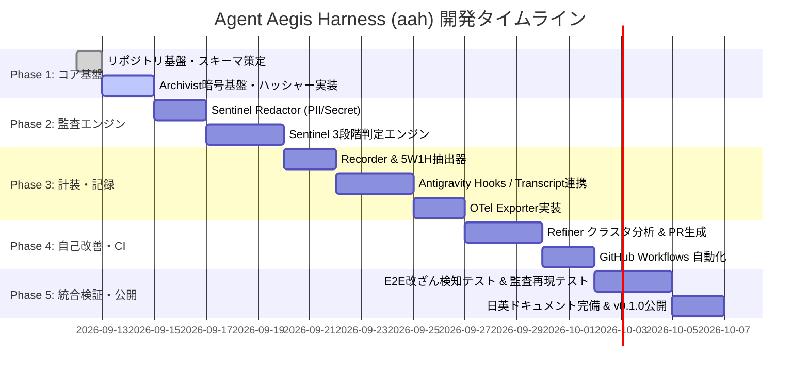
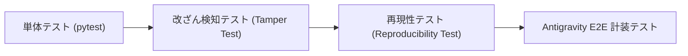

# Agent Aegis Harness (aah) - 開発計画書

## 1. 基本方針と開発原則

本開発計画は、`blueprint.md` および `spec.md` に定義された設計仕様を、決定論的再現性と高い堅牢性をもって具現化するための実装ロードマップです。以下の 3 大原則に準拠して進めます。

1. **Determinism First (決定論的再現性の最優先)**:
   すべての監査判定およびログ出力は、ルールセットのダイジェスト（`policy_hash_digest`）と暗号学的 Hash Chain によって一意に検証可能であること。
2. **Zero-Friction Integration (摩擦ゼロの導入体験)**:
   開発者が意識せずとも Google Antigravity や Claude Code などのエージェント実行に自然に計装され、わずか 1 コマンド（`aah init`）でセットアップが完了すること。
3. **Layered Defense & Decoupled Refinement (多層防御と疎結合な改善)**:
   実行時の安全担保（Sentinel: <10msの静的AST検査）を最優先し、自己改善（Refiner）はオフラインバッチとして疎結合に分離すること。

---

## 2. マイルストーン & フェーズ計画

### Phase 1: コアスキーマ・構成管理・Archivist 暗号基盤
- **目標**: リポジトリ構造の初期化、JSONスキーマの定義、および不変監査の根幹となるポリシーハッシュ・Hash Chain 計算モジュールを完成させる。
- **主要成果物**:
  - `pyproject.toml`, `Makefile`, `.gitignore`
  - `.aegis/schemas/audit-event.schema.json`
  - `.aegis/schemas/frontmatter.schema.json`
  - `src/aegis/archivist/policy_hasher.py`（ルール・スキルの sha256 計算）
  - `src/aegis/archivist/integrity.py`（Hash Chain の生成・検証）
  - `tests/test_archivist.py`

### Phase 2: Sentinel 判定エンジン & Redactor (マスキング)
- **目標**: エージェントの実行前後に介入する軽量・超高速な監査判定エンジンと、機密情報の漏洩を防ぐ Redactor を実装。
- **主要成果物**:
  - `src/aegis/sentinel/redactor.py`（正規表現・AST による秘密鍵・トークン・PII マスキング）
  - `src/aegis/sentinel/judge.py`（Tier 1: AST/静的ルール、Tier 2: 軽量モデル、Tier 3: LLM Judge）
  - `.aegis/rules/security-policy.yaml`, `context-drift-policy.yaml`, `skill-compliance-policy.yaml`
  - `tests/test_sentinel.py`

### Phase 3: Recorder & Google Antigravity / OTel 統合
- **目標**: 透過的ラッパー（`aah wrap`）の実装、Google Antigravity のライフサイクルフック／Transcript／Walkthrough 機構との連携、および OpenTelemetry エクスポーターの実装。
- **主要成果物**:
  - `src/aegis/recorder/tracer.py`（5W1H 監査イベント生成）
  - `src/aegis/recorder/antigravity_adapter.py`（Antigravity SDK Hooks アダプタ）
  - `src/aegis/recorder/otel_exporter.py`（OTLP 転送クライアント）
  - `src/aegis/cli.py`（`init`, `wrap`, `check`, `verify` コマンド）
  - `tests/test_recorder.py`

### Phase 4: Refiner & CI/CD 自動化
- **目標**: 蓄積された監査ログのクラスタリング分析、改善パッチの自動生成（PR 起票）、および GitHub Actions ワークフローを構築。
- **主要成果物**:
  - `src/aegis/refiner/cluster_analyzer.py`（ドリフト・違反パターンの集約）
  - `src/aegis/refiner/patch_proposer.py`（ルール／スキル改善提案）
  - `.github/workflows/audit-ci.yml`, `frontmatter-linter.yml`, `self-refine-batch.yml`
  - `tests/test_refiner.py`

### Phase 5: 日英ドキュメント完備・E2E 検証・リリース
- **目標**: 英語正本と日本語版の 1 対 1 ドキュメント整備、決定論的監査再現性テスト、改ざん検知ストレステストの完遂、および初期リリース。
- **主要成果物**:
  - `README.md` / `README.ja.md`, `ARCHITECTURE.md` / `ARCHITECTURE.ja.md`
  - ADR ドキュメント群 (`docs/adr/`)
  - E2E テストスイート（意図的なログ改ざん検知、ポリシー変更時の再現テスト）

---

## 3. タスク詳細 WBS (Work Breakdown Structure)

| WBS ID | タスク名 | 担当モジュール | 完了基準 (Acceptance Criteria) |
| :--- | :--- | :--- | :--- |
| **1.1** | ディレクトリ構造 & pyproject.toml 作成 | Root / Build | `pip install -e .` が通り、`aah --help` が動作すること |
| **1.2** | JSON スキーマ定義 | `.aegis/schemas/` | ドラフトスキーマバリデーションが jsonschema で通ること |
| **1.3** | Policy Hasher 実装 | `src/aegis/archivist/` | `.aegis/rules` や `.skills` の全ファイルを走査し、決定的 sha256 を算出すること |
| **1.4** | Hash Chain 検証ロジック実装 | `src/aegis/archivist/` | 過去ログの改ざん（1文字変更）を即座にエラーとして検知できること |
| **2.1** | PII / Secret Redactor 実装 | `src/aegis/sentinel/` | API Key, JWT, IP, メールアドレス等の正規表現置換テストが 100% 通ること |
| **2.2** | Sentinel Tier 1 判定エンジン | `src/aegis/sentinel/` | 危険コマンド（`rm -rf /` 等）やルール違反を <10ms で BLOCK 判定できること |
| **2.3** | CLI `check` コマンド統合 | `src/aegis/cli.py` | Rich テーブルで Sentinel 監査結果が端末に美しく描画されること |
| **3.1** | 5W1H 監査イベント生成器 | `src/aegis/recorder/` | 入出力から AegisAuditEvent インスタンスを組み立て、スキーマ準拠すること |
| **3.2** | Antigravity SDK フックアダプタ | `src/aegis/recorder/` | `pre_tool_call_decide`, `post_tool_call`, `on_compaction` 等を購読できること |
| **3.3** | Dual-Stream ログ出力実装 | `src/aegis/recorder/` | コンパクトログと完全証跡ログ（Forensic）の並行書き込みができること |
| **4.1** | Refiner クラスタリング分析 | `src/aegis/refiner/` | 過去ログから多発する違反ルール TOP3 を集計・分類できること |
| **4.2** | 自動 PR 作成スクリプト | `src/aegis/refiner/` | ルール修正ブランチを作成し git diff を出力できること |
| **5.1** | 決定論的再現テストスイート | `tests/` | 過去ログの入力から同一 Sentinel Verdict が再現されることを検証 |
| **5.2** | Front-matter リンター CI | `.github/workflows/` | 全 Markdown の Front-matter 構文と日英ファイル対比を自動検証すること |

---

## 4. テスト・検証戦略

1. **単体テスト (`tests/`)**:
   - `test_archivist.py`: ハッシュ計算の冪等性、Merkle Chain の連鎖正当性。
   - `test_sentinel.py`: Redactor のマスキング漏れゼロ検証、判定ルールの境界値テスト。
   - `test_recorder.py`: スキーマ検証、欠損フィールドのエラーハンドリング。
2. **改ざん検知テスト (Tamper Detection Test)**:
   - 正常に記録された `.aegis/logs/audit-trail.jsonl` の任意行（タイムスタンプ、判定結果等）を 1 ビット改変し、`aah verify` が確実に改ざんを検知し異常終了することを確認。
3. **決定論的再現性テスト (Reproducibility Test)**:
   - 過去の監査ログに記録された `policy_hash_digest` と同一のポリシーバンドルを読み込み、同一の `trigger.sanitized_prompt` を投入した際に、Sentinel の `verdict.status` と `violations` が 100% 一致することを自動検証。
4. **Antigravity 実機 E2E テスト**:
   - 仮想の Antigravity エージェントタスクを実行させ、計画（`implementation_plan.md`）、ツール実行（`pre_tool_call_decide`）、事後検証（`walkthrough.md`）の一連の証跡がデュアルストリームログに完全記録されることを確認。

---

## 5. リスク評価と緩和策

| リスク | 影響度 | 発生確率 | 緩和策 |
| :--- | :--- | :--- | :--- |
| **監視オーバーヘッドによるエージェント遅延** | 中 | 中 | Sentinel Tier 1 は純粋な AST/正規表現で <10ms に制限。重い評価は非同期バッチへ退避。 |
| **機密情報のマスキング漏れ** | 極大 | 低 | 既知トークン（OpenAI, GitHub, AWS, GCP）の厳格な正規表現セットに加え、エントロピー検知を導入。 |
| **大容量監査ログによるディスク逼迫** | 中 | 高 | Antigravity 思想に基づくデュアルストリーム（軽量ログは常時保持、Forensic ログは圧縮またはリモート退避）。 |
| **エージェントツール仕様変更に伴う計装破壊** | 高 | 中 | ツール層と監査ロジックを直接結合せず、OpenInference / JSON Schema 抽象層を介して疎結合に保つ。 |
