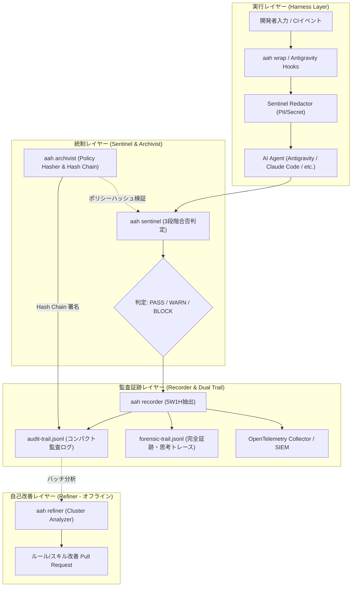

# Agent Aegis Harness (aah) - 仕様書

## 1. 概要と基本メタデータ

### 1.1 背景と目的
ソフトウェア開発において自律型 AI エージェント（Google Antigravity, Claude Code, GitHub Copilot, Cursor 等）の導入が加速する中、エージェントの挙動監視、セキュリティ侵害（秘密鍵・PII流出）の抑止、コンテキストドリフト（指示の逸脱・忘却）の防止、および過去の推論・操作結果の法的・技術的再現性を担保するガバナンス基盤が不可欠となっています。

**Agent Aegis Harness (aah)** は、特定のエージェントや LLM に依存せず、AI 開発プロセス全体に「馬具（Harness）」として装着し、5W1H（Trigger, Context, Reasoning, Action, Output, Verdict）の不変監査証跡を記録・判定・改善する統合ガバナンス基盤です。

### 1.2 プロジェクト基本仕様
| 項目 | 設定値 / 仕様 |
| :--- | :--- |
| **リポジトリ名** | `agent-aegis-harness` |
| **正式名称** | Agent Aegis Harness (AEGIS: Automated Evaluation & Governance Infrastructure for Software-AI) |
| **短縮コマンド** | `aah` (エイリアス: `aegis`) |
| **ライセンス** | MIT License (Copyright (c) 2026 @sun-flat-yamada) |
| **準拠標準** | OpenTelemetry, OpenInference, JSON Schema Draft-07, Effective YAML Front-matter |
| **対象AIツール** | Google Antigravity (IDE / CLI / SDK), Claude Code, GitHub Copilot, Cursor, Windsurf, 自作CLIエージェント |

---

## 2. アーキテクチャとコンポーネント責務

Aegis は「監査（実行時統制・封印）」と「自己改善（オフライン分析・PR提案）」を疎結合に分離した 4+1 コアコンポーネントから構成されます。



### 2.1 各コンポーネントの責務定義
1. **aah wrap / Interceptor (透過実行レイヤー)**:
   - CLI コマンドのラッパー、または Google Antigravity SDK のライフサイクルフック（`pre_turn`, `pre_tool_call_decide`, `post_tool_call` 等）を通じて、入出力を透過的にキャプチャ。
2. **aah sentinel (監査判定エンジン)**:
   - リアルタイム合否判定（構文完全性、コンテキストドリフト、危険コマンド、ポリシー違反のブロック）。
   - **Tier 1 (AST/Regex, <10ms)** → **Tier 2 (軽量モデル, <100ms)** → **Tier 3 (PR/CI時 LLM-Judge)** の多層防御。
3. **aah archivist (書記・構成管理・暗号署名)**:
   - ルール・スキル・プロンプト群の統合ハッシュ（`policy_hash_digest`）を算出・固定。
   - 暗号学的 Hash Chain による監査ログ改ざん検知（Merkle Chain）。
   - 過去ログと同一ルールでの「決定論的監査再現テスト」を実行。
4. **aah recorder (証跡記録・OTel 転送)**:
   - 5W1H（Trigger, Context, Reasoning, Action, Verdict, Integrity）の構造化。
   - Antigravity の Transcript（軽量版 `transcript.jsonl` と完全版 `transcript_full.jsonl`）の設計思想を取り入れたデュアルストリーム出力。
5. **aah refiner (改善・最適化エンジン)**:
   - 監査実行時とは切り離された「完全オフラインバッチ」。
   - 蓄積された違反・ドリフト傾向をクラスタリング分析し、`.aegis/rules/` や `.skills/` の修正 PR を自動起票。

---

## 3. Google Antigravity 機構の統合監査仕様

Google Antigravity の最新アーキテクチャを取り込み、以下の監査証跡モデルを確立します。

### 3.1 ライフサイクルフックと監査イベントのマッピング
Antigravity のライフサイクルフックと Aegis 監査イベントの対応関係：

| Antigravity Hook | 発生契機 | Aegis の処理・監査記録 |
| :--- | :--- | :--- |
| `on_session_start` | エージェントセッション開始 | リポジトリの Git SHA、`policy_hash_digest`、実行環境メタデータを固定し Session Block を初期化 |
| `pre_turn` | ユーザープロンプト投入時 | プロンプトのサニタイズ（PII/シークレットマスク）、`trigger.sanitized_prompt` 記録、入力トークン計測 |
| `pre_tool_call_decide` | ツール実行前 | **Sentinel 即時監査**: コマンドの安全許可リスト照合、非ワークスペースアクセス判定、BLOCK時は即座に中断 |
| `post_tool_call` | ツール実行完了時 | ツール実行結果のステータス、生成されたファイル差分（`git diff --stat`）、戻り値のサニタイズ記録 |
| `on_tool_error` | ツール実行失敗時 | エラー種別・スタックトレースのマスキング記録、自己修復ループの開始検知 |
| `on_compaction` | コンテキスト圧縮時 | **要約による指示忘却（Context Drift）の検知**: 圧縮前後で必須ポリシー・制約が失われていないか検証 |
| `on_interaction` | ユーザーへの確認・質問時 | `ask_question` 等のインタラクション仕様、ユーザー回答内容、承認意思決定のタイムスタンプ記録 |
| `on_session_end` | セッション終了時 | 最終 Hash Chain 封印、UsageMetadata（思考トークン含む）の集計、セッション要約の保存 |

### 3.2 計画と事後エビデンスの二重封印 (Two-Phase Evidence)
Antigravity の Planning Mode（`implementation_plan.md`）と事後検証（`walkthrough.md`）を監査証跡に組み込みます。

1. **Phase 1: 計画署名 (`implementation_plan_digest`)**:
   - エージェントが自律変更を開始する前に策定した `implementation_plan.md` の SHA-256 ハッシュを記録。
   - 「変更意図」「影響範囲」「検証計画」が事前に固定されていることを保証。
2. **Phase 2: 事後エビデンス署名 (`walkthrough_digest`)**:
   - 変更完了後に作成された `walkthrough.md` の SHA-256 ハッシュおよび検証結果（テスト成否、Embedded Media、差分）を記録。
   - 計画された変更と実際の変更・テスト結果の一致性を Sentinel が監査。

### 3.3 思考トークン (Extended Thinking) と推論トレースの独立監査
- Gemini や Claude などの拡張思考モデルにおける `thoughts_token_count` および推論思考ブロック（`thoughts`）を独立フィールドとして監視。
- 推論過程（Reasoning）において、安全制約やポリシーを検討した形跡があるかを Sentinel が検証可能にする。

---

## 4. 監査ログスキーマ仕様 (`.aegis/schemas/audit-event.schema.json`)

```json
{
  "$schema": "http://json-schema.org/draft-07/schema#",
  "title": "AegisAuditEvent",
  "type": "object",
  "required": [
    "trace_id",
    "span_id",
    "step_index",
    "timestamp",
    "audit_reproducibility",
    "environment",
    "trigger",
    "retrieval_context",
    "inference_trace",
    "action_payload",
    "sentinel_verdict",
    "integrity"
  ],
  "properties": {
    "trace_id": { "type": "string", "format": "uuid" },
    "span_id": { "type": "string" },
    "step_index": { "type": "integer", "minimum": 0 },
    "timestamp": { "type": "string", "format": "date-time" },
    "audit_reproducibility": {
      "type": "object",
      "required": ["policy_bundle_version", "policy_hash_digest", "sentinel_version", "evaluator_engine"],
      "properties": {
        "policy_bundle_version": { "type": "string", "example": "v1.0.0" },
        "policy_hash_digest": { "type": "string", "example": "sha256:7e8a9f4c..." },
        "sentinel_version": { "type": "string", "example": "0.1.0" },
        "evaluator_engine": { "type": "string", "example": "ast-rule+llm-judge" }
      }
    },
    "environment": {
      "type": "object",
      "required": ["client_tool", "repository", "git_commit"],
      "properties": {
        "client_tool": {
          "type": "string",
          "enum": ["google-antigravity", "claude-code", "github-copilot", "cursor", "windsurf", "cli"]
        },
        "client_version": { "type": "string" },
        "repository": { "type": "string" },
        "git_commit": { "type": "string" },
        "user_hash": { "type": "string" },
        "session_id": { "type": "string" },
        "subagent_depth": { "type": "integer", "default": 0 },
        "parent_trace_id": { "type": "string" }
      }
    },
    "trigger": {
      "type": "object",
      "required": ["source", "sanitized_prompt"],
      "properties": {
        "source": { "type": "string", "enum": ["user_prompt", "agent_loop", "ci_event", "pre_commit", "hook_event"] },
        "sanitized_prompt": { "type": "string" },
        "redaction_applied": {
          "type": "array",
          "items": { "type": "string" }
        }
      }
    },
    "retrieval_context": {
      "type": "object",
      "properties": {
        "referenced_files": {
          "type": "array",
          "items": {
            "type": "object",
            "properties": {
              "path": { "type": "string" },
              "blob_sha": { "type": "string" },
              "token_count": { "type": "integer" }
            }
          }
        },
        "loaded_skills": { "type": "array", "items": { "type": "string" } },
        "loaded_rules": { "type": "array", "items": { "type": "string" } },
        "knowledge_items": { "type": "array", "items": { "type": "string" } }
      }
    },
    "inference_trace": {
      "type": "object",
      "properties": {
        "model_id": { "type": "string" },
        "reasoning_summary": { "type": "string" },
        "token_usage": {
          "type": "object",
          "properties": {
            "prompt_tokens": { "type": "integer" },
            "candidates_tokens": { "type": "integer" },
            "thoughts_tokens": { "type": "integer" },
            "cached_tokens": { "type": "integer" },
            "total_tokens": { "type": "integer" }
          }
        }
      }
    },
    "planning_evidence": {
      "type": "object",
      "properties": {
        "plan_artifact_path": { "type": "string" },
        "plan_hash_digest": { "type": "string" },
        "plan_status": { "type": "string", "enum": ["PROPOSED", "APPROVED", "REJECTED", "SKIPPED"] }
      }
    },
    "action_payload": {
      "type": "object",
      "properties": {
        "tool_calls": {
          "type": "array",
          "items": {
            "type": "object",
            "properties": {
              "tool_name": { "type": "string" },
              "arguments": { "type": "object" },
              "status": { "type": "string", "enum": ["PENDING", "APPROVED", "BLOCKED", "SUCCESS", "ERROR"] },
              "error_message": { "type": "string" }
            }
          }
        },
        "file_diff_stat": { "type": "string" },
        "files_modified": { "type": "array", "items": { "type": "string" } }
      }
    },
    "sentinel_verdict": {
      "type": "object",
      "required": ["status", "score", "violations", "tier_level"],
      "properties": {
        "status": { "type": "string", "enum": ["PASS", "WARN", "BLOCK"] },
        "score": { "type": "number", "minimum": 0, "maximum": 100 },
        "tier_level": { "type": "string", "enum": ["TIER_1_AST", "TIER_2_MODEL", "TIER_3_LLM_JUDGE"] },
        "violations": {
          "type": "array",
          "items": {
            "type": "object",
            "properties": {
              "rule_id": { "type": "string" },
              "severity": { "type": "string", "enum": ["CRITICAL", "HIGH", "MEDIUM", "LOW"] },
              "message": { "type": "string" }
            }
          }
        }
      }
    },
    "verification_evidence": {
      "type": "object",
      "properties": {
        "walkthrough_path": { "type": "string" },
        "walkthrough_digest": { "type": "string" },
        "tests_passed": { "type": "boolean" },
        "evidence_media": { "type": "array", "items": { "type": "string" } }
      }
    },
    "integrity": {
      "type": "object",
      "required": ["previous_record_hash", "current_record_hash"],
      "properties": {
        "previous_record_hash": { "type": "string" },
        "current_record_hash": { "type": "string" }
      }
    }
  }
}
```

---

## 5. Front-matter 仕様 & 多言語ドキュメント標準

リポジトリ内のすべての Markdown ドキュメントは、以下の YAML Front-matter を付与し、英語正本（`*.md`）と日本語翻訳（`*.ja.md`）を 1 対 1 で同期管理します。

```yaml
---
$schema: ".aegis/schemas/frontmatter.schema.json"
doc_type: "architecture_doc" # [system_prompt | audit_rule | skill_spec | architecture_doc | adr | guide]
id: "SPEC-001"
title: "Document Title Here"
version: "1.0.0"
status: "active" # [draft | active | deprecated | superseded]
language: "ja" # [en | ja]
canonical_ref: "docs/SPEC.md"
hash_digest: "sha256:..."
compatibility:
  tools: ["google-antigravity", "claude-code", "github-copilot", "cursor"]
  min_aah_version: "0.1.0"
tags: ["governance", "audit", "ai-ready"]
author: "@sun-flat-yamada"
last_reviewed: "2026-09-12"
---
```

---

## 6. CLI インターフェース仕様 (`aah`)

```text
aah [OPTIONS] COMMAND [ARGS]...

Commands:
  init      リポジトリに .aegis 設定、スキーマ、および各ツールのフックを展開
  wrap      AI エージェントコマンドを Sentinel 監査下でラップ実行
  check     ステージングされた変更および直近ログの Sentinel 即時監査を実行
  verify    監査ログの Hash Chain 整合性とポリシー決定論的再現性を検証
  refine    蓄積された監査ログをオフライン分析し、ルール/スキルの改善 PR を起票
  report    監査イベントから人間向け Markdown / HTML 監査レポート（Walkthrough形式）を出力
```
