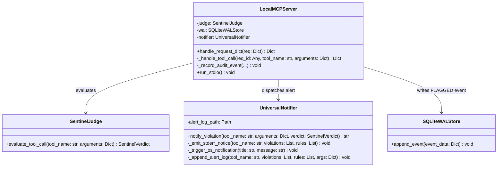

# MCP セキュリティゲートウェイ監査専従化 & マルチプラットフォーム汎用通知実装設計書 (Implementation)

**Document ID:** IMPL-MCP-AUDIT-001 | **Version:** 1.0.0 | **Status:** Active | **Author:** @sun-flat-yamada (Youhei Yamada)  
**Target Change:** `.devs/changes/2026-09-12_mcp-audit-notification`  
**Blueprint:** [`blueprint.md`](blueprint.md) | **Spec:** [`spec.md`](spec.md) | **Plan:** [`plan.md`](plan.md)

---

## 1. クラス設計 & 相互作用



---

## 2. ディレクトリ構成とモジュール配置

```text
agent-aegis-harness/
├── src/aegis/
│   ├── mcp_gateway/
│   │   ├── __init__.py
│   │   ├── protocol.py
│   │   ├── client.py
│   │   ├── server.py              # [MODIFY] LocalMCPServer の遮断ロジック改修
│   │   └── notifier.py            # [NEW] UniversalNotifier 実装
│   └── cli.py                     # [MODIFY] セルフテスト更新
├── docs/setup/
│   ├── target-project-guide.ja.md # [MODIFY] 監査専従・通知へのガイド改訂
│   └── target-project-guide.md    # [MODIFY] 英語版ガイド改訂
└── tests/
    └── test_mcp_gateway.py        # [MODIFY] 非遮断・通知の単体テスト
```

---

## 3. 実装詳細設計

### 3.1 `UniversalNotifier` (`src/aegis/mcp_gateway/notifier.py`)
```python
import os
import sys
import platform
import shutil
import threading
import subprocess
from datetime import datetime
from pathlib import Path
from typing import Any, Dict, List
from aegis.models import SentinelVerdict

class UniversalNotifier:
    def __init__(self, alert_log_path: str = ".aegis/alerts.log"):
        self.alert_log_path = Path(alert_log_path)

    def notify_violation(
        self,
        tool_name: str,
        arguments: Dict[str, Any],
        verdict: SentinelVerdict
    ) -> str:
        violations = [v.message for v in verdict.violations]
        rules = list({v.rule_id for v in verdict.violations})

        # Layer 1: STDERR + Terminal Bell
        self._emit_stderr_notice(tool_name, violations, rules)

        # Layer 3: OS Native Toast Notification (非同期バックグラウンド)
        title = "⚠️ Aegis Security Warning"
        msg = f"Potential dangerous operation in tool '{tool_name}': {'; '.join(violations[:2])}"
        threading.Thread(target=self._trigger_os_notification, args=(title, msg), daemon=True).start()

        # Layer 4: 永続化アラートファイルへの追記
        self._append_alert_log(tool_name, violations, rules, arguments)

        # Layer 2: インバンド警告メッセージ（戻り値としてエージェントへ提供）
        inband_msg = (
            f"⚠️ [AEGIS AUDIT WARNING] Dangerous operation detected by Aegis Sentinel:\n"
            f"- Tool: {tool_name}\n"
            f"- Policy Violations: {'; '.join(violations)}\n"
            f"- Rules: {', '.join(rules)}\n"
            f"Note: This operation was NOT blocked (Audit-only mode). "
            f"Audit event was recorded as FLAGGED and developer notification was dispatched."
        )
        return inband_msg

    def _emit_stderr_notice(self, tool_name: str, violations: List[str], rules: List[str]) -> None:
        try:
            banner = (
                f"\n\033[1;33m[AEGIS AUDIT NOTICE]\033[0m \033[1;31m⚠️ Potential Dangerous Operation Detected!\033[0m\n"
                f"  Tool    : \033[1m{tool_name}\033[0m\n"
                f"  Policy  : {', '.join(rules)}\n"
                f"  Reason  : {'; '.join(violations)}\n"
                f"  Status  : \033[1;32mExecution NOT blocked (Audit-only mode)\033[0m\a\n"
            )
            sys.stderr.write(banner)
            sys.stderr.flush()
        except Exception:
            pass

    def _trigger_os_notification(self, title: str, message: str) -> None:
        current_os = platform.system()
        try:
            if current_os == "Darwin":
                # macOS: osascript
                clean_title = title.replace('"', '\\"')
                clean_msg = message.replace('"', '\\"')
                subprocess.run(
                    ["osascript", "-e", f'display notification "{clean_msg}" with title "{clean_title}" sound name "Ping"'],
                    check=False,
                    stdout=subprocess.DEVNULL,
                    stderr=subprocess.DEVNULL,
                    timeout=2
                )
            elif current_os == "Linux":
                # Linux: notify-send (存在する場合)
                if shutil.which("notify-send"):
                    subprocess.run(
                        ["notify-send", "-u", "critical", title, message],
                        check=False,
                        stdout=subprocess.DEVNULL,
                        stderr=subprocess.DEVNULL,
                        timeout=2
                    )
            elif current_os == "Windows":
                # Windows: PowerShell による非同期トースト / バルーン通知
                clean_msg = message.replace('"', '`"')
                clean_title = title.replace('"', '`"')
                ps_script = (
                    f'[reflection.assembly]::loadwithpartialname("System.Windows.Forms") | Out-Null; '
                    f'$notify = New-Object System.Windows.Forms.NotifyIcon; '
                    f'$notify.Icon = [System.Drawing.SystemIcons]::Warning; '
                    f'$notify.Visible = $true; '
                    f'$notify.ShowBalloonTip(3000, "{clean_title}", "{clean_msg}", [System.Windows.Forms.ToolTipIcon]::Warning)'
                )
                subprocess.run(
                    ["powershell", "-NoProfile", "-NonInteractive", "-Command", ps_script],
                    check=False,
                    stdout=subprocess.DEVNULL,
                    stderr=subprocess.DEVNULL,
                    timeout=3
                )
        except Exception:
            pass

    def _append_alert_log(self, tool_name: str, violations: List[str], rules: List[str], args: Dict[str, Any]) -> None:
        try:
            self.alert_log_path.parent.mkdir(parents=True, exist_ok=True)
            timestamp = datetime.now().isoformat()
            log_line = (
                f"[{timestamp}] [WARNING] tool={tool_name} rules={','.join(rules)} "
                f"violations={';'.join(violations)} args={str(args)[:200]}\n"
            )
            with open(self.alert_log_path, "a", encoding="utf-8") as f:
                f.write(log_line)
        except Exception:
            pass
```

---

## 4. 実行手順
1. `src/aegis/mcp_gateway/notifier.py` を作成。
2. `src/aegis/mcp_gateway/server.py` を更新。
3. `src/aegis/cli.py` を更新。
4. `docs/setup/target-project-guide.ja.md` および `docs/setup/target-project-guide.md` を改訂。
5. `tests/test_mcp_gateway.py` を更新し、`python -m pytest` を実行。
6. `python -m aegis.cli mcp-server --test` で実機確認。
