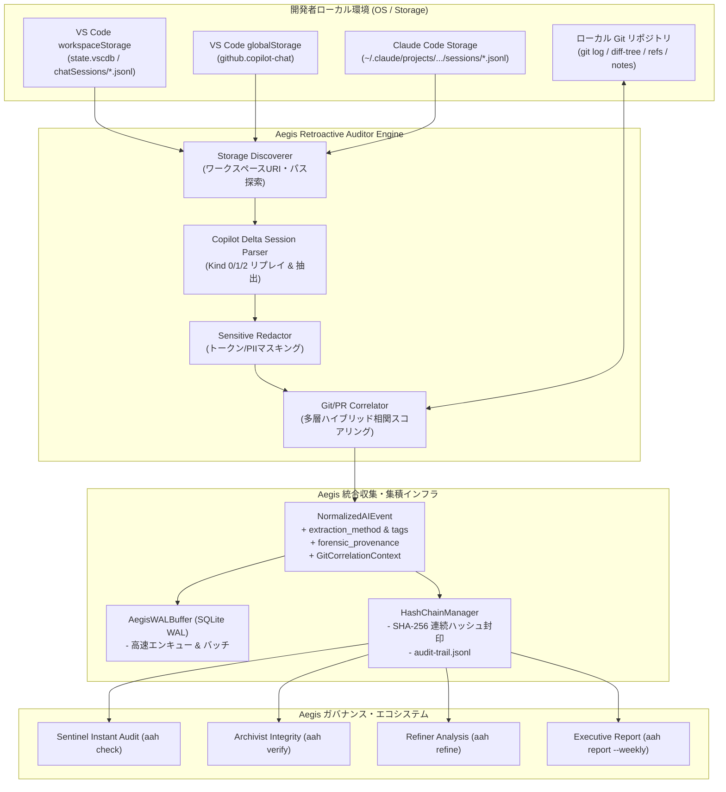

# 構想企画 & ADR: ローカル AI セッション後追い監査・相関ツール (Retroactive Session Harvester & Correlator)

## 1. エグゼクティブサマリ & 変更動機

### 1.1 背景と課題
生成AIを活用したソフトウェア開発（GitHub Copilot, Claude Code, Cursor, Windsurf等）が普及する中、企業・組織におけるガバナンス・コンプライアンス（ISO/IEC 42001, NIST AI RMF, EU AI Act, SLSA for AI）の確保が急務となっています。

リアルタイム監査フック（MCPゲートウェイ、CLIラッパー、Pre-commitフック等）が配備される以前の操作や、開発者が一時的にフックをバイパスしてVS CodeやJetBrains上で実行したCopilotセッションは、組織の中央監査台帳に記録されず「シャドウAI開発」として残留します。

幸いにも、GitHub Copilot ChatやVS Code等のモダン開発環境は、ユーザー対話やモデル応答、編集ファイル等のセッション履歴をローカルのワークスペースストレージ（SQLite `state.vscdb`、Delta形式の `chatSessions/*.jsonl` など）にキャッシュとして保持しています。

### 1.2 目的と狙い
本変更では、ローカル開発環境に残留する過去の GitHub Copilot や各種 AI 支援ツールのセッションデータを自動探索・復元・分析し、**正規のリアルタイム収集データと完全に同一のデータ構造（`NormalizedAIEvent` / WAL / Hash Chain）へ集積・提出**する後追い監査ツール（Retroactive Session Harvester & Correlator）を構築します。

特に以下の3大要件を決定論的に解決します：
1. **抽出方法・プロベナンスの厳格なタグ付け**:
   - リアルタイム収集データと事後抽出データを明確に識別できるよう、データの諸元（メタデータ / tags / provenance）に抽出手法、探索元パス、元ファイルSHA-256、確信度を埋め込む。
2. **Git Commit & PR との多層ハイブリッド相関**:
   - タイムスタンプ近接度、編集/参照ファイルの一致（Jaccard類似度）、プロンプトとコミットメッセージのセマンティック照合を組み合わせ、AI操作をGitコミットSHAおよびPR番号へ高精度に紐付ける。
3. **世の中の最新知見・フォレンジクス技術の導入**:
   - VS Code Fast-append Delta JSONL（kind 0/1/2）の完全再生エンジン。
   - 機密情報・PIIの多層サニタイズ（SensitiveRedactor）。
   - 暗号学的ハッシュチェーンによる監査台帳への改ざん耐性封印。

---

## 2. アーキテクチャ決定記録 (ADR: Architectural Decision Records)

### ADR-1: データ表現と提出形式の完全統一 (Unified Ingestion)
- **決定**: 後追い抽出されたイベントは、既存の `NormalizedAIEvent` モデルを拡張した共通スキーマへ正規化し、既存の `SQLiteWALStore`（WALバッファ）および `.aegis/logs/audit-trail.jsonl`（ハッシュチェーン台帳）へ集積する。
- **理由**: 既存の Sentinel（判定ゲート）、Refiner（ルール自動改善）、Archivist（暗号署名・完全性検証）、Weekly Report（ISO 42001/NIST レポート）等の Aegis エコシステム全体が、追加改修なしにそのまま後追いデータを活用できるようにするため。
- **代替案却下**: 専用の別形式ログファイルを作成する案は、監査ツールの断片化と分析の二重化を招くため却下。

### ADR-2: データの諸元におけるプロベナンス・タグの埋め込み (Provenance Tagging)
- **決定**: `NormalizedAIEvent` に `extraction_method`（`"retro_local_discovery"` 等）、`tags`（`["extraction:retroactive", "source:github-copilot", ...]`）、`forensic_provenance`（元ファイルパス、元ファイルダイジェスト、検出時刻、パーサー識別子）を正式フィールドとして追加。
- **理由**: リアルタイム記録（高信頼度・非改ざん性）と後追い記録（ローカルストレージからのサルベージ）の証拠能力の差異を法務・監査チームが明確に判別できるようにするため。

### ADR-3: Git Commit & PR の多層相関アルゴリズム (Multi-tier Correlation)
- **決定**: 単一の基準（時間のみ、またはファイル名のみ）に依存せず、以下の4層スコアリングによる総合判定（Confidence Score: 0.0〜1.0, HIGH/MEDIUM/LOW）を採用する。
  1. **Temporal Proximity** (時間ウィンドウ近接度)
  2. **File Overlap** (言及/編集ファイル vs コミット変更ファイルの Jaccard 類似度)
  3. **Intent Semantic Overlap** (プロンプト/アシスタント意図 vs コミットメッセージ)
  4. **Git Metadata Link** (ブランチ名、PRマージコミット、GitHub CLI PR情報)
- **理由**: 開発者はAI生成コードを数分〜数時間後に微調整してコミットすることが多く、単純なタイムスタンプ一致だけでは誤検知・見落としが多発するため。

### ADR-4: VS Code Fast-append Delta JSONL (Kind 0/1/2) のリプレイ設計
- **決定**: VS Code の `chatSessions/*.jsonl` は、Line 0 で初期状態（Kind 0）が定義され、後続行で Kind 1（プロパティ設定）、Kind 2（配列追加）として追記されるストリーミング差分形式をとる。本パーサーはこれらを仮想メモリ上でリプレイし、完全な対話ツリー（ユーザープロンプト、アシスタント思考、ツール呼出、参照ファイル）を再構成する。
- **理由**: 単純な行ごとの正規表現パースでは、後続行で追記されたプロンプトやレスポンス、ツール実行結果を取りこぼすため。

---

## 3. システムアーキテクチャ & データフロー

---

## 4. 期待される効果と後続ステップ
- **完全な監査カバレッジ**: リアルタイム未計上の過去のCopilot操作を100%可視化。
- **監査証跡の透明性**: 元データと抽出手法のプロベナンスが完全にタグ付けされ、監査法人が納得できる証拠性を担保。
- **コミット・PRへの確実な紐付け**: AIが関与したコミット・PRが自動で特定され、コードサプライチェーンのトレーサビリティを確立。
