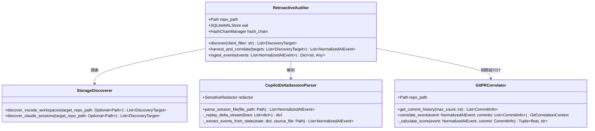

# Antigravity 実装詳細設計書: ローカル AI セッション後追い監査・相関ツール

## 1. Antigravity クラス設計 & 相互作用図



---

## 2. ディレクトリ構成とモジュール配置

```text
src/aegis/
├── models.py                          # [MODIFY] ForensicProvenance, GitCorrelationContext, NormalizedAIEvent 拡張
├── cli.py                             # [MODIFY] harvest retro コマンドの追加
└── harvester/
    ├── __init__.py                    # [MODIFY] エクスポート定義の追加
    ├── claude.py                      # [EXISTING] Claude セッションパーサー
    ├── watcher.py                     # [EXISTING] リアルタイム監視ハーベスター
    ├── copilot_parser.py              # [NEW] VS Code Copilot Delta セッションパーサー
    ├── git_correlator.py              # [NEW] Git Commit & PR 多層相関エンジン
    ├── discoverer.py                  # [NEW] ローカルストレージ自動探索モジュール
    └── retro_auditor.py               # [NEW] 後追い監査オーケストレーター
tests/
    └── test_retro_harvester.py        # [NEW] 後追い監査・Deltaパース・Git相関の包括的テスト
```

---

## 3. コアデータモデル（Pydantic v2 実装詳細）

### 3.1 `ForensicProvenance`
```python
class ForensicProvenance(BaseModel):
    source_path: str = Field(..., description="抽出元のローカルファイル絶対パス")
    source_sha256: str = Field(..., description="抽出元ファイルの SHA-256 ダイジェスト")
    parser_id: str = Field(..., description="パーサー識別子 (例: copilot-delta-v1)")
    extraction_timestamp: datetime = Field(default_factory=datetime.utcnow, description="抽出日時")
    confidence_level: str = Field("HIGH", description="復元完全性の確信度 (HIGH | MEDIUM | LOW)")
    raw_record_kind: Optional[int] = Field(None, description="VS Code Delta Record Kind")
```

### 3.2 `GitCorrelationContext` の拡張
```python
class GitCorrelationContext(BaseModel):
    commit_sha: Optional[str] = None
    commit_timestamp: Optional[datetime] = None
    commit_author: Optional[str] = None
    commit_message: Optional[str] = None
    branch_name: Optional[str] = None
    staged_files: List[str] = Field(default_factory=list)
    diff_hash: Optional[str] = None
    pr_number: Optional[int] = None
    pr_url: Optional[str] = None
    confidence_score: float = Field(default=0.0, ge=0.0, le=1.0)
    confidence_level: str = Field(default="UNLINKED")
    correlation_proof: Optional[str] = None
```

### 3.3 `NormalizedAIEvent` への追加フィールド
```python
    extraction_method: str = Field(default="realtime_hook", description="realtime_hook | retro_local_discovery")
    tags: List[str] = Field(default_factory=list, description="諸元識別タグ (例: source:github-copilot, extraction:retroactive)")
    forensic_provenance: Optional[ForensicProvenance] = Field(None, description="事後抽出フォレンジクス諸元")
```

---

## 4. パーサー & 相関アルゴリズム詳細

### 4.1 VS Code Fast-append Delta Stream Replay
VS Code の `chatSessions/*.jsonl` は以下の構造を取ります：
- **Kind 0 (Base Snapshot)**: ルートオブジェクト `{"kind": 0, "v": {"sessionId": "...", "requests": []}}`
- **Kind 1 (Property Setter)**: パス `k` に基づく置換 `{"kind": 1, "k": ["requests", 0, "message"], "v": "..."}`
- **Kind 2 (Array Appender)**: 配列への要素追加 `{"kind": 2, "k": ["requests"], "v": [{...}]}` または `{"kind": 2, "k": ["requests", 0, "response"], "v": [...]}`

パーサーは行を順次読み込み、`dict` 状態を仮想リプレイして完全な `requests` リストを復元します。

### 4.2 Git Commit & PR 多層相関アルゴリズム
相関確信度スコア $S \in [0.0, 1.0]$:
$$S = 0.40 \cdot S_{\text{temporal}} + 0.45 \cdot S_{\text{files}} + 0.15 \cdot S_{\text{semantic}}$$

1. **時間スコア ($S_{\text{temporal}}$)**:
   - コミット時刻 $T_c$ とセッション時刻 $T_s$ の差分 $\Delta t = T_c - T_s$
   - $\Delta t \in [0, 30\text{min}] \implies 1.0$
   - $\Delta t \in (30\text{min}, 2\text{h}] \implies 0.7$
   - $\Delta t \in (2\text{h}, 24\text{h}] \implies 0.4$
   - $\Delta t > 24\text{h}$ または $\Delta t < 0$ (未来のコミットに紐づかない場合) $\implies 0.1$
2. **ファイルスコア ($S_{\text{files}}$)**:
   - セッション言及ファイル集合 $A$、コミット変更ファイル集合 $C$
   - $S_{\text{files}} = \frac{|A \cap C|}{|A \cup C|}$ （$A \cap C \neq \emptyset$ の場合）
3. **セマンティックスコア ($S_{\text{semantic}}$)**:
   - ユーザープロンプトのトークン集合とコミットメッセージの共通トークン率。

---

## 5. 署名・完全性検証アルゴリズム

集積フェーズでは、抽出されたイベントを `HashChainManager` 経由で暗号学的に連鎖させます：
$$H_0 = \text{Genesis Hash}$$
$$H_i = \text{SHA-256}(H_{i-1} \parallel \text{canonical\_json}(E_i))$$
各レコードの `previous_record_hash` に $H_{i-1}$、`current_record_hash` に $H_i$ が書き込まれ、`aah verify` で改ざんが検知可能となります。

---

## 6. 実行・テスト手順

```bash
# 1. テストスイートの実行
.\.venv\Scripts\pytest tests/test_retro_harvester.py -v

# 2. CLI 動作確認 (ドライラン: 検出のみ)
.\.venv\Scripts\python -m aegis.cli harvest retro --dry-run

# 3. CLI 動作確認 (実際の集積 & Git相関)
.\.venv\Scripts\python -m aegis.cli harvest retro --ingest

# 4. 改ざん検知検証
.\.venv\Scripts\python -m aegis.cli verify
```
