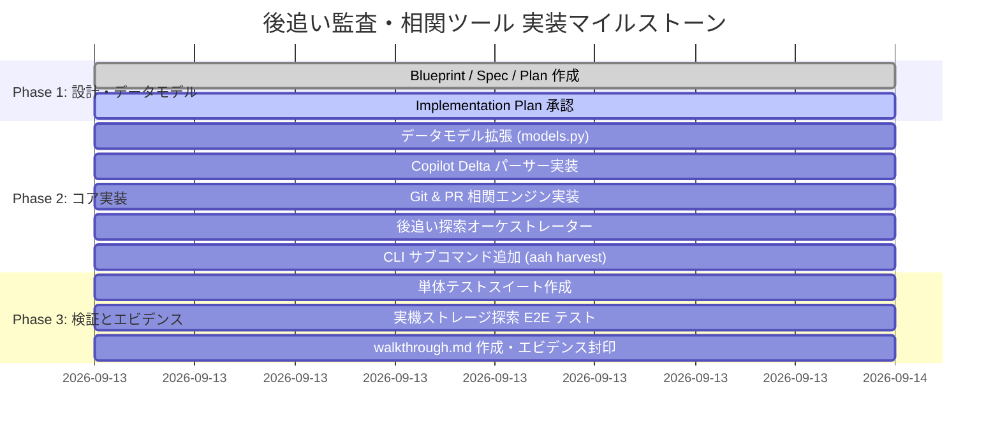

# 開発計画書 & WBS: ローカル AI セッション後追い監査・相関ツール

## 1. 開発方針・原則

1. **決定論的再現性と多層防御 (Determinism & Defense-in-Depth)**:
   - 抽出処理、Git 相関スコア計算、サニタイズはすべて副作用のない純粋関数または決定論的アルゴリズムとし、再現性を保証する。
2. **既存エコシステムとの 100% 互換性 (Zero-Friction Integration)**:
   - 抽出イベントは標準の `NormalizedAIEvent` を介して SQLite WAL および `audit-trail.jsonl` に集積し、既存の Sentinel（`aah check`）、Archivist（`aah verify`）、Refiner（`aah refine`）、Report（`aah report`）をそのまま実行可能にする。
3. **完全なフォレンジクス証跡とプロベナンス (Forensic Traceability)**:
   - 後追い抽出であることを識別するタグ情報（`tags`）および諸元（`extraction_method`, `forensic_provenance`）を必須付与。
4. **安全・非破壊なリードオンリー動作**:
   - 開発者の VS Code や他社ツールのローカルキャッシュファイル、設定、SQLite を一切破壊・変更・ロックしない。

---

## 2. マイルストーン & フェーズ計画

---

## 3. タスク詳細 WBS (Work Breakdown Structure)

### Task 1: データモデル拡張 (`src/aegis/models.py`)
- [ ] `ForensicProvenance` クラスの定義（元ファイルパス、元ファイル SHA-256、パーサーID、抽出日時、確信度）。
- [ ] `GitCorrelationContext` の拡張（コミット日時、コミッター、メッセージ、PR番号、PR URL、相関スコア、確信度レベル）。
- [ ] `NormalizedAIEvent` への `extraction_method`、`tags`、`forensic_provenance` フィールドの追加。
- **完了基準**: `models.py` の Pydantic スキーマが既存テストを壊さずにロードできること。

### Task 2: VS Code / Copilot Delta パーサー実装 (`src/aegis/harvester/copilot.py`)
- [ ] VS Code Fast-append Delta JSONL（Kind 0: base, Kind 1: set, Kind 2: append）の仮想リプレイエンジンの構築。
- [ ] ユーザー入力、モデル名、思考過程、ツール呼出、参照ファイル（`contentReferences`）、編集対象ファイルの抽出。
- [ ] `SensitiveRedactor` によるシークレット・PII のマスキング。
- [ ] 元ファイルの SHA-256 ハッシュ計算と `ForensicProvenance` 生成。
- **完了基準**: サンプル JSONL および実ファイルに対して正常に `NormalizedAIEvent` が生成されること。

### Task 3: Git & PR 相関エンジン実装 (`src/aegis/harvester/git_correlator.py`)
- [ ] `git log` によるコミット履歴（ハッシュ、UNIX時刻、作者、件名）の取得。
- [ ] `git diff-tree` による各コミットの変更ファイル一覧の取得。
- [ ] 多層スコアリング関数（時間近接度、ファイル Jaccard 類似度、プロンプト/メッセージ類似度）の実装。
- [ ] PR 番号抽出（コミットメッセージ正規表現、`gh pr` キャッシュ照合）。
- **完了基準**: セッションイベントに対して、最も関連性の高いコミットとスコアが正しく付与されること。

### Task 4: 後追い探索オーケストレーター (`src/aegis/harvester/retro_auditor.py`)
- [ ] VS Code `workspaceStorage` の自動探索（`workspace.json` を用いたカレントリポジトリ照合および全ワークスペーススキャン）。
- [ ] Claude Code `~/.claude/projects/` の既存パーサー連携。
- [ ] 抽出された全イベントへのプロベナンスタグ（`tags`）付与。
- [ ] `AegisWALBuffer` (SQLite WAL) へのエンキューおよび `audit-trail.jsonl` へのハッシュチェーン追記（`HashChainManager` 連携）。
- **完了基準**: ワンコールで検出・抽出・相関・集積が完了すること。

### Task 5: CLI インターフェース実装 (`src/aegis/cli.py`)
- [ ] `aah harvest retro` コマンドの実装（`--repo`, `--tool`, `--correlate-git`, `--ingest`, `--dry-run`, `--output`）。
- [ ] Rich コンソールによる美麗な結果サマリテーブル表示（検出件数、相関コミット数、PRリンク数、タグ情報）。
- **完了基準**: `aah harvest retro --help` および実機実行が成功すること。

### Task 6: テストスイートと実証
- [ ] `tests/test_retro_harvester.py` の実装（単体テスト、モックテスト、異常系テスト）。
- [ ] `pytest` による全テスト通過確認。
- [ ] `aah verify` によるハッシュチェーン整合性検証。
- **完了基準**: 全テスト PASS、退行なし。

---

## 4. テスト・検証戦略

| テストカテゴリ | 対象 | 検証内容 | 合否基準 |
|:---|:---|:---|:---|
| **単体テスト** | `copilot.py` | Kind 0/1/2 のリプレイ、プロンプト・ツール・ファイルの抽出、Redaction | 想定通りの `NormalizedAIEvent` が抽出されること |
| **単体テスト** | `git_correlator.py` | 時間近接度、ファイル重複、メッセージ類似度の重み付け計算 | 最適なコミットSHAとスコアが付与されること |
| **統合テスト** | `retro_auditor.py` | 探索 $\to$ 抽出 $\to$ 相関 $\to$ WAL/ハッシュチェーン集積 | WALおよび `audit-trail.jsonl` に保存され、タグが付与されること |
| **整合性テスト** | `Archivist` | 後追い集積後のログ台帳検証 | `aah verify` が tamper-free で PASS すること |
| **CLI テスト** | `cli.py` | `aah harvest retro` の各種オプション動作 | 終了コード 0、適切なサマリ出力 |

---

## 5. リスク評価と緩和策

| リスク | 影響度 | 発生確率 | 緩和策 |
|:---|:---:|:---:|:---|
| **大規模なローカルストレージ走査による遅延** | 中 | 中 | `workspace.json` による対象リポジトリ優先探索、および `--since` による期間フィルタリングを設ける。 |
| **VS Code バージョン差によるスキーマ不一致** | 中 | 低 | Delta パーサーは未知の Kind や壊れた行を例外キャッチしてスキップし、部分抽出を許容する防御的設計とする。 |
| **個人情報・トークンの意図せぬログ蓄積** | 高 | 中 | 抽出時に必ず `SensitiveRedactor` を通し、API キーや個人パスを完全にサニタイズする。 |
| **Git リポジトリ外のファイルや無関係なコミットとの誤紐付け** | 低 | 中 | 相関確信度スコアの閾値（0.40未満は UNLINKED）を設け、不確実な紐付けを排除する。 |
