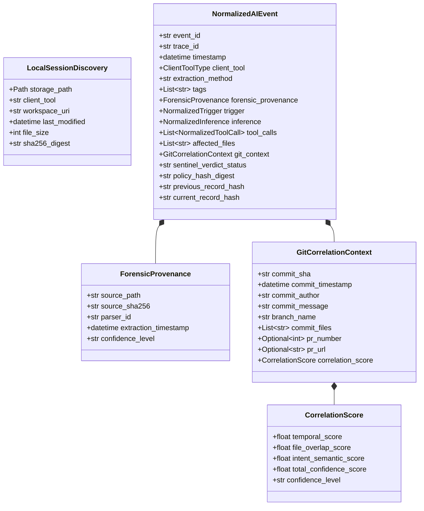

# 要求分析 & 詳細仕様書: ローカル AI セッション後追い監査・相関ツール

## 1. システム全体像とドメインモデル

本仕様は、開発者のローカルストレージ（VS Code `workspaceStorage`, `globalStorage`, Claude Code `~/.claude`, Cursor 等）に蓄積された AI 会話・編集セッションデータを探索・復元し、正規の 5W1H 監査イベントへ正規化、Git コミットおよび PR と紐付けて提出・集積するための技術仕様を定義します。

### 1.1 ドメインモデル


---

## 2. データ構造 & スキーマ定義

### 2.1 拡張 Pydantic モデル定義 (`aegis.models`)

#### A. `ForensicProvenance` (フォレンジクス諸元モデル)
```python
class ForensicProvenance(BaseModel):
    """後追い抽出データのフォレンジクス完全性と探索諸元"""
    source_path: str = Field(..., description="抽出元のローカルファイル絶対パス")
    source_sha256: str = Field(..., description="抽出元ファイルの SHA-256 ダイジェスト")
    parser_id: str = Field(..., description="解析に使用したパーサー識別子 (例: copilot-delta-v1)")
    extraction_timestamp: datetime = Field(default_factory=datetime.utcnow, description="抽出実行日時")
    confidence_level: str = Field("HIGH", description="復元完全性の確信度 (HIGH | MEDIUM | LOW)")
    raw_record_kind: Optional[int] = Field(None, description="VS Code Delta Record Kind (0: base, 1: set, 2: append)")
```

#### B. `GitCorrelationContext` の拡張
```python
class GitCorrelationContext(BaseModel):
    commit_sha: Optional[str] = None
    commit_timestamp: Optional[datetime] = None
    commit_author: Optional[str] = None
    commit_message: Optional[str] = None
    branch_name: Optional[str] = None
    staged_files: List[str] = Field(default_factory=list)
    diff_hash: Optional[str] = None
    pr_number: Optional[int] = None
    pr_url: Optional[str] = None
    confidence_score: float = Field(default=0.0, ge=0.0, le=1.0, description="コミット紐付け総合確信度 (0.0~1.0)")
    confidence_level: str = Field(default="UNLINKED", description="HIGH | MEDIUM | LOW | UNLINKED")
    correlation_proof: Optional[str] = None
```

#### C. `NormalizedAIEvent` の拡張フィールド
- `extraction_method`: `str = "realtime_hook"` (デフォルト) / `"retro_local_discovery"` (後追い抽出)
- `tags`: `List[str] = Field(default_factory=list)` (例: `["source:github-copilot", "extraction:retroactive", "storage:vscode-workspace-storage"]`)
- `forensic_provenance`: `Optional[ForensicProvenance] = None`

---

## 3. インターフェース仕様 (CLI & Engine)

### 3.1 CLI コマンド仕様: `aah harvest retro`
```bash
aah harvest retro [OPTIONS]
```

**引数・オプション**:
- `--repo PATH`: 監査対象リポジトリのパス（デフォルト: `.` カレントリポジトリ）。ワークスペース照合に利用。
- `--tool TEXT`: 対象 AI ツールフィルタ（`all`, `copilot`, `claude`, `cursor`。デフォルト: `all`）。
- `--since TEXT`: 抽出対象の期間（例: `7d`, `30d`, `2026-01-01`。デフォルト: 全期間）。
- `--correlate-git / --no-correlate-git`: Git コミットおよび PR への自動紐付けを行うか（デフォルト: `True`）。
- `--ingest / --dry-run`: 抽出結果を SQLite WAL および `audit-trail.jsonl` に提出・集積するか、コンソール表示のみとするか（デフォルト: `--ingest`）。
- `--output PATH` / `-o PATH`: 抽出結果の JSON/JSONL 出力先パス（任意）。

### 3.2 コアコンポーネント API

#### `RetroactiveSessionHarvester` (`aegis.harvester.retro_harvester`)
```python
class RetroactiveSessionHarvester:
    def __init__(self, repo_path: Path = Path(".")): ...
    def discover_storage_locations(self, client_filter: Optional[str] = None) -> List[DiscoveryTarget]: ...
    def extract_events(self, targets: List[DiscoveryTarget]) -> List[NormalizedAIEvent]: ...
    def correlate_with_git(self, events: List[NormalizedAIEvent]) -> List[NormalizedAIEvent]: ...
    def submit_and_ingest(self, events: List[NormalizedAIEvent]) -> IngestionSummary: ...
```

#### `CopilotDeltaSessionParser` (`aegis.harvester.copilot_parser`)
- VS Code の `chatSessions/<session-id>.jsonl` を読み込み。
- Kind 0 (初期化), Kind 1 (プロパティ更新), Kind 2 (配列追加) の Delta Stream をリプレイ。
- ユーザー入力、モデル思考、Agent種別（`github.copilot.editsAgent` 等）、参照ファイル（`contentReferences`）、編集対象ファイルを抽出。
- `SensitiveRedactor` で機密情報（トークン、APIキー、プライベートパス）をサニタイズ。

#### `GitPRCorrelator` (`aegis.harvester.git_correlator`)
- `git log`（コミット一覧、日時、コミッター、メッセージ）を取得。
- `git diff-tree` による各コミットの変更ファイル一覧を取得。
- セッションの `timestamp`、`affected_files`、`trigger.sanitized_prompt` と各コミットを照合。
- PR 検出: `git log` 内の `Merge pull request #<N>` や `(#<N>)`、GitHub CLI (`gh pr list`) のローカルキャッシュから PR 番号を特定。
- 多層スコアリング関数:
  $$\text{Score} = w_1 \cdot S_{\text{temporal}} + w_2 \cdot S_{\text{files}} + w_3 \cdot S_{\text{semantic}}$$
  - $w_1 = 0.40$ (時間ウィンドウ: 30分以内 1.0, 2時間以内 0.7, 24時間以内 0.4)
  - $w_2 = 0.45$ (ファイル Jaccard 類似度: $\frac{|F_{\text{ai}} \cap F_{\text{commit}}|}{|F_{\text{ai}} \cup F_{\text{commit}}|}$)
  - $w_3 = 0.15$ (メッセージ/プロンプトのトークン重複類似度)
  - 総合スコア $\ge 0.65$ で HIGH, $\ge 0.40$ で MEDIUM, それ未満は LOW または UNLINKED。

---

## 4. セキュリティ、マスキング、コンテキストドリフト抑止要件

1. **機密情報マスキング (Sensitive Redaction)**:
   - 過去のローカルキャッシュには古い GitHub PAT、AWS アクセスキー、パスワード、秘密鍵が生で残存している可能性がある。
   - すべての抽出プロンプト・アシスタント思考・差分は、`SensitiveRedactor` の正規表現およびエントロピースキャンを通過させ、`[REDACTED_API_KEY]` 等に置換する。
2. **改ざん耐性と証跡完全性 (Forensic Integrity)**:
   - 抽出元のローカルファイル全体の SHA-256 ダイジェストを計算し、`forensic_provenance.source_sha256` に記録。
   - 抽出されたイベントは、`HashChainManager` によって直前のレコードハッシュと連鎖（`previous_record_hash` $\to$ `current_record_hash`）させて `audit-trail.jsonl` に書き込む。
3. **ローカルデータの非破壊性 (Read-only Guarantee)**:
   - ユーザーの VS Code や Claude Code のローカルファイル、SQLite DB に対しては読み取り専用（`readonly=True` またはリードモード）でアクセスし、一切の変更・削除を行わない。

---

## 5. 非機能要件

- **処理速度**: 100 件のセッションファイルおよび過去 1,000 件の Git コミットの探索・抽出・相関処理を 5 秒以内に完了すること。
- **堅牢性 (Fault Tolerance)**: 破損した JSONL や未サポート形式の古いキャッシュファイルが存在しても、エラーをスキップして処理を継続すること。
- **決定論的再現性**: 同一のローカルファイル群および Git 履歴に対して実行した場合、常に同一の正規化イベントおよびスコアが生成されること。
