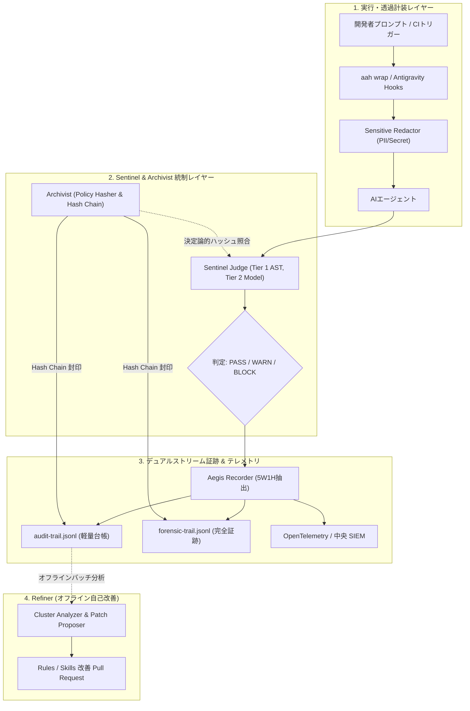

# Agent Aegis Harness アーキテクチャ & システム設計書

## 1. システム構想
Agent Aegis Harness (`aah`) は、ソフトウェア開発AI（Google Antigravity, Claude Code, GitHub Copilot, Cursor 等）の挙動を透過的に計装・監査し、継続的に改善するための共通ガバナンス基盤です。開発者の日常業務に自然に装着され、決定論的再現性、暗号学的改ざん防止、3段階多層防御、およびオフライン自己改善を提供します。

## 2. コアサブシステム仕様

### 2.1 Sentinel (リアルタイム監査・合否判定員)
- **Tier 1 (<10ms)**: インプロセスの高速 AST および正規表現フィルタリングにより、危険コマンド（再帰削除 `rm -rf /`、ディスクフォーマット、破壊操作）やホワイトリスト外ツールの実行を即時遮断（BLOCK）。
- **Sensitive Redactor**: ツール実行・ログ記録直前に、各種クラウドキー（OpenAI, GitHub, AWS）や認証トークン、IP、メールアドレスを自動マスキング。

### 2.2 Archivist (書記・暗号学的証明・再現性管理)
- **Policy Hasher**: `.aegis/rules/` および `.skills/` 内の全ポリシーファイルから正規化 SHA-256 ダイジェスト（`policy_hash_digest`）を算出・固定。
- **Hash Chain Manager**: 各ログ行が直前ブロックのハッシュを取り込む Merkle 連鎖（$H_i = \text{SHA256}(H_{i-1} + \text{Payload}_i)$）により、ログの1文字の改ざんや削除を数学的に即時検知。

### 2.3 Recorder (5W1H デュアルストリーム記録)
- **軽量監査ログ (`audit-trail.jsonl`)**: 日常の点検や高速検証に適したサマリーログ。
- **完全フォレンジックログ (`forensic-trail.jsonl`)**: プロンプト全文、推論トレース、ツール引数の完全な生証跡を保持。
- **独立連鎖保証**: 両ストリームが独立したハッシュチェーンを維持し、完全な暗号学的検証を保証。

### 2.4 Refiner (自己改善・最適化ループ)
- **疎結合運用**: 過去ログの監査判定再現性を保つため、監査実行時と自己改善を完全に分離したオフラインバッチとして動作。
- **Cluster Analyzer & Patch Proposer**: 蓄積ログを分析し、誤検知パターンの緩和やホワイトリスト更新の差分 PR を起票。
