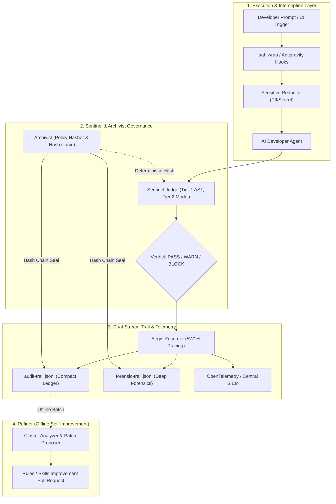

# Agent Aegis Harness Architecture & System Design

## 1. System Vision
Agent Aegis Harness (`aah`) provides an end-to-end governance and observability harness for AI agents (Google Antigravity, Claude Code, GitHub Copilot, Cursor, etc.). It acts as transparent equipment attached to developer workflows, providing deterministic auditability, cryptographic immutability, multi-tiered guardrails, and offline self-refinement.

## 2. Core Subsystems

### 2.1 Sentinel (Real-time Guardrail & Judge)
- **Tier 1 (<10ms)**: Fast in-process AST and regex filtering detecting destructive shell commands (`rm -rf /`, formatting, recursive disk deletion) and policy violations.
- **Sensitive Redactor**: Pre-execution masking of API keys (OpenAI, GitHub, AWS), generic secret tokens, IPv4 addresses, and email addresses.

### 2.2 Archivist (Cryptographic Proof & Reproducibility)
- **Policy Hasher**: Computes a canonical SHA-256 digest (`policy_hash_digest`) across all active policies (`.aegis/rules/`) and skills (`.skills/`).
- **Hash Chain Manager**: Blockchain-style cryptographic linking of audit records ($H_i = \text{SHA256}(H_{i-1} + \text{Payload}_i)$). Detects any tampering, deletion, or reordering.

### 2.3 Recorder (5W1H Dual-Stream Tracing)
- **Compact Trail (`audit-trail.jsonl`)**: Lightweight summary trail for rapid verification and dashboard reporting.
- **Forensic Trail (`forensic-trail.jsonl`)**: Full deep-dive trail preserving complete prompt contexts, reasoning traces, and tool arguments.
- **Independent Merkle Linking**: Both trails maintain independent cryptographic hash chains to ensure complete mathematical integrity.

### 2.4 Refiner (Offline Self-Improvement)
- **Decoupled Architecture**: Refinement runs purely offline to maintain deterministic historical reproducibility.
- **Cluster Analyzer**: Aggregates recurring block patterns, unwhitelisted tools, and drift occurrences.
- **Patch Proposer**: Generates recommended policy adjustments and automated Pull Request proposals.
