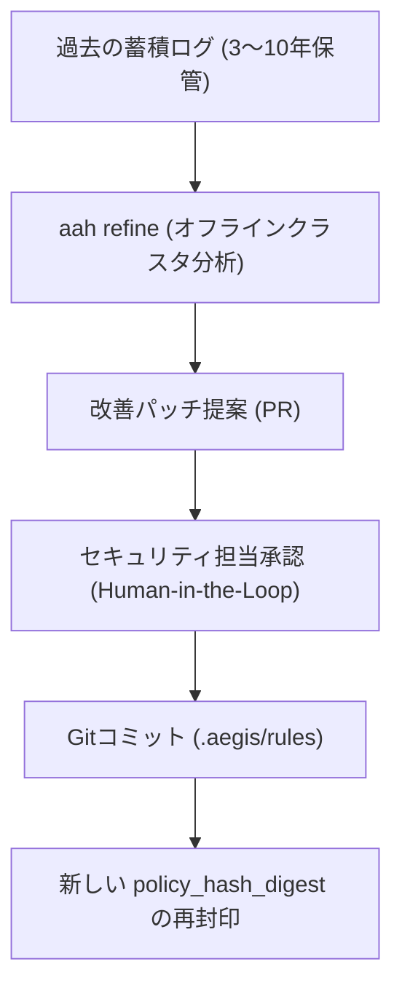

# 監査機構改善・構成管理・バージョン整合管理ガイド

本ガイドは、モデルの進化や開発現場のルール変更に合わせて、監査ポリシー、スキーマ、および AI スキルを安全に進化させつつ、過去ログの決定論的再現性を維持するための運用手順を定めます。

## 1. 継続的ガバナンス改善の原則



1. **疎結合な改善 (Decoupled Refinement)**: 監査ルール改定はリアルタイムではなく、必ず人間のレビューを経た Pull Request として適用します。
2. **決定論的ダイジェスト**: ルールやスキルが 1 文字でも改定されると、新しい `policy_hash_digest` が再計算され、当時のバージョンと不可分に紐付けられます。
3. **過去ログの可読性永続保証**: 数年前に記録された不変ログが将来にわたって検証・復号可能であることを保証します。

---

## 2. スキーマの SemVer 管理規約

ログスキーマ（`.aegis/schemas/audit-event.schema.json`）は厳格なセマンティックバージョニングに準拠します：
- **パッチ (`x.y.Z`)**: フィールド説明文の修正。
- **マイナー (`x.Y.z`)**: オプショナル項目の追加。旧スキーマで記録されたログも新スキーマで完全に互換性を保ちます。
- **メジャー (`X.y.z`)**: 破壊的変更。スキーマファイルを上書きせず、新スキーマ（`audit-event.v2.schema.json`）を共存させる **Dual-Reading (マルチスキーマ検証)** を採用します。

---

## 3. ポリシー改善の運用フロー

1. 蓄積された監査ログを分析：
   ```bash
   aah refine --propose-pr
   ```
2. 提案内容の確認：
   - 開発者が頻繁に使用している未許可ツールのホワイトリスト追加可否を検討。
   - 誤検知率が高いコンテキストドリフト閾値の微調整。
3. ローカル検証：
   ```bash
   pytest -v tests/
   aah check
   ```
4. PR を起票し、セキュリティ・ガバナンスチームの合意形成を経てマージします。
