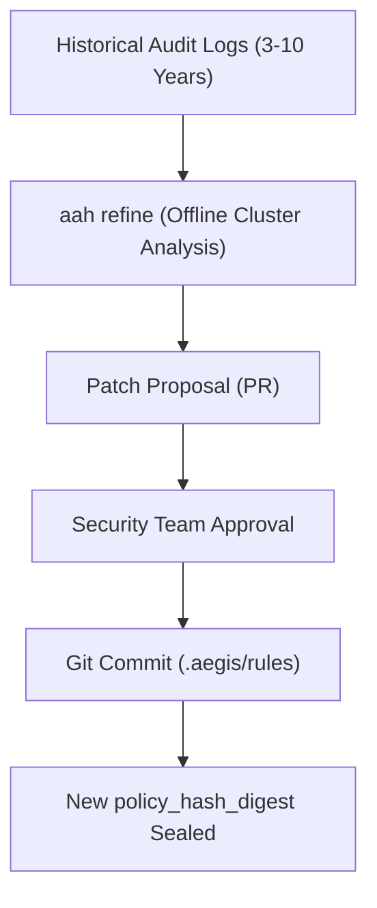

# Harness Evolution & Version Consistency Management Guide

This guide governs how policies, schemas, and AI skills evolve over time while preserving backward compatibility and deterministic historical reproducibility.

## 1. Principles of Continuous Governance Evolution



1. **Decoupled Refinement**: Policies are updated via deliberate Human-in-the-Loop Git Pull Requests, never during real-time auditing.
2. **Canonical Policy Digest**: Any change to `.aegis/rules/` or `.skills/` automatically recalculates a new deterministic `policy_hash_digest`.
3. **Decodability Guarantee**: Historical logs recorded years ago must always decode and verify successfully against schema specifications.

---

## 2. Schema SemVer & Dual-Reading Protocol

Audit schemas (`.aegis/schemas/audit-event.schema.json`) follow strict Semantic Versioning:
- **Patch (`x.y.Z`)**: Field descriptions, formatting examples.
- **Minor (`x.Y.z`)**: Adding optional fields (e.g. `environment.ide_version`). Old logs remain fully compliant without breaking.
- **Major (`X.y.z`)**: Breaking field alterations. Aegis adopts a Multi-Schema coexistence strategy (`audit-event.v2.schema.json`), allowing verifiers to select the appropriate parser based on the event's schema reference.

---

## 3. Policy Update Procedure

1. Run Refiner on historical logs:
   ```bash
   aah refine --propose-pr
   ```
2. Inspect recommendations:
   - Identify unwhitelisted tools repeatedly requested by developers.
   - Adjust drift threshold if false-positive warnings exceed acceptable rates.
3. Apply changes and verify:
   ```bash
   pytest -v tests/
   aah check
   ```
4. Submit PR for security review and merge into the central policy repository.
