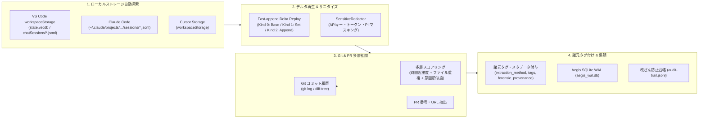

# ローカル AI セッション後追い監査・Git相関運用ガイド

## 1. 概要と背景

### 1.1 なぜ「後追い監査」が必要なのか？
組織で AI 開発ガバナンス（ISO/IEC 42001, NIST AI RMF, EU AI Act, SLSA for AI）を推進する際、リアルタイム監査フック（MCPゲートウェイ、CLIラッパー、Pre-commitフック等）が配備される前に開発者が実行した過去の AI 操作や、フックを一時的にバイパスして行われたローカル操作は、組織の中央台帳に記録されず「シャドウ AI 開発」として潜在的コンプライアンスリスクになります。

VS Code (GitHub Copilot Chat)、Claude Code、Cursor 等のモダン IDE/ツールは、対話履歴や編集指示をローカルストレージ（SQLite `state.vscdb`、差分ストリーム形式の `chatSessions/*.jsonl` 等）にキャッシュとして保持しています。

**Agent Aegis Harness (`aah`) の後追い監査機能 (`aah harvest retro` / `aah audit-retro`)** は、これらローカルキャッシュを自動探索・復元し、**正規のリアルタイム収集データと完全に同一のフォーマット（`NormalizedAIEvent` / WAL / Hash Chain）で集積・提出**すると同時に、Git コミットや PR と高精度に紐付けるソリューションを提供します。

---

## 2. アーキテクチャと主要機能



### 2.1 主な特徴

1. **VS Code Fast-append Delta Stream の完全仮想リプレイ**:
   - `chatSessions/*.jsonl` のベーススナップショット（Kind 0）、プロパティ更新（Kind 1）、配列要素追加（Kind 2）を仮想リプレイし、ユーザープロンプト、モデル名、思考、ツール呼出、参照ファイル、編集ファイルを忠実に再構築します。
2. **データの諸元におけるプロベナンスタグ埋め込み**:
   - リアルタイムログと明確に識別できるよう、各イベントに `extraction_method: "retro_local_discovery"`、タグ群（`source:github-copilot`, `extraction:retroactive`, `session:<id>`）、および元ファイルハッシュを含む `forensic_provenance` を付与します。
3. **Git Commit & PR との多層ハイブリッド相関**:
   - 単なる時間比較に頼らず、言及ファイルとコミット変更ファイルの Jaccard 類似度、プロンプトとコミットメッセージのセマンティック重複度を重み付け計算し、確信度（HIGH/MEDIUM/LOW/UNLINKED）と PR 番号を付与します。
4. **機密情報の徹底マスキング**:
   - 過去のローカルキャッシュに含まれる古い API キー（OpenAI `sk-proj-...`、GitHub PAT、AWS キー等）や PII を `SensitiveRedactor` で自動検出しマスキングします。
5. **暗号学的完全性封印 (Hash Chain)**:
   - 抽出イベントを `HashChainManager` 経由で連鎖させ、既存の `aah verify` や `aah check` で改ざん検知が可能な状態で集積します。

---

## 3. コマンドリファレンス (`aah harvest retro`)

### 3.1 基本構文
```bash
# 標準コマンド
aah harvest retro [OPTIONS]

# エイリアス（短縮コマンド）
aah audit-retro [OPTIONS]
```

### 3.2 オプション一覧

| オプション | 型 / デフォルト | 説明 |
|:---|:---:|:---|
| `--repo PATH` | `PATH` (デフォルト: `.`) | 監査対象リポジトリのパス。ワークスペース URI との照合および Git コミット・PR 取得に使用します。 |
| `--tool TEXT` | `TEXT` (デフォルト: `all`) | 対象 AI ツールフィルタ（`all`, `copilot`, `claude`, `cursor`）。 |
| `--since TEXT` | `TEXT` (デフォルト: なし) | 抽出対象期間の絞り込み（例: `7d` (直近7日), `24h` (直近24時間), `2026-01-01`）。 |
| `--matched-only` | フラグ (デフォルト: 無効) | 対象リポジトリのワークスペースと厳格に一致するセッションのみを抽出。 |
| `--correlate-git` / `--no-correlate-git` | フラグ (デフォルト: 有効) | Git コミットおよび PR との自動相関紐付けを実行するかどうか。 |
| `--ingest` / `--dry-run` | フラグ (デフォルト: `--ingest`) | 抽出イベントを SQLite WAL および `audit-trail.jsonl` に保存するか（`--dry-run` はシミュレーション表示のみ）。 |
| `--output PATH`, `-o PATH` | `PATH` (デフォルト: なし) | 抽出・正規化された `NormalizedAIEvent` の全データを JSON ファイルとしてエクスポート。 |

---

## 4. 利用シナリオと運用例

### ユースケース 1: ドライランによるシャドウ AI 操作の事前調査
実データへの書き込みを行わず、現在のローカル環境に残存している Copilot セッション数や Git 相関可能性を調査します。

```bash
aah harvest retro --dry-run
```

**実行結果サマリ例**:
```text
[RETRO AUDIT] Starting retroactive local AI session discovery...
  Target Repository: /path/to/repo
  Tool Filter: all | Ingest: False | Git Correlation: True
    Aegis Retroactive AI Session Audit Summary    
┏━━━━━━━━━━━━━━━━━━━━━━━━━━┳━━━━━━━━━━━━━━━━━━━━━┓
┃ Metric                   ┃ Count / Status      ┃
┡━━━━━━━━━━━━━━━━━━━━━━━━━━╇━━━━━━━━━━━━━━━━━━━━━┩
│ Discovered Session Files │ 48                  │
│ Matched Workspace Files  │ 8                   │
│ Extracted AI Turn Events │ 15                  │
│ Git Correlated Commits   │ 1                   │
│ Linked Pull Requests     │ 0                   │
│ Ingestion Mode           │ DRY-RUN (Simulated) │
└──────────────────────────┴─────────────────────┘
```

---

### ユースケース 2: 対象リポジトリの一致セッションのみを抽出・集積
カレントリポジトリに関連するセッションのみを厳格に対象とし、直近30日間の操作を台帳に集積します。

```bash
aah harvest retro --matched-only --since 30d --ingest
```

集積後、改ざん防止台帳の整合性を検証します：
```bash
aah verify --log-file .aegis/logs/audit-trail.jsonl
```
出力例：
```text
[VERIFY] Verifying audit log integrity: .aegis/logs/audit-trail.jsonl...
[OK] Cryptographic proof verified. All 82 audit blocks intact. No tampering detected.
```

---

### ユースケース 3: 外部監査用 JSON レポートのエクスポート
法務・セキュリティ監査チームへの提出用として、諸元タグや相関証明を含む完全な JSON エクスポートを生成します。

```bash
aah harvest retro --tool copilot -o .aegis/reports/copilot-retro-audit.json
```

---

## 5. データの諸元（メタデータ）の確認方法

集積されたログ (`.aegis/logs/audit-trail.jsonl`) を確認すると、各イベントに以下のような完全な諸元情報が記録されていることが確認できます。

```json
{
  "trace_id": "sess-copilot-01_turn_0",
  "client_tool": "github-copilot",
  "extraction_method": "retro_local_discovery",
  "tags": [
    "source:github-copilot",
    "extraction:retroactive",
    "storage:vscode-workspace-storage",
    "session:sess-copilot-01",
    "agent:github.copilot.editsAgent",
    "workspace:matched",
    "git:correlated_high",
    "commit:44ac46c",
    "pr:42"
  ],
  "forensic_provenance": {
    "source_path": "C:\\Users\\...\\workspaceStorage\\...\\chatSessions\\sess-copilot-01.jsonl",
    "source_sha256": "d563d1a66aefc37db00023aaeea94593e9e20200a5811656e55d90aecfda5cf0",
    "parser_id": "copilot-delta-v1",
    "extraction_timestamp": "2026-09-13T11:16:23.682853",
    "confidence_level": "HIGH"
  },
  "git_context": {
    "commit_sha": "44ac46ca829b01e3b092a487c65ef49a01234567",
    "commit_timestamp": "2026-04-04T05:10:00",
    "commit_author": "Developer <dev@example.com>",
    "commit_message": "feat(auth): improve session handling (#42)",
    "branch_name": "main",
    "pr_number": 42,
    "confidence_score": 0.88,
    "confidence_level": "HIGH",
    "correlation_proof": "sha:44ac46c|score:0.88|level:HIGH|pr:42"
  },
  "integrity": {
    "previous_record_hash": "5d53c45732eb54373243f074358d66cb94dfffca1f5c482504e9e1f87af0a523",
    "current_record_hash": "c02ecb2de28c41e41eb62ab209e3f9bb14d5749087dbac7521e2b3ec529abf7e"
  }
}
```

これにより、リアルタイム収集ログと後追い抽出ログをフィルタリング・判別しながら、統一された台帳としてシームレスにガバナンス評価（`aah check` や `aah report`）へ流し込むことが可能になります。
