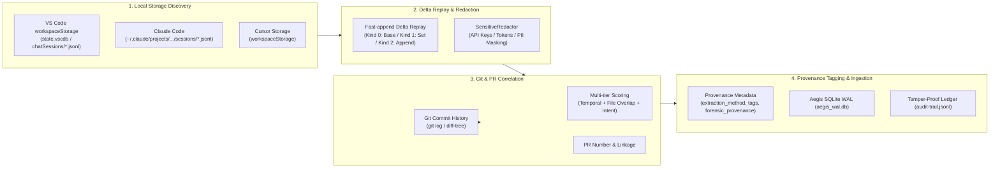

# Retroactive Local AI Session Harvester & Git Correlator Guide

## 1. Overview & Problem Statement

### 1.1 Why is Retroactive Auditing Necessary?
When organizations introduce AI engineering governance standards (such as ISO/IEC 42001, NIST AI RMF, EU AI Act, or SLSA for AI), AI developer operations executed prior to the rollout of real-time audit hooks (MCP gateway, CLI wrapper, pre-commit hooks) or operations performed when hooks were temporarily bypassed create an unrecorded compliance blind spot ("Shadow AI Development").

Fortunately, modern developer environments like VS Code (GitHub Copilot Chat), Claude Code, and Cursor cache conversation history and editing actions locally (e.g. SQLite `state.vscdb`, delta-stream `chatSessions/*.jsonl`).

**The Agent Aegis Harness (`aah`) Retroactive Auditor (`aah harvest retro` / `aah audit-retro`)** automatically discovers and recovers these cached sessions, normalizing them into the **exact same 5W1H audit schema (`NormalizedAIEvent`) and cryptographic hash-chain ledger (`audit-trail.jsonl`)** as real-time events, while cryptographically correlating operations with Git commits and PRs.

---

## 2. Architecture & Key Capabilities



### 2.1 Key Highlights

1. **Full Virtual Replay of VS Code Fast-append Delta JSONL**:
   - Accurately reconstructs conversational turns, prompt messages, model names, agent identities (e.g., `github.copilot.editsAgent`), tool invocations, referenced files (`contentReferences`), and modified files from streaming deltas.
2. **Provenance Tagging in Data Specifications**:
   - To distinguish retroactive events from real-time events, records include `extraction_method: "retro_local_discovery"`, descriptive `tags` (e.g. `source:github-copilot`, `extraction:retroactive`, `session:<id>`), and `forensic_provenance` containing the source file's SHA-256 digest and parser identification.
3. **Multi-tier Git Commit & PR Correlation**:
   - Evaluates temporal proximity ($S_{\text{temporal}}$), file set Jaccard similarity ($S_{\text{files}}$), and intent semantic token overlap ($S_{\text{semantic}}$) to assign confidence levels (`HIGH`, `MEDIUM`, `LOW`, `UNLINKED`) and associate pull request numbers.
4. **Sensitive Redaction of Cached Secrets**:
   - Automatically sanitizes legacy or active secrets (including modern OpenAI `sk-proj-...` keys, GitHub tokens, AWS keys, and PII) prior to logging.
5. **Cryptographic Hash Chain Sealing**:
   - Connects each recovered turn to the existing Merkle hash chain, enabling verification with `aah verify` and gating with `aah check`.

---

## 3. CLI Command Reference (`aah harvest retro`)

### 3.1 Basic Usage
```bash
# Standard command
aah harvest retro [OPTIONS]

# Convenient alias
aah audit-retro [OPTIONS]
```

### 3.2 Options

| Option | Type / Default | Description |
|:---|:---:|:---|
| `--repo PATH` | `PATH` (default: `.`) | Path to the target Git repository for workspace matching and commit correlation. |
| `--tool TEXT` | `TEXT` (default: `all`) | AI tool filter (`all`, `copilot`, `claude`, `cursor`). |
| `--since TEXT` | `TEXT` (default: None) | Filter sessions modified after this period (e.g., `7d`, `24h`, `2026-01-01`). |
| `--matched-only` | Flag (default: False) | Only extract sessions whose workspace URI matches the target repository. |
| `--correlate-git` / `--no-correlate-git` | Flag (default: True) | Perform automated multi-tier correlation against Git commits and PRs. |
| `--ingest` / `--dry-run` | Flag (default: `--ingest`) | Ingest into SQLite WAL and `audit-trail.jsonl` (`--dry-run` performs discovery only). |
| `--output PATH`, `-o PATH` | `PATH` (default: None) | Export normalized events as a JSON file. |

---

## 4. Usage Examples & Workflows

### Example 1: Dry-Run Reconnaissance
Inspect available cached sessions and verify Git correlation without modifying audit ledgers:

```bash
aah harvest retro --dry-run
```

### Example 2: Ingest Repository-Matched Sessions with Period Filter
Recover and ingest only sessions corresponding to the current project over the past 30 days:

```bash
aah harvest retro --matched-only --since 30d --ingest
```

Verify ledger cryptographic integrity post-ingestion:
```bash
aah verify --log-file .aegis/logs/audit-trail.jsonl
```

### Example 3: Export Evidence for Legal / Audit Review
Generate an external audit JSON document:

```bash
aah harvest retro --tool copilot -o .aegis/reports/copilot-retro-audit.json
```

---

## 5. Sample Provenance & Ingestion Structure

Recovered events stored in `.aegis/logs/audit-trail.jsonl` feature complete provenance:

```json
{
  "trace_id": "sess-copilot-01_turn_0",
  "client_tool": "github-copilot",
  "extraction_method": "retro_local_discovery",
  "tags": [
    "source:github-copilot",
    "extraction:retroactive",
    "storage:vscode-workspace-storage",
    "session:sess-copilot-01",
    "workspace:matched",
    "git:correlated_high",
    "commit:44ac46c",
    "pr:42"
  ],
  "forensic_provenance": {
    "source_path": "C:\\Users\\...\\workspaceStorage\\...\\chatSessions\\sess-copilot-01.jsonl",
    "source_sha256": "d563d1a66aefc37db00023aaeea94593e9e20200a5811656e55d90aecfda5cf0",
    "parser_id": "copilot-delta-v1",
    "extraction_timestamp": "2026-09-13T11:16:23.682853",
    "confidence_level": "HIGH"
  },
  "git_context": {
    "commit_sha": "44ac46ca829b01e3b092a487c65ef49a01234567",
    "commit_timestamp": "2026-04-04T05:10:00",
    "commit_author": "Developer <dev@example.com>",
    "commit_message": "feat(auth): improve session handling (#42)",
    "branch_name": "main",
    "pr_number": 42,
    "confidence_score": 0.88,
    "confidence_level": "HIGH",
    "correlation_proof": "sha:44ac46c|score:0.88|level:HIGH|pr:42"
  },
  "integrity": {
    "previous_record_hash": "5d53c45732eb54373243f074358d66cb94dfffca1f5c482504e9e1f87af0a523",
    "current_record_hash": "c02ecb2de28c41e41eb62ab209e3f9bb14d5749087dbac7521e2b3ec529abf7e"
  }
}
```
