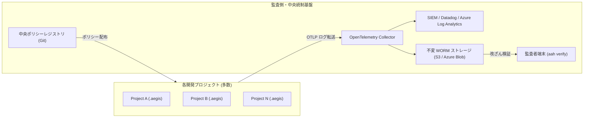

# 監査側初期構築 & 中央統制基盤セットアップガイド

本ガイドは、セキュリティ・コンプライアンス・監査室が、組織横断で AI エージェントの監査ログを集約・検証・監視するための中央インフラを構築する手順を説明します。

## 1. 全社ガバナンス構成図



---

## 2. 初期構築手順

### Step 1: 中央ポリシーレジストリの整備
全社共通の禁止コマンド、マスキングパターン、許可ツール定義を専用リポジトリ（`aegis-central-policies`）で一元管理します。各プロジェクトの CI で同期を行います。

### Step 2: OpenTelemetry Collector の配備
各端末および CI から送信される `AegisAuditEvent` を安全に受領する OTel Collector を構成します：
```yaml
receivers:
  otlp:
    protocols:
      grpc:
        endpoint: 0.0.0.0:4317
exporters:
  file:
    path: /var/log/aegis/central-audit.jsonl
service:
  pipelines:
    logs:
      receivers: [otlp]
      exporters: [file]
```

### Step 3: 不変ストレージ (WORM ロック) の有効化
EU AI Act（第12条）および各種法令要件に基づき、最低3年〜最大10年間の削除・改ざん不能ロック（S3 Object Lock Compliance Mode または Azure Blob 時間ベース保持）を適用します。

---

## 3. 定常監査・改ざん検証手順

監査者は、取得した監査ログの暗号学的整合性を検証します：
```bash
aah verify --log-file /path/to/central-audit.jsonl
```
これにより以下が立証されます：
- ブロックチェーン型 Hash Chain 連鎖が破綻していないこと
- 承認されたポリシーダイジェスト（`policy_hash_digest`）の統制下で記録されていること
- 開発者や第三者による手動改ざん・ログの欠落が一切ないこと
