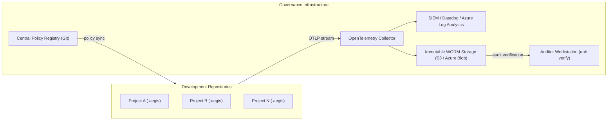

# Auditor & Governance Central Setup Guide

This guide describes how security, compliance, and governance teams establish central infrastructure to collect, verify, and monitor AI agent audit logs across enterprise repositories.

## 1. Central Governance Topology



---

## 2. Infrastructure Setup Steps

### Step 1: Central Policy Registry
Maintain organization-wide governance rules in a centralized repository (`aegis-central-policies`). Individual repositories sync policies during CI builds or developer onboarding.

### Step 2: OpenTelemetry Ingestion Collector
Configure an OTel Collector to receive `AegisAuditEvent` telemetry via gRPC / HTTP (port 4317/4318) and route to central storage:
```yaml
receivers:
  otlp:
    protocols:
      grpc:
        endpoint: 0.0.0.0:4317
exporters:
  file:
    path: /var/log/aegis/central-audit.jsonl
service:
  pipelines:
    logs:
      receivers: [otlp]
      exporters: [file]
```

### Step 3: Immutable Storage (WORM Lock)
Enable compliance retention policies (such as AWS S3 Object Lock or Azure Blob Time-based Retention) to guarantee 3 to 10 years of immutable audit retention required by EU AI Act and SOC 2 Type II regulations.

---

## 3. Daily Governance Verification

Auditors verify log integrity using Archivist:
```bash
aah verify --log-file /path/to/central-audit.jsonl
```
This verifies:
- Unbroken cryptographic Hash Chain links ($H_i = \text{SHA256}(H_{i-1} + \text{Payload}_i)$)
- Matching `policy_hash_digest` against approved central policy versions
- Zero log tampering or missing events
