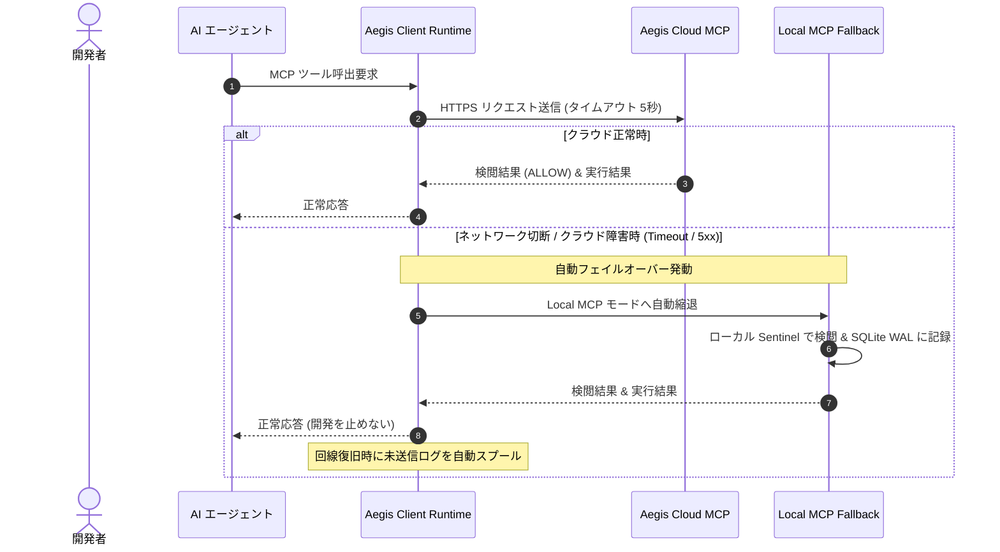

# Aegis Cloud MCP Security Gateway 構築・運用ガイド

本ガイドは、全社規模（100PJ × 数十名規模）で AI 開発ツール（Claude Code, VSCode Copilot, Cursor 等）の Model Context Protocol (MCP) ツール呼び出しを一元検閲・監査するための **「Aegis Cloud MCP Security Gateway」** の構築手順と運用プラクティスを定めます。

---

## 1. 全体アーキテクチャ

Aegis Cloud MCP サーバーは、社内ネットワークまたは閉域網上に配置され、開発者端末からの MCP ツール要求（ファイル操作、Bash 実行、検索等）を中央で安全に中継・検閲します。

```mermaid
flowchart TD
    subgraph Clients ["開発者端末 (100+ プロジェクト)"]
        Dev1["Developer Machine A<br/>(Claude Code / Cursor)"]
        Dev2["Developer Machine B<br/>(VSCode Copilot)"]
    end

    subgraph SecurityPerimeter ["社内ネットワーク / クラウド境界"]
        APIGW["API Gateway / リバースプロキシ<br/>(TLS終端 / mTLS / Bearer認証)"]
        
        subgraph ComputeCluster ["コンテナ実行環境 (Container Apps / ECS)"]
            MCPService["Aegis MCP Security Gateway<br/>(Python / aah mcp-server --cloud)"]
            SentinelEngine["Sentinel Central Judge<br/>(中央ルール即時検閲)"]
        end

        subgraph CentralServices ["全社中央統制サービス"]
            PolicyRepo["中央ポリシー GitOps<br/>(禁止コマンド / シークレット定義)"]
            CentralWORM["監査ログ WORM 保管層<br/>(Azure Blob Immutable / AWS S3 Lock)"]
            SIEM["SIEM / Log Analytics<br/>(即時アラート通知)"]
        end
    end

    Dev1 -->|HTTPS / SSE (Bearer Token)| APIGW
    Dev2 -->|HTTPS / SSE (Bearer Token)| APIGW
    APIGW --> MCPService
    MCPService --> SentinelEngine
    PolicyRepo -->|動的同期| SentinelEngine
    SentinelEngine -->|5W1H 監査イベント| CentralWORM
    SentinelEngine -->|違反即時通知| SIEM
```

### Local MCP との使い分け
- **Local MCP (デフォルト):** 端末ローカルで完結し、ゼロインフラ・完全オフラインで動作。
- **Cloud MCP (本ガイド):** 全社一括でのポリシー適用、端末に秘密鍵や高度な検閲ルールを置かないゼロトラスト構成、リアルタイムの中央インシデント遮断が必要なプロジェクトで有効化。

---

## 2. コンテナイメージの準備

Aegis MCP サーバーは、軽量な Python/FastAPI ベースのコンテナとして動作します。

### 2.1 `Dockerfile`
```dockerfile
FROM python:3.11-slim

WORKDIR /app

# セキュリティパッケージと必要なツールの導入
RUN apt-get update && apt-get install -y --no-install-recommends \
    curl \
    git \
    ca-certificates \
    && rm -rf /var/lib/apt/lists/*

# 依存関係のインストール
COPY pyproject.toml .
RUN pip install --no-cache-dir .[cloud]

# アプリケーションコードとデフォルトルールの配置
COPY src/ /app/src/
COPY .aegis/rules/ /app/rules/

ENV PYTHONUNBUFFERED=1
ENV AEGIS_MCP_MODE=cloud
ENV AEGIS_RULES_DIR=/app/rules

EXPOSE 8000

# MCP SSE/HTTP エンドポイントを起動
CMD ["uvicorn", "aegis.mcp_gateway.server:app", "--host", "0.0.0.0", "--port", "8000"]
```

---

## 3. インフラプロビジョニング手順

### 選択肢 A: Azure Container Apps (推奨・推奨構成)

Azure 環境に Bicep または Azure CLI を用いてプロビジョニングします。

```bash
# 1. リソースグループと Container Apps 環境の作成
az group create --name rg-aegis-governance --location japaneast
az containerapp env create --name env-aegis-mcp --resource-group rg-aegis-governance --location japaneast

# 2. Key Vault からの認証トークン参照とコンテナデプロイ
az containerapp create \
  --name aegis-mcp-gateway \
  --resource-group rg-aegis-governance \
  --environment env-aegis-mcp \
  --image myregistry.azurecr.io/aegis-mcp-gateway:latest \
  --target-port 8000 \
  --ingress external \
  --min-replicas 2 \
  --max-replicas 10 \
  --secrets mcp-auth-token=keyvaultref:https://kv-aegis.vault.azure.net/secrets/mcp-auth-token \
  --env-vars AEGIS_AUTH_TOKEN=secretref:mcp-auth-token \
             AEGIS_STORAGE_MODE=azure_blob \
             AZURE_STORAGE_CONTAINER="https://staegisaudit.blob.core.windows.net/audit-worm"
```

### 選択肢 B: AWS ECS / Fargate

AWS 環境に ECS タスク定義と Application Load Balancer (ALB) を構成します。

```bash
# AWS ECS タスクの起動 (Fargate 構成)
aws ecs run-task \
  --cluster cluster-aegis-governance \
  --task-definition aegis-mcp-gateway:1 \
  --launch-type FARGATE \
  --network-configuration "awsvpcConfiguration={subnets=[subnet-12345],securityGroups=[sg-67890],assignPublicIp=DISABLED}"
```

### 選択肢 C: Docker Compose (社内オンプレミス / 検証環境)

```yaml
version: "3.8"
services:
  aegis-cloud-mcp:
    image: aegis-mcp-gateway:latest
    ports:
      - "8000:8000"
    environment:
      - AEGIS_AUTH_TOKEN=${AEGIS_AUTH_TOKEN}
      - AEGIS_STORAGE_MODE=local_volume
    volumes:
      - ./central-audit-logs:/app/logs
      - ./central-rules:/app/rules:ro
    restart: unless-stopped
```

---

## 4. クライアント側（開発プロジェクト）の接続設定

プロジェクト側で Cloud MCP サーバーを利用するための設定手順です。

### 4.1 `.aegis/config.yaml` の切り替え
```yaml
version: "1.3.0"
repository_id: "payment-service"

mcp_gateway:
  mode: "cloud" # "local" から "cloud" へ変更
  cloud:
    endpoint: "https://aegis-mcp.enterprise.internal/v1/mcp"
    auth:
      type: "bearer_token"
      token_env_var: "AEGIS_CLOUD_MCP_TOKEN"
    tls_verify: true
    timeout_sec: 5
    fallback_to_local_on_error: true # クラウド障害時の自動ローカル縮退
```

### 4.2 各種ツール設定への反映

`aah init` または `aah mcp-config` を実行すると、各ツールの設定ファイルに Cloud MCP の URL が反映されます。

- **Claude Code (`.claude/config.json`):**
  ```json
  {
    "mcpServers": {
      "aegis-security": {
        "url": "https://aegis-mcp.enterprise.internal/v1/mcp",
        "headers": {
          "Authorization": "Bearer ${AEGIS_CLOUD_MCP_TOKEN}"
        }
      }
    }
  }
  ```

- **VSCode (`.vscode/settings.json`):**
  ```json
  {
    "github.copilot.advanced": {
      "mcpServers": {
        "aegis": {
          "type": "sse",
          "url": "https://aegis-mcp.enterprise.internal/v1/mcp"
        }
      }
    }
  }
  ```

---

## 5. 高可用性 & ローカルフォールバック (Resilience)

通信切断やクラウド障害によって開発者の業務が停止する（Flow State が阻害される）のを防ぐため、以下のフェイルセーフ機構が組み込まれています。



---

## 6. セキュリティ・認証ベストプラクティス

1. **ゼロトラスト認証:**
   - 開発者個人の API トークンではなく、端末のデバイス証明書（mTLS）または社内 IdP（Azure AD / Okta）発行の OIDC ワークスペーストークンを使用。
2. **監査ログの WORM 封印:**
   - Cloud MCP で生成された監査ログは、即座に改ざん防止ストレージ（Azure Blob 不変ストレージ / S3 Object Lock）へ書き込み、3〜10年間削除不能とする。
3. **ヘルスチェックとアラート監視:**
   - `/healthz` エンドポイントを監視し、レイテンシが 200ms を超過した場合はアラートを発報。
