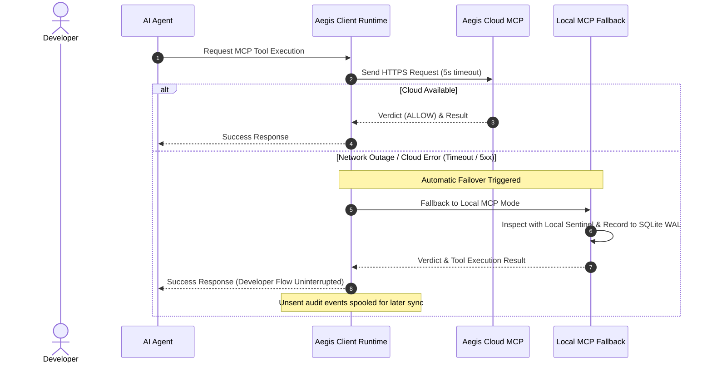

# Aegis Cloud MCP Security Gateway Setup & Operations Guide

This guide establishes the provisioning procedures and operational practices for the **Aegis Cloud MCP Security Gateway**, designed to centrally inspect, govern, and audit Model Context Protocol (MCP) tool invocations across an enterprise scale (100+ projects × dozens of developers).

---

## 1. System Architecture

The Aegis Cloud MCP Server is deployed within an enterprise intranet or secure cloud perimeter to safely broker and inspect MCP tool requests (file operations, bash execution, web searches, etc.) from developer workstations.

```mermaid
flowchart TD
    subgraph Clients ["Developer Workstations (100+ Projects)"]
        Dev1["Developer Machine A<br/>(Claude Code / Cursor)"]
        Dev2["Developer Machine B<br/>(VSCode Copilot)"]
    end

    subgraph SecurityPerimeter ["Internal Network / Cloud Perimeter"]
        APIGW["API Gateway / Reverse Proxy<br/>(TLS Termination / mTLS / Bearer Auth)"]
        
        subgraph ComputeCluster ["Container Runtime (Container Apps / ECS)"]
            MCPService["Aegis MCP Security Gateway<br/>(Python / aah mcp-server --cloud)"]
            SentinelEngine["Sentinel Central Judge<br/>(Central Rule Real-time Inspection)"]
        end

        subgraph CentralServices ["Enterprise Central Governance"]
            PolicyRepo["Central Policy GitOps<br/>(Forbidden Commands / Secret Patterns)"]
            CentralWORM["Immutable Audit Log WORM Storage<br/>(Azure Blob Immutable / AWS S3 Lock)"]
            SIEM["SIEM / Log Analytics<br/>(Instant Violation Alerts)"]
        end
    end

    Dev1 -->|HTTPS / SSE (Bearer Token)| APIGW
    Dev2 -->|HTTPS / SSE (Bearer Token)| APIGW
    APIGW --> MCPService
    MCPService --> SentinelEngine
    PolicyRepo -->|Dynamic Sync| SentinelEngine
    SentinelEngine -->|5W1H Audit Event| CentralWORM
    SentinelEngine -->|Real-time Alert| SIEM
```

### Distinction from Local MCP Mode
- **Local MCP Mode (Default):** Runs entirely within the local workstation process. Zero infrastructure, zero cost, fully offline capable.
- **Cloud MCP Mode (This Guide):** Enables enterprise-wide instant policy synchronization, zero local trust (no sensitive rules on client machines), and centralized real-time security alerting.

---

## 2. Container Image Preparation

The Aegis Cloud MCP Gateway runs as a lightweight container based on Python 3.11 and FastAPI / SSE.

### 2.1 `Dockerfile`
```dockerfile
FROM python:3.11-slim

WORKDIR /app

# Install security packages and utilities
RUN apt-get update && apt-get install -y --no-install-recommends \
    curl \
    git \
    ca-certificates \
    && rm -rf /var/lib/apt/lists/*

# Install dependencies
COPY pyproject.toml .
RUN pip install --no-cache-dir .[cloud]

# Copy application source code and default security rules
COPY src/ /app/src/
COPY .aegis/rules/ /app/rules/

ENV PYTHONUNBUFFERED=1
ENV AEGIS_MCP_MODE=cloud
ENV AEGIS_RULES_DIR=/app/rules

EXPOSE 8000

# Start MCP SSE/HTTP service
CMD ["uvicorn", "aegis.mcp_gateway.server:app", "--host", "0.0.0.0", "--port", "8000"]
```

---

## 3. Infrastructure Provisioning Procedures

### Option A: Azure Container Apps (Recommended Enterprise Target)

Provision using Bicep or Azure CLI in your secure subscription:

```bash
# 1. Create Resource Group and Container Apps Environment
az group create --name rg-aegis-governance --location japaneast
az containerapp env create --name env-aegis-mcp --resource-group rg-aegis-governance --location japaneast

# 2. Deploy Container with Key Vault Secret Integration
az containerapp create \
  --name aegis-mcp-gateway \
  --resource-group rg-aegis-governance \
  --environment env-aegis-mcp \
  --image myregistry.azurecr.io/aegis-mcp-gateway:latest \
  --target-port 8000 \
  --ingress external \
  --min-replicas 2 \
  --max-replicas 10 \
  --secrets mcp-auth-token=keyvaultref:https://kv-aegis.vault.azure.net/secrets/mcp-auth-token \
  --env-vars AEGIS_AUTH_TOKEN=secretref:mcp-auth-token \
             AEGIS_STORAGE_MODE=azure_blob \
             AZURE_STORAGE_CONTAINER="https://staegisaudit.blob.core.windows.net/audit-worm"
```

### Option B: AWS ECS / Fargate

```bash
# Launch AWS ECS Task (Fargate configuration)
aws ecs run-task \
  --cluster cluster-aegis-governance \
  --task-definition aegis-mcp-gateway:1 \
  --launch-type FARGATE \
  --network-configuration "awsvpcConfiguration={subnets=[subnet-12345],securityGroups=[sg-67890],assignPublicIp=DISABLED}"
```

### Option C: Docker Compose (On-Premises / Evaluation)

```yaml
version: "3.8"
services:
  aegis-cloud-mcp:
    image: aegis-mcp-gateway:latest
    ports:
      - "8000:8000"
    environment:
      - AEGIS_AUTH_TOKEN=${AEGIS_AUTH_TOKEN}
      - AEGIS_STORAGE_MODE=local_volume
    volumes:
      - ./central-audit-logs:/app/logs
      - ./central-rules:/app/rules:ro
    restart: unless-stopped
```

---

## 4. Client Project Configuration

To configure client development repositories to route tool calls via the Cloud MCP Gateway:

### 4.1 Update `.aegis/config.yaml`
```yaml
version: "1.3.0"
repository_id: "payment-service"

mcp_gateway:
  mode: "cloud" # Switched from "local" to "cloud"
  cloud:
    endpoint: "https://aegis-mcp.enterprise.internal/v1/mcp"
    auth:
      type: "bearer_token"
      token_env_var: "AEGIS_CLOUD_MCP_TOKEN"
    tls_verify: true
    timeout_sec: 5
    fallback_to_local_on_error: true # Automatically degrade to local inspection if cloud is offline
```

### 4.2 Multi-Agent Tool Configuration

Running `aah init` or `aah mcp-config` automatically sets up target tool configurations:

- **Claude Code (`.claude/config.json`):**
  ```json
  {
    "mcpServers": {
      "aegis-security": {
        "url": "https://aegis-mcp.enterprise.internal/v1/mcp",
        "headers": {
          "Authorization": "Bearer ${AEGIS_CLOUD_MCP_TOKEN}"
        }
      }
    }
  }
  ```

- **VSCode (`.vscode/settings.json`):**
  ```json
  {
    "github.copilot.advanced": {
      "mcpServers": {
        "aegis": {
          "type": "sse",
          "url": "https://aegis-mcp.enterprise.internal/v1/mcp"
        }
      }
    }
  }
  ```

---

## 5. Resilience & Local Fallback

To ensure developer productivity and workflow flow state are never interrupted during network outages, Aegis implements an automatic client-side fallback mechanism:



---

## 6. Security & Governance Best Practices

1. **Zero-Trust Device Identity:**
   - Prefer device-bound mTLS certificates or enterprise IdP OIDC tokens over static personal tokens.
2. **Immediate WORM Storage Lock:**
   - All audit records streamed through Cloud MCP must be immediately locked in immutable object storage (3 to 10 years retention).
3. **Health Check & Latency SLA:**
   - Monitor the `/healthz` endpoint; trigger alerts if p99 latency exceeds 200ms.
